# Flow Sequence Admin

Tài liệu mô tả flow thực tế của trang Admin trong thư mục `admin/` (snapshot theo code hiện tại).

## Phạm vi và ghi chú

- Các route đang được bảo vệ: `/`, `/restaurants`, `/users`, `/logs`, `/trajectory`, `/tours`, `/translation-billing`, `/account`.
- Menu sidebar hiện hiển thị: Tổng quan, Tuyến di chuyển, Tour, Nhà hàng, Người dùng, Lịch sử, Chi phí dịch token, Tài khoản.
- Route `/trajectory` hoạt động và hiển thị trên sidebar.
- Trang trajectory đang dùng `sessionLimit = 100` cố định trong UI (không có control đổi 20/50/100/200/all).

## Tóm tắt chức năng theo sequence

1.Kiểm tra phiên đăng nhập
Kiểm tra cookie phiên admin qua GET /Auth/admin/me để quyết định vào route bảo vệ hay chuyển về /login.

2.Đăng nhập admin
Xác thực thông tin đăng nhập với POST /Auth/admin/login sau bước validate form, thành công thì vào dashboard.

3.Đăng xuất
Gọi logout theo best-effort, luôn xóa state local và đưa người dùng về /login.

4.Điều hướng và bảo vệ route
Sidebar điều hướng qua React Router, ProtectedRoute chặn truy cập khi chưa đăng nhập hoặc sai role admin.

5.Xem dashboard tổng quan
Tải song song các KPI thực thể, KPI analytics và dữ liệu map để hiển thị tổng quan hệ thống.

6.Đổi bộ lọc heatmap trên dashboard
Cho phép đổi mốc thời gian heatmap và gọi lại API để cập nhật bản đồ nhiệt theo filter mới.

7.Xem tuyến di chuyển người dùng
Mở trang trajectory và tải dữ liệu đường đi theo sessionLimit cố định 100 để render lên bản đồ.

8.Xem danh sách và tìm kiếm nhà hàng
Tải danh sách nhà hàng cùng người dùng, lọc seller active cho form tạo và tìm kiếm nhà hàng ngay trên client.

9.Xem chi tiết nhà hàng
Mở dialog chi tiết bằng dữ liệu GET /restaurant/{id}, ưu tiên ảnh primary khi hiển thị.

10.Tạo nhà hàng mới
Validate form tạo nhà hàng, gọi POST /restaurant và cập nhật lại danh sách khi tạo thành công.

10a.Tự điền tọa độ từ link Google Maps khi tạo nhà hàng
Ưu tiên parse tọa độ ở client, nếu không được thì gọi API resolve để tự điền vĩ độ/kinh độ.

11.Khóa hoặc mở khóa nhà hàng
Yêu cầu xác nhận trước khi đổi trạng thái hoạt động nhà hàng qua PATCH /restaurant/{id}/status.

12.Xem danh sách người dùng
Tải toàn bộ danh sách người dùng và hiển thị bảng quản trị, có xử lý lỗi tải dữ liệu.

13.Tạo người dùng mới
Validate thông tin tạo user rồi gọi POST /api/users, thành công thì refresh danh sách người dùng.

14.Khóa hoặc mở khóa người dùng
Đổi trạng thái active của user qua API sau khi admin xác nhận thao tác.

14a.Xem chi tiết người dùng và nhà hàng đang quản lý
Hiển thị hồ sơ user và danh sách nhà hàng họ quản lý từ dữ liệu đã load sẵn.

15.Xem nhật ký hệ thống và nhật ký nghe audio
Hiển thị đồng thời hai bảng audit logs và audio activity để theo dõi vận hành.

16.Tự động làm mới nhật ký
Tự refresh dữ liệu hai bảng nhật ký mỗi 30 giây theo trang hiện tại.

17.Phân trang nhật ký
Hỗ trợ phân trang độc lập cho bảng audit và bảng audio activity.

18.Xem danh sách tour và chi tiết tour
Tải danh sách tour, dữ liệu nhà hàng và chi tiết từng tour để chuẩn bị chỉnh sửa.

18a.Tạo tour mới
Tạo tour mới với validate dữ liệu đầu vào và upload ảnh tour nếu có file ảnh.

19.Lưu cập nhật tour (thứ tự stop + metadata)
Lưu thay đổi thứ tự điểm dừng và metadata tour theo từng API tương ứng sau khi validate.

20.Thêm nhà hàng vào tour
Thêm restaurant vào tour khi dữ liệu hợp lệ và không có unsaved changes.

20a.Khóa hoặc mở khóa tour
Cho phép kích hoạt/ngưng hoạt động tour qua PATCH /Tour/{id} sau bước xác nhận.

21.Xem và cập nhật thông tin tài khoản
Xem profile admin, chỉnh sửa thông tin cá nhân và refresh trạng thái đăng nhập sau khi lưu.

22.Đổi mật khẩu tài khoản
Đổi mật khẩu với validate bắt buộc/độ dài/xác nhận khớp và reset form khi thành công.

23.Xem trang Dịch vụ (token)
Mở trang translation-billing và tải dữ liệu mặc định để hiển thị KPI cùng bảng tổng hợp theo tháng.

24.Lọc theo tháng/người bán
Cho phép đổi bộ lọc billingMonth/sellerUsername, reset page phù hợp và tải lại dữ liệu theo điều kiện mới.

25.Xem lịch sử sử dụng dịch vụ
Tải và hiển thị bảng usage chi tiết theo bộ lọc hiện tại để admin theo dõi phát sinh token.

26.Phân trang dữ liệu
Hỗ trợ phân trang độc lập cho bảng monthly và usage để duyệt dữ liệu theo từng trang.

## 1. Kiểm tra phiên đăng nhập

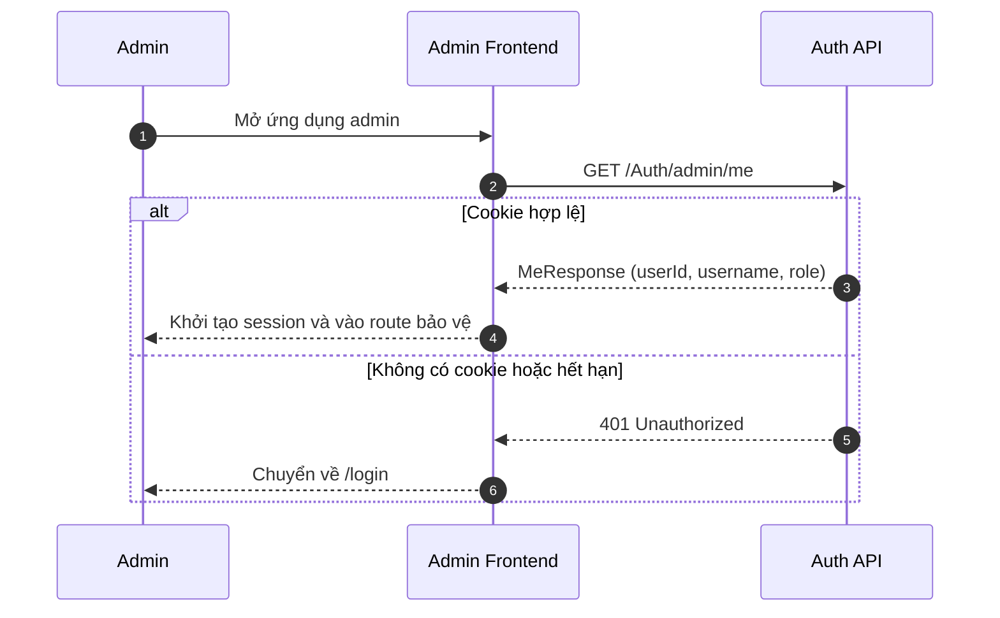
```mermaid
sequenceDiagram
    autonumber
    participant U as Admin
    participant FE as Admin Frontend
    participant AUTH as Auth API

    U->>FE: Mở ứng dụng admin
    FE->>AUTH: GET /Auth/admin/me
    alt Cookie hợp lệ
        AUTH-->>FE: MeResponse (userId, username, role)
        FE-->>U: Khởi tạo session và vào route bảo vệ
    else Không có cookie hoặc hết hạn
        AUTH-->>FE: 401 Unauthorized
        FE-->>U: Chuyển về /login
    end
```

## 2. Đăng nhập admin

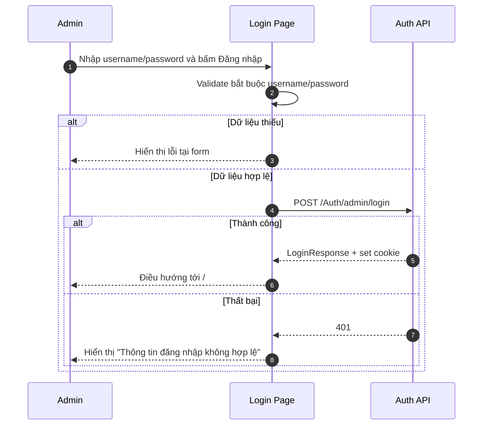
```mermaid
sequenceDiagram
    autonumber
    participant U as Admin
    participant FE as Login Page
    participant AUTH as Auth API

    U->>FE: Nhập username/password và bấm Đăng nhập
    FE->>FE: Validate bắt buộc username/password
    alt Dữ liệu thiếu
        FE-->>U: Hiển thị lỗi tại form
    else Dữ liệu hợp lệ
        FE->>AUTH: POST /Auth/admin/login
        alt Thành công
            AUTH-->>FE: LoginResponse + set cookie
            FE-->>U: Điều hướng tới /
        else Thất bại
            AUTH-->>FE: 401
            FE-->>U: Hiển thị "Thông tin đăng nhập không hợp lệ"
        end
    end
```

## 3. Đăng xuất

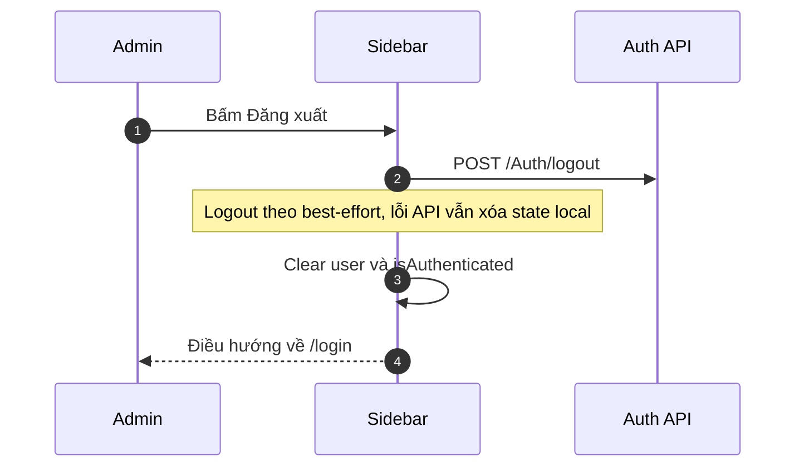
```mermaid
sequenceDiagram
    autonumber
    participant U as Admin
    participant FE as Sidebar
    participant AUTH as Auth API

    U->>FE: Bấm Đăng xuất
    FE->>AUTH: POST /Auth/logout
    Note over FE: Logout theo best-effort, lỗi API vẫn xóa state local
    FE->>FE: Clear user và isAuthenticated
    FE-->>U: Điều hướng về /login
```

## 4. Điều hướng và bảo vệ route

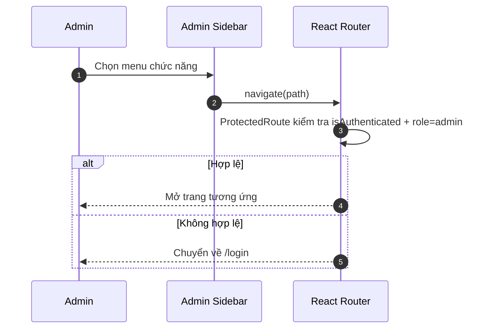
```mermaid
sequenceDiagram
    autonumber
    participant U as Admin
    participant FE as Admin Sidebar
    participant ROUTER as React Router

    U->>FE: Chọn menu chức năng
    FE->>ROUTER: navigate(path)
    ROUTER->>ROUTER: ProtectedRoute kiểm tra isAuthenticated + role=admin
    alt Hợp lệ
        ROUTER-->>U: Mở trang tương ứng
    else Không hợp lệ
        ROUTER-->>U: Chuyển về /login
    end
```

## 5. Xem dashboard tổng quan

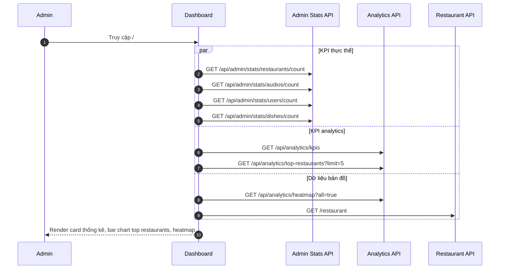
```mermaid
sequenceDiagram
    autonumber
    participant U as Admin
    participant FE as Dashboard
    participant STATS as Admin Stats API
    participant ANA as Analytics API
    participant RES as Restaurant API

    U->>FE: Truy cập /
    par KPI thực thể
        FE->>STATS: GET /api/admin/stats/restaurants/count
        FE->>STATS: GET /api/admin/stats/audios/count
        FE->>STATS: GET /api/admin/stats/users/count
        FE->>STATS: GET /api/admin/stats/dishes/count
    and KPI analytics
        FE->>ANA: GET /api/analytics/kpis
        FE->>ANA: GET /api/analytics/top-restaurants?limit=5
    and Dữ liệu bản đồ
        FE->>ANA: GET /api/analytics/heatmap?all=true
        FE->>RES: GET /restaurant
    end
    FE-->>U: Render card thống kê, bar chart top restaurants, heatmap
```

## 6. Đổi bộ lọc heatmap trên dashboard

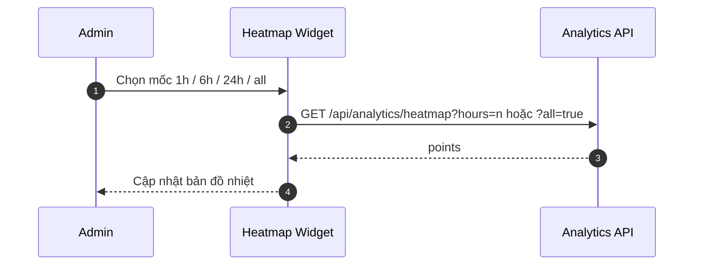
```mermaid
sequenceDiagram
    autonumber
    participant U as Admin
    participant FE as Heatmap Widget
    participant ANA as Analytics API

    U->>FE: Chọn mốc 1h / 6h / 24h / all
    FE->>ANA: GET /api/analytics/heatmap?hours=n hoặc ?all=true
    ANA-->>FE: points
    FE-->>U: Cập nhật bản đồ nhiệt
```

## 7. Xem tuyến di chuyển người dùng

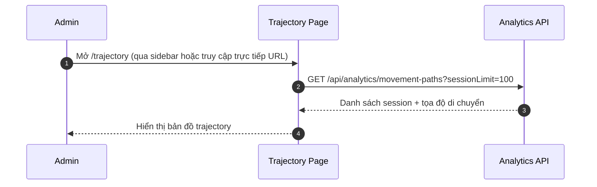
```mermaid
sequenceDiagram
    autonumber
    participant U as Admin
    participant FE as Trajectory Page
    participant ANA as Analytics API

    U->>FE: Mở /trajectory (qua sidebar hoặc truy cập trực tiếp URL)
    FE->>ANA: GET /api/analytics/movement-paths?sessionLimit=100
    ANA-->>FE: Danh sách session + tọa độ di chuyển
    FE-->>U: Hiển thị bản đồ trajectory
```

## 8. Xem danh sách và tìm kiếm nhà hàng

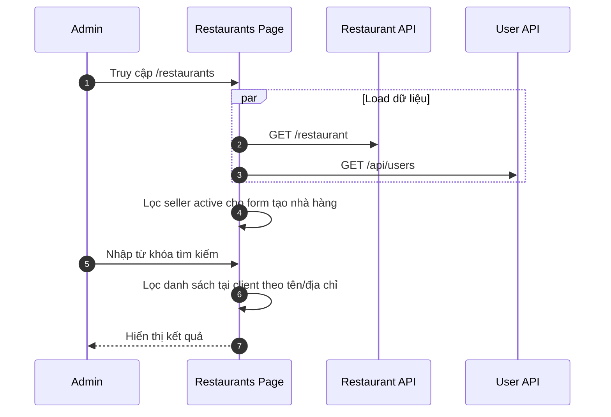
```mermaid
sequenceDiagram
    autonumber
    participant U as Admin
    participant FE as Restaurants Page
    participant RES as Restaurant API
    participant USER as User API

    U->>FE: Truy cập /restaurants
    par Load dữ liệu
        FE->>RES: GET /restaurant
        FE->>USER: GET /api/users
    end
    FE->>FE: Lọc seller active cho form tạo nhà hàng
    U->>FE: Nhập từ khóa tìm kiếm
    FE->>FE: Lọc danh sách tại client theo tên/địa chỉ
    FE-->>U: Hiển thị kết quả
```

## 9. Xem chi tiết nhà hàng

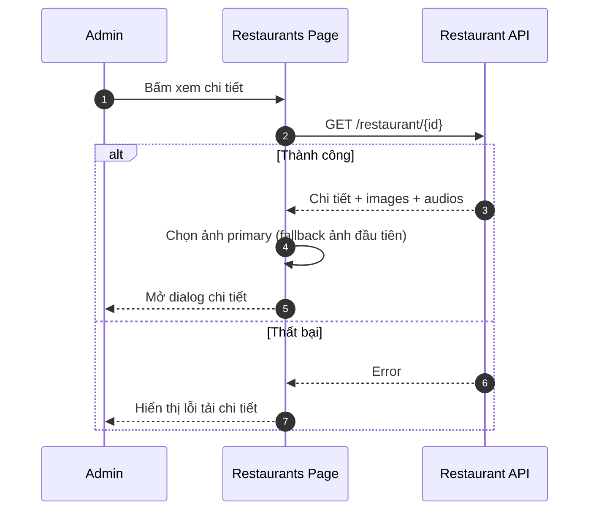
```mermaid
sequenceDiagram
    autonumber
    participant U as Admin
    participant FE as Restaurants Page
    participant RES as Restaurant API

    U->>FE: Bấm xem chi tiết
    FE->>RES: GET /restaurant/{id}
    alt Thành công
        RES-->>FE: Chi tiết + images + audios
        FE->>FE: Chọn ảnh primary (fallback ảnh đầu tiên)
        FE-->>U: Mở dialog chi tiết
    else Thất bại
        RES-->>FE: Error
        FE-->>U: Hiển thị lỗi tải chi tiết
    end
```

## 10. Tạo nhà hàng mới

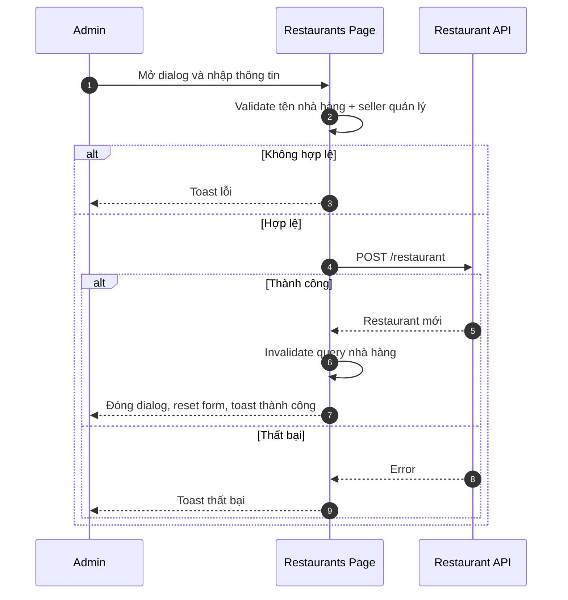
```mermaid
sequenceDiagram
    autonumber
    participant U as Admin
    participant FE as Restaurants Page
    participant RES as Restaurant API

    U->>FE: Mở dialog và nhập thông tin
    FE->>FE: Validate tên nhà hàng + seller quản lý
    alt Không hợp lệ
        FE-->>U: Toast lỗi
    else Hợp lệ
        FE->>RES: POST /restaurant
        alt Thành công
            RES-->>FE: Restaurant mới
            FE->>FE: Invalidate query nhà hàng
            FE-->>U: Đóng dialog, reset form, toast thành công
        else Thất bại
            RES-->>FE: Error
            FE-->>U: Toast thất bại
        end
    end
```

## 10a. Tự điền tọa độ từ link Google Maps khi tạo nhà hàng

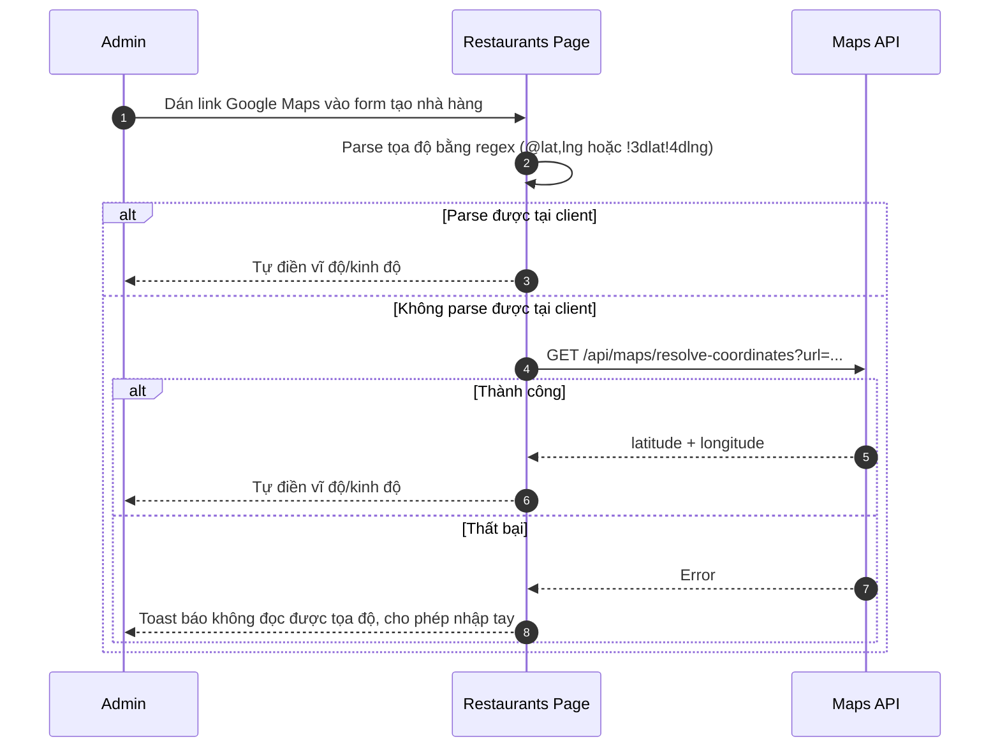
```mermaid
sequenceDiagram
    autonumber
    participant U as Admin
    participant FE as Restaurants Page
    participant MAP as Maps API

    U->>FE: Dán link Google Maps vào form tạo nhà hàng
    FE->>FE: Parse tọa độ bằng regex (@lat,lng hoặc !3dlat!4dlng)
    alt Parse được tại client
        FE-->>U: Tự điền vĩ độ/kinh độ
    else Không parse được tại client
        FE->>MAP: GET /api/maps/resolve-coordinates?url=...
        alt Thành công
            MAP-->>FE: latitude + longitude
            FE-->>U: Tự điền vĩ độ/kinh độ
        else Thất bại
            MAP-->>FE: Error
            FE-->>U: Toast báo không đọc được tọa độ, cho phép nhập tay
        end
    end
```

## 11. Khóa hoặc mở khóa nhà hàng

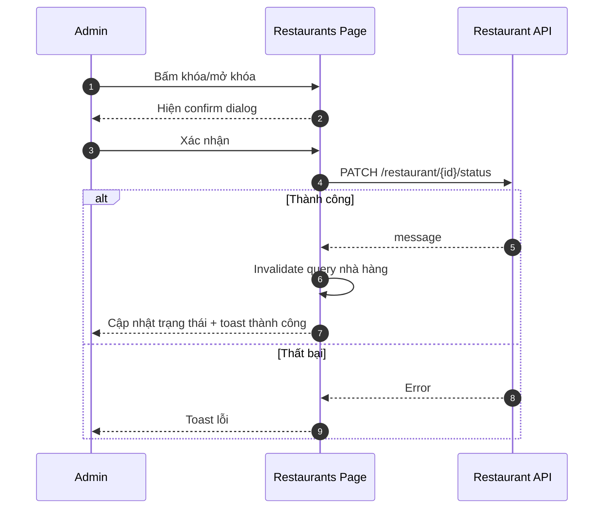
```mermaid
sequenceDiagram
    autonumber
    participant U as Admin
    participant FE as Restaurants Page
    participant RES as Restaurant API

    U->>FE: Bấm khóa/mở khóa
    FE-->>U: Hiện confirm dialog
    U->>FE: Xác nhận
    FE->>RES: PATCH /restaurant/{id}/status
    alt Thành công
        RES-->>FE: message
        FE->>FE: Invalidate query nhà hàng
        FE-->>U: Cập nhật trạng thái + toast thành công
    else Thất bại
        RES-->>FE: Error
        FE-->>U: Toast lỗi
    end
```

## 12. Xem danh sách người dùng

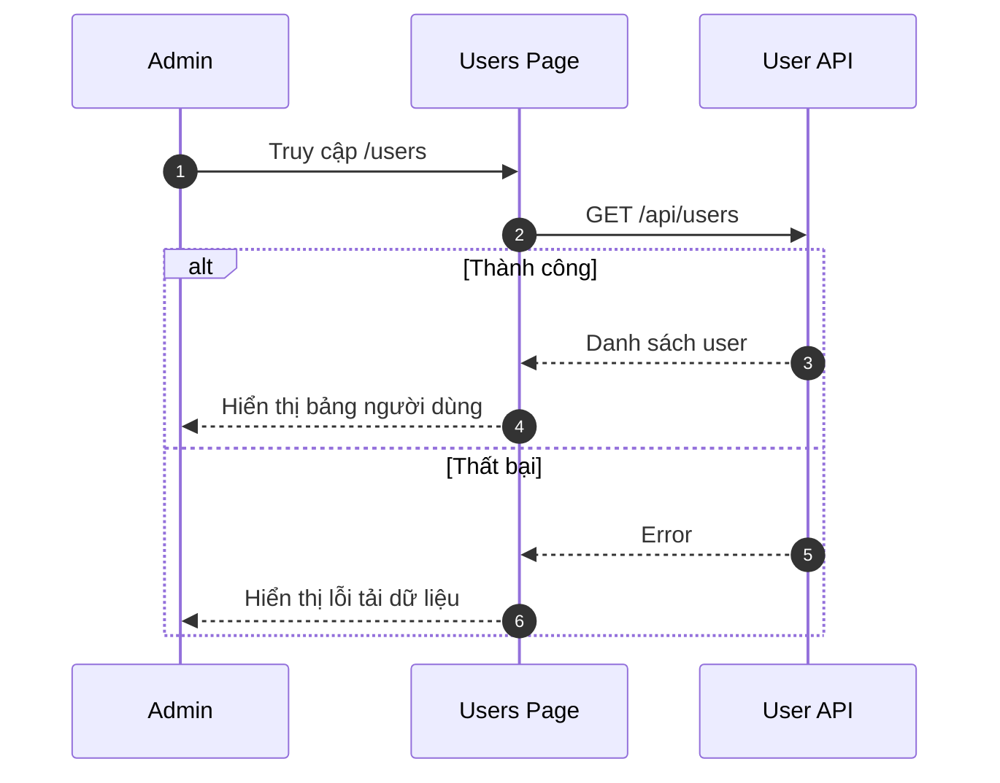
```mermaid
sequenceDiagram
    autonumber
    participant U as Admin
    participant FE as Users Page
    participant USER as User API

    U->>FE: Truy cập /users
    FE->>USER: GET /api/users
    alt Thành công
        USER-->>FE: Danh sách user
        FE-->>U: Hiển thị bảng người dùng
    else Thất bại
        USER-->>FE: Error
        FE-->>U: Hiển thị lỗi tải dữ liệu
    end
```

## 13. Tạo người dùng mới

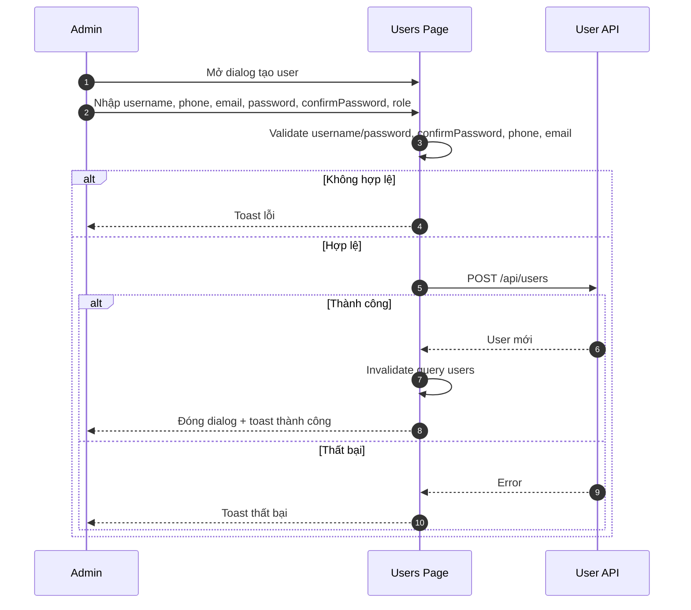
```mermaid
sequenceDiagram
    autonumber
    participant U as Admin
    participant FE as Users Page
    participant USER as User API

    U->>FE: Mở dialog tạo user
    U->>FE: Nhập username, phone, email, password, confirmPassword, role
    FE->>FE: Validate username/password, confirmPassword, phone, email
    alt Không hợp lệ
        FE-->>U: Toast lỗi
    else Hợp lệ
        FE->>USER: POST /api/users
        alt Thành công
            USER-->>FE: User mới
            FE->>FE: Invalidate query users
            FE-->>U: Đóng dialog + toast thành công
        else Thất bại
            USER-->>FE: Error
            FE-->>U: Toast thất bại
        end
    end
```

Ghi chú: Vai trò được chọn khi tạo mới. Sau khi tạo, màn hình chi tiết chỉ hiển thị role (read-only), không có thao tác đổi role.

## 14. Khóa hoặc mở khóa người dùng

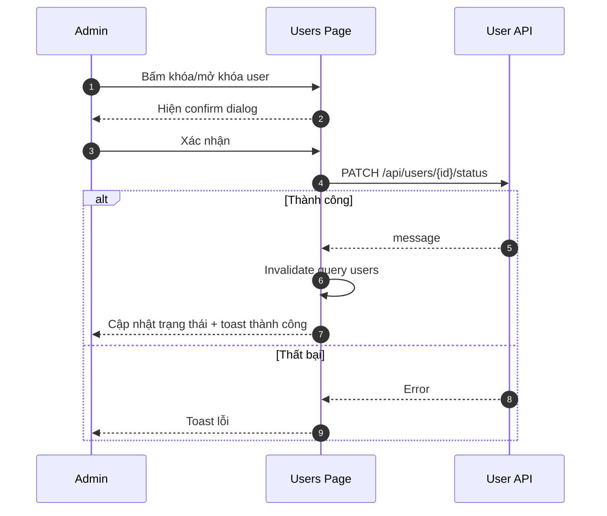
```mermaid
sequenceDiagram
    autonumber
    participant U as Admin
    participant FE as Users Page
    participant USER as User API

    U->>FE: Bấm khóa/mở khóa user
    FE-->>U: Hiện confirm dialog
    U->>FE: Xác nhận
    FE->>USER: PATCH /api/users/{id}/status
    alt Thành công
        USER-->>FE: message
        FE->>FE: Invalidate query users
        FE-->>U: Cập nhật trạng thái + toast thành công
    else Thất bại
        USER-->>FE: Error
        FE-->>U: Toast lỗi
    end
```

## 14a. Xem chi tiết người dùng và nhà hàng đang quản lý

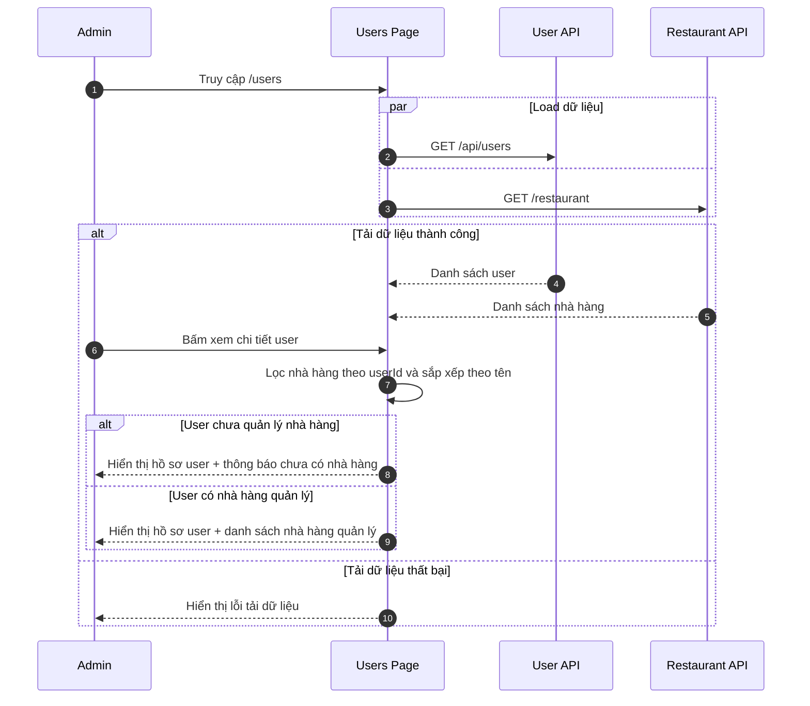
```mermaid
sequenceDiagram
    autonumber
    participant U as Admin
    participant FE as Users Page
    participant USER as User API
    participant RES as Restaurant API

    U->>FE: Truy cập /users
    par Load dữ liệu
        FE->>USER: GET /api/users
    and
        FE->>RES: GET /restaurant
    end
    alt Tải dữ liệu thành công
        USER-->>FE: Danh sách user
        RES-->>FE: Danh sách nhà hàng
        U->>FE: Bấm xem chi tiết user
        FE->>FE: Lọc nhà hàng theo userId và sắp xếp theo tên
        alt User chưa quản lý nhà hàng
            FE-->>U: Hiển thị hồ sơ user + thông báo chưa có nhà hàng
        else User có nhà hàng quản lý
            FE-->>U: Hiển thị hồ sơ user + danh sách nhà hàng quản lý
        end
    else Tải dữ liệu thất bại
        FE-->>U: Hiển thị lỗi tải dữ liệu
    end
```

## 15. Xem nhật ký hệ thống và nhật ký nghe audio

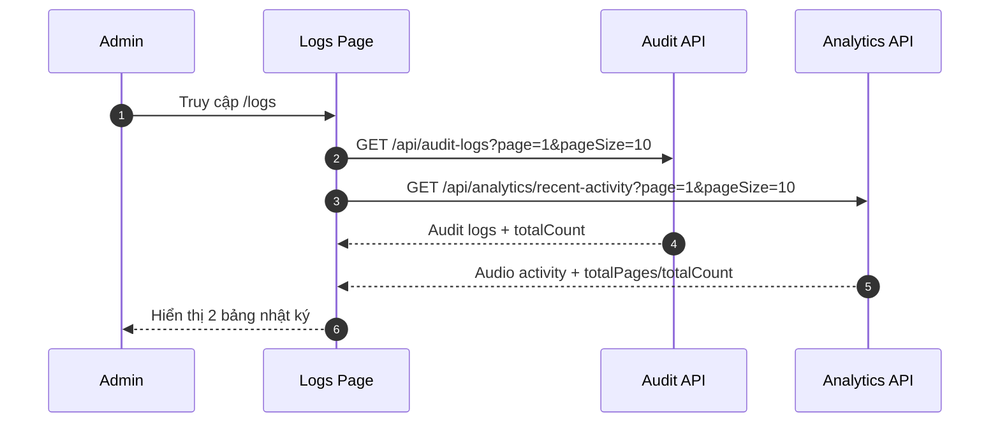
```mermaid
sequenceDiagram
    autonumber
    participant U as Admin
    participant FE as Logs Page
    participant AUD as Audit API
    participant ANA as Analytics API

    U->>FE: Truy cập /logs
    FE->>AUD: GET /api/audit-logs?page=1&pageSize=10
    FE->>ANA: GET /api/analytics/recent-activity?page=1&pageSize=10
    AUD-->>FE: Audit logs + totalCount
    ANA-->>FE: Audio activity + totalPages/totalCount
    FE-->>U: Hiển thị 2 bảng nhật ký
```

## 16. Tự động làm mới nhật ký

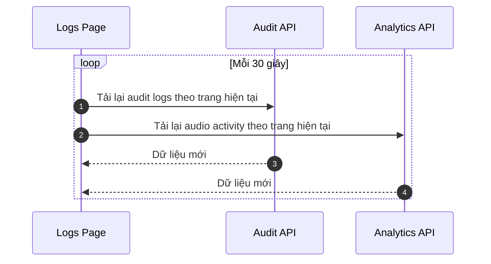
```mermaid
sequenceDiagram
    autonumber
    participant FE as Logs Page
    participant AUD as Audit API
    participant ANA as Analytics API

    loop Mỗi 30 giây
        FE->>AUD: Tải lại audit logs theo trang hiện tại
        FE->>ANA: Tải lại audio activity theo trang hiện tại
        AUD-->>FE: Dữ liệu mới
        ANA-->>FE: Dữ liệu mới
    end
```

## 17. Phân trang nhật ký

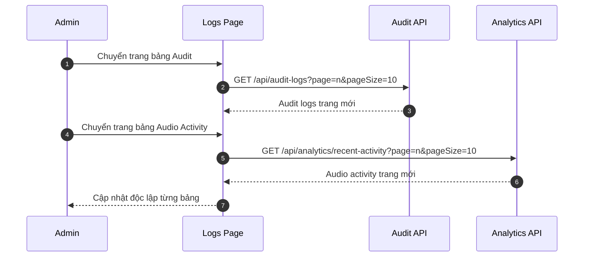
```mermaid
sequenceDiagram
    autonumber
    participant U as Admin
    participant FE as Logs Page
    participant AUD as Audit API
    participant ANA as Analytics API

    U->>FE: Chuyển trang bảng Audit
    FE->>AUD: GET /api/audit-logs?page=n&pageSize=10
    AUD-->>FE: Audit logs trang mới

    U->>FE: Chuyển trang bảng Audio Activity
    FE->>ANA: GET /api/analytics/recent-activity?page=n&pageSize=10
    ANA-->>FE: Audio activity trang mới

    FE-->>U: Cập nhật độc lập từng bảng
```

## 18. Xem danh sách tour và chi tiết tour

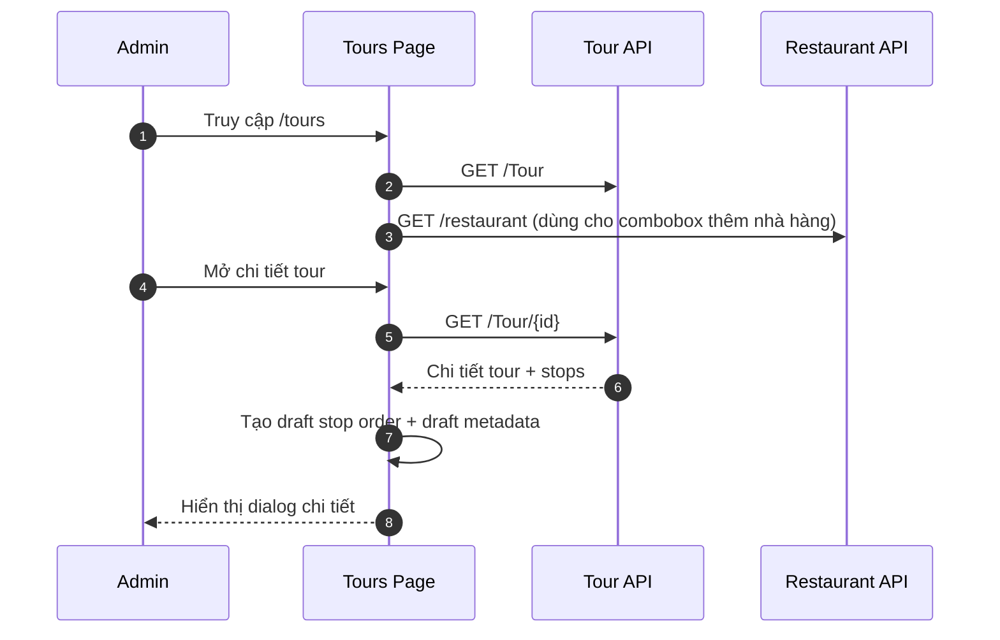
```mermaid
sequenceDiagram
    autonumber
    participant U as Admin
    participant FE as Tours Page
    participant TOUR as Tour API
    participant RES as Restaurant API

    U->>FE: Truy cập /tours
    FE->>TOUR: GET /Tour
    FE->>RES: GET /restaurant (dùng cho combobox thêm nhà hàng)
    U->>FE: Mở chi tiết tour
    FE->>TOUR: GET /Tour/{id}
    TOUR-->>FE: Chi tiết tour + stops
    FE->>FE: Tạo draft stop order + draft metadata
    FE-->>U: Hiển thị dialog chi tiết
```

## 18a. Tạo tour mới

```mermaid
sequenceDiagram
    autonumber
    participant U as Admin
    participant FE as Tours Page
    participant TOUR as Tour API

    U->>FE: Bấm Thêm tour và nhập tên/mô tả/thời gian/ảnh
    FE->>FE: Validate tên tour và estimatedDuration là số nguyên >= 0
    alt Không hợp lệ
        FE-->>U: Toast lỗi
    else Hợp lệ
        FE->>TOUR: POST /Tour
        alt Có ảnh file
            FE->>TOUR: POST /Tour/{id}/upload-image
        end
        FE->>FE: Invalidate query tours
        FE-->>U: Đóng dialog + toast tạo tour thành công
    end
```

## 19. Lưu cập nhật tour (thứ tự stop + metadata)

```mermaid
sequenceDiagram
    autonumber
    participant U as Admin
    participant FE as Tour Detail Dialog
    participant TOUR as Tour API

    U->>FE: Kéo-thả stop order, sửa estimatedDuration/isActive/name/description
    FE->>FE: Validate estimatedDuration là số nguyên >= 0
    alt Không hợp lệ
        FE-->>U: Toast lỗi
    else Hợp lệ
        alt Có đổi thứ tự
            FE->>TOUR: PUT /Tour/{id}/stops/order
            TOUR-->>FE: message
        end
        alt Có đổi metadata
            FE->>TOUR: PATCH /Tour/{id}
            TOUR-->>FE: message
        end
        FE->>FE: Invalidate tours + tour detail
        FE-->>U: Toast lưu thành công
    end
```

## 20. Thêm nhà hàng vào tour

```mermaid
sequenceDiagram
    autonumber
    participant U as Admin
    participant FE as Tour Detail Dialog
    participant TOUR as Tour API

    U->>FE: Chọn nhà hàng và bấm Thêm
    FE->>FE: Validate có restaurantId và không có unsaved changes
    alt Không hợp lệ
        FE-->>U: Toast lỗi
    else Hợp lệ
        FE->>TOUR: POST /Tour/{id}/restaurants
        alt Thành công
            TOUR-->>FE: message
            FE->>FE: Invalidate tours + tour detail, reset combobox
            FE-->>U: Toast thành công
        else Thất bại
            TOUR-->>FE: Error
            FE-->>U: Toast thất bại
        end
    end
```

## 20a. Khóa hoặc mở khóa tour

```mermaid
sequenceDiagram
    autonumber
    participant U as Admin
    participant FE as Tours Page
    participant TOUR as Tour API

    U->>FE: Bấm ngưng hoạt động/kích hoạt tour
    FE-->>U: Hiện confirm dialog
    U->>FE: Xác nhận
    FE->>TOUR: PATCH /Tour/{id} (isActive=true/false)
    alt Thành công
        TOUR-->>FE: message
        FE->>FE: Invalidate tours (+ tour detail nếu đang mở)
        FE-->>U: Cập nhật trạng thái + toast thành công
    else Thất bại
        TOUR-->>FE: Error
        FE-->>U: Toast lỗi
    end
```

## 21. Xem và cập nhật thông tin tài khoản

```mermaid
sequenceDiagram
    autonumber
    participant U as Admin
    participant FE as Account Page
    participant USER as User API
    participant AUTHCTX as Auth Context

    U->>FE: Truy cập /account
    FE->>USER: GET /api/users/{userId}
    USER-->>FE: Thông tin tài khoản

    U->>FE: Bấm Chỉnh sửa profile
    U->>FE: Sửa username/phone/email và bấm Lưu
    FE->>FE: Validate username, phone, email
    alt Không hợp lệ
        FE-->>U: Toast lỗi
    else Hợp lệ
        FE->>USER: PATCH /Auth/profile
        alt Thành công
            USER-->>FE: User mới
            FE->>AUTHCTX: refreshMe()
            FE->>FE: Invalidate account + users
            FE-->>U: Toast thành công
        else Thất bại
            USER-->>FE: Error
            FE-->>U: Toast thất bại
        end
    end
```

## 22. Đổi mật khẩu tài khoản

```mermaid
sequenceDiagram
    autonumber
    participant U as Admin
    participant FE as Account Page
    participant AUTH as Auth API

    U->>FE: Nhập oldPassword/newPassword/confirmNewPassword
    FE->>FE: Validate bắt buộc, newPassword >= 6, confirm khớp
    alt Không hợp lệ
        FE-->>U: Toast lỗi
    else Hợp lệ
        FE->>AUTH: PATCH /Auth/password
        alt Thành công
            AUTH-->>FE: message
            FE->>FE: Reset form mật khẩu
            FE-->>U: Toast đổi mật khẩu thành công
        else Thất bại
            AUTH-->>FE: Error
            FE-->>U: Toast thất bại
        end
    end
```

## 23. Xem trang Dịch vụ (token)

```mermaid
sequenceDiagram
    autonumber
    participant U as Admin
    participant FE as Translation Billing Page
    participant BILL as Translation Billing API

    U->>FE: Truy cập /translation-billing
    FE->>BILL: GET /api/admin/translation-billing/monthly?billingMonth&sellerUsername&page=1&pageSize=20
    BILL-->>FE: Summary + monthly items
    FE-->>U: Hiển thị KPI tổng hợp và bảng monthly mặc định
```

## 24. Lọc theo tháng/người bán

```mermaid
sequenceDiagram
    autonumber
    participant U as Admin
    participant FE as Translation Billing Page
    participant BILL as Translation Billing API

    U->>FE: Đổi filter billingMonth / sellerUsername
    FE->>FE: Reset page về 1 cho bảng liên quan
    FE->>BILL: GET /api/admin/translation-billing/monthly?billingMonth&sellerUsername&page=1&pageSize=20
    FE->>BILL: GET /api/admin/translation-billing/usage?billingMonth&sellerUsername&page=1&pageSize=20
    BILL-->>FE: Dữ liệu mới
    FE-->>U: Cập nhật KPI và 2 bảng
```

## 25. Xem lịch sử sử dụng dịch vụ

```mermaid
sequenceDiagram
    autonumber
    participant U as Admin
    participant FE as Translation Billing Page
    participant BILL as Translation Billing API

    U->>FE: Xem bảng lịch sử usage
    FE->>BILL: GET /api/admin/translation-billing/usage?billingMonth&sellerUsername&page&pageSize
    BILL-->>FE: usage items + totalCount
    FE-->>U: Hiển thị lịch sử sử dụng dịch token theo từng bản ghi
```

## 26. Phân trang dữ liệu

```mermaid
sequenceDiagram
    autonumber
    participant U as Admin
    participant FE as Translation Billing Page
    participant BILL as Translation Billing API

    U->>FE: Chuyển trang bảng monthly
    FE->>BILL: GET /api/admin/translation-billing/monthly?billingMonth&sellerUsername&page=n&pageSize
    BILL-->>FE: monthly items trang mới

    U->>FE: Chuyển trang bảng usage
    FE->>BILL: GET /api/admin/translation-billing/usage?billingMonth&sellerUsername&page=n&pageSize
    BILL-->>FE: usage items trang mới
    FE-->>U: Cập nhật độc lập từng bảng
```

---

## Các flow đã bỏ hoặc đã đổi so với bản cũ

- Đã bỏ flow đổi vai trò người dùng trong UI admin (role chỉ chọn lúc tạo mới, không đổi được ở màn hình chi tiết).
- Đã bỏ flow đổi `sessionLimit` trên trang trajectory (UI hiện dùng cố định 100).
