# Flow Sequence App

Tài liệu mô tả flow thực tế của ứng dụng mobile trong thư mục FoodMarketNarrator.Maui (snapshot theo code hiện tại).

## Phạm vi và ghi chú

- App dùng .NET MAUI, điều hướng bằng AppShell với 6 tab: MainPage, MapPage, TourPage, FavoritePage, HistoryPage, SettingsPage.
- Khi app start sẽ chạy warm-up nền, khởi động tracking GPS và đồng bộ log location.
- Narration tự chạy theo geofence khi bật narration flow.
- Deep link hiện nhận scheme foodmarketnarrator://open, validate hợp lệ rồi apply qua QrAccessService.
- Dữ liệu có cơ chế offline cache cho POI, language, dishes, tours, images, audio.

## Tóm tắt chức năng theo sequence

1.Khởi Động App
Khởi tạo AppShell và giao diện tab, xử lý deep link đầu vào (nếu có), đồng thời kích hoạt các dịch vụ nền quan trọng gồm warm-up dữ liệu, khởi tạo audio, đồng bộ location log và bắt đầu tracking GPS.

2.Warm-up dữ liệu nền
Tải sẵn language, tour, POI và khởi chạy job làm ấm dữ liệu phụ (ảnh, món ăn) để giảm độ trễ khi người dùng mở các tab.

3.Bootstrap audio library khi startup
Chuẩn bị audio theo trạng thái online/offline, đồng bộ bản mới, đặt cờ sẵn sàng phát để narration không bị khựng.

4.Theo dõi vị trí và quyền truy cập
Xin quyền location/notification theo đúng Android version, bật foreground service và publish sự kiện vị trí theo ngưỡng di chuyển.

5.Đồng bộ session và location logs
Mở phiên theo dõi, gửi log vị trí định kỳ; nếu lỗi thì giữ batch để retry, tránh mất dữ liệu tracking.

6.Geofence enter/exit/switch
Từ luồng vị trí, xác định vào vùng, ra vùng, hoặc chuyển POI; có hysteresis để tránh rung biên.

7.Bật/tắt narration tự động
Quản lý vòng đời chế độ thuyết minh: start thì subscribe tracking và reset state, stop thì dọn queue và dừng audio.

8.Trigger phát audio theo POI
Áp dụng rule chống lặp (distance, cooldown, played list), chọn audio theo ngôn ngữ rồi phát và ghi nhận đã phát.

9.Playback nguồn audio và cache
Ưu tiên cache local, nếu thiếu mới tải mạng và lưu lại theo chính sách LRU để dùng lại offline.

10.Ghi audio logs khi phát
Ghi lại thời điểm bắt đầu/kết thúc playback, gửi backend phục vụ thống kê và phân tích hành vi nghe.

11.MainPage: danh sách POI và điều hướng chi tiết
Tải danh sách POI, filter theo ngữ cảnh và điều hướng vào trang chi tiết từng địa điểm.

12.MapPage: lọc/scope POI và tương tác bản đồ
Hiển thị marker, hỗ trợ tìm kiếm/lọc, giới hạn scope theo tour và điều hướng nhanh sang chi tiết.

13.POIDetail: phát thủ công, favorite, chỉ đường
Cung cấp thao tác trực tiếp trên một POI: nghe audio thủ công, thêm yêu thích, mở app bản đồ để dẫn đường.

14.Tour flow
Tải danh sách tour, cho phép bắt đầu tour để nhảy sang map với danh sách điểm dừng đúng thứ tự.

15.Favorites và History flow
Hiển thị danh sách yêu thích và lịch sử đã xem/nghe, kết hợp dữ liệu POI để render thông tin đầy đủ.

16.Settings flow
Đổi ngôn ngữ, xin quyền vị trí nền, xóa cache/dữ liệu cục bộ, dọn lịch sử/yêu thích.

17.Deep link QR flow
Nhận link từ Android intent, dispatch vào app, validate scheme/host rồi apply qua QrAccessService.

## 1. Khởi tạo ứng dụng

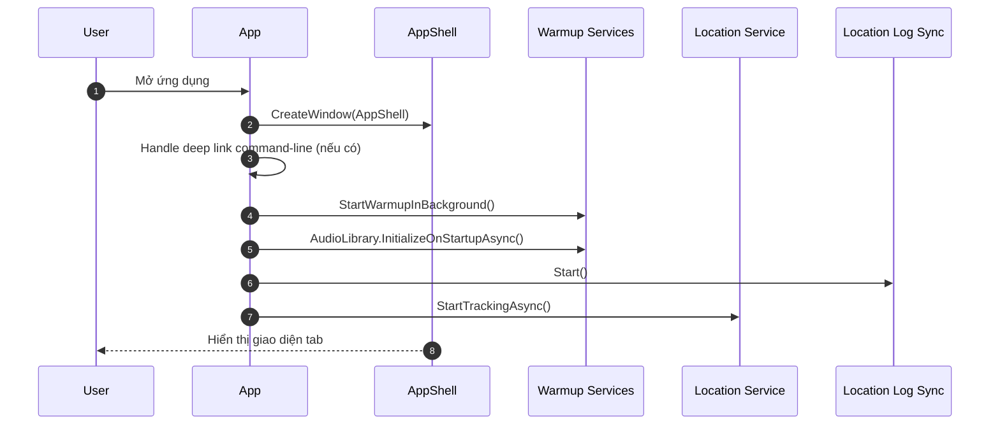
```mermaid
sequenceDiagram
    autonumber
    participant U as User
    participant APP as App
    participant SHELL as AppShell
    participant WARM as Warmup Services
    participant LOC as Location Service
    participant LOG as Location Log Sync

    U->>APP: Mở ứng dụng
    APP->>SHELL: CreateWindow(AppShell)
    APP->>APP: Handle deep link command-line (nếu có)
    APP->>WARM: StartWarmupInBackground()
    APP->>WARM: AudioLibrary.InitializeOnStartupAsync()
    APP->>LOG: Start()
    APP->>LOC: StartTrackingAsync()
    SHELL-->>U: Hiển thị giao diện tab
```

## 2. Warm-up dữ liệu nền

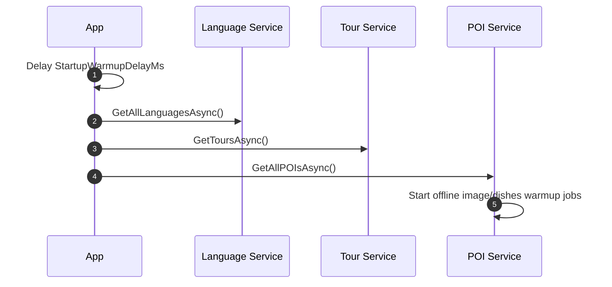
```mermaid
sequenceDiagram
    autonumber
    participant APP as App
    participant LANG as Language Service
    participant TOUR as Tour Service
    participant POI as POI Service

    APP->>APP: Delay StartupWarmupDelayMs
    APP->>LANG: GetAllLanguagesAsync()
    APP->>TOUR: GetToursAsync()
    APP->>POI: GetAllPOIsAsync()
    POI->>POI: Start offline image/dishes warmup jobs
```

## 3. Bootstrap audio library khi startup

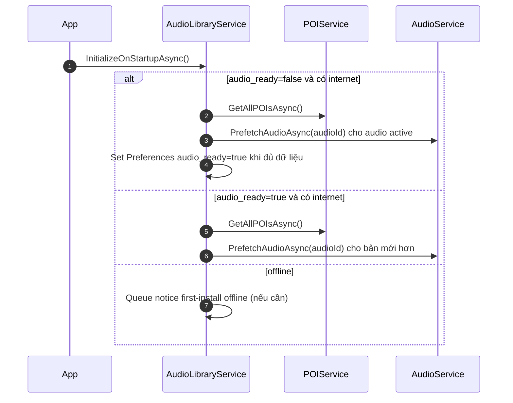
```mermaid
sequenceDiagram
    autonumber
    participant APP as App
    participant LIB as AudioLibraryService
    participant POI as POIService
    participant AUD as AudioService

    APP->>LIB: InitializeOnStartupAsync()
    alt audio_ready=false và có internet
        LIB->>POI: GetAllPOIsAsync()
        LIB->>AUD: PrefetchAudioAsync(audioId) cho audio active
        LIB->>LIB: Set Preferences audio_ready=true khi đủ dữ liệu
    else audio_ready=true và có internet
        LIB->>POI: GetAllPOIsAsync()
        LIB->>AUD: PrefetchAudioAsync(audioId) cho bản mới hơn
    else offline
        LIB->>LIB: Queue notice first-install offline (nếu cần)
    end
```

## 4. Theo dõi vị trí và quyền truy cập

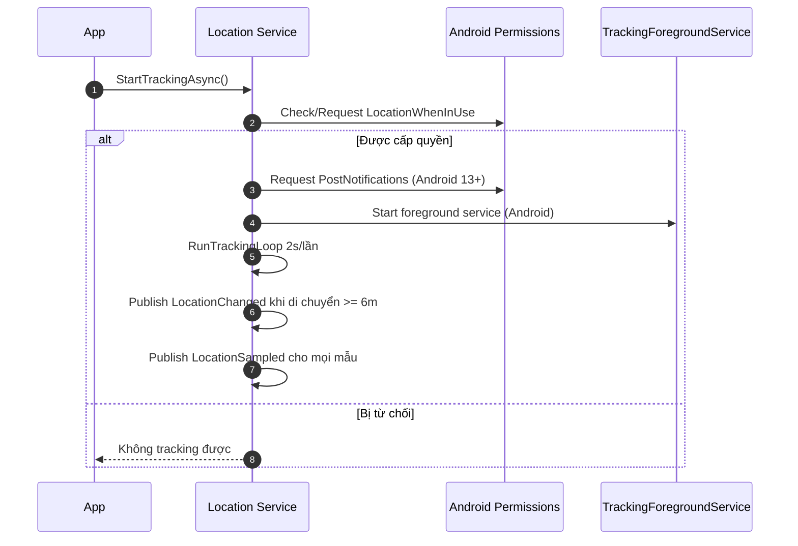
```mermaid
sequenceDiagram
    autonumber
    participant FE as App
    participant LOC as Location Service
    participant OS as Android Permissions
    participant FG as TrackingForegroundService

    FE->>LOC: StartTrackingAsync()
    LOC->>OS: Check/Request LocationWhenInUse
    alt Được cấp quyền
        LOC->>OS: Request PostNotifications (Android 13+)
        LOC->>FG: Start foreground service (Android)
        LOC->>LOC: RunTrackingLoop 2s/lần
        LOC->>LOC: Publish LocationChanged khi di chuyển >= 6m
        LOC->>LOC: Publish LocationSampled cho mọi mẫu
    else Bị từ chối
        LOC-->>FE: Không tracking được
    end
```

## 5. Đồng bộ session và location logs

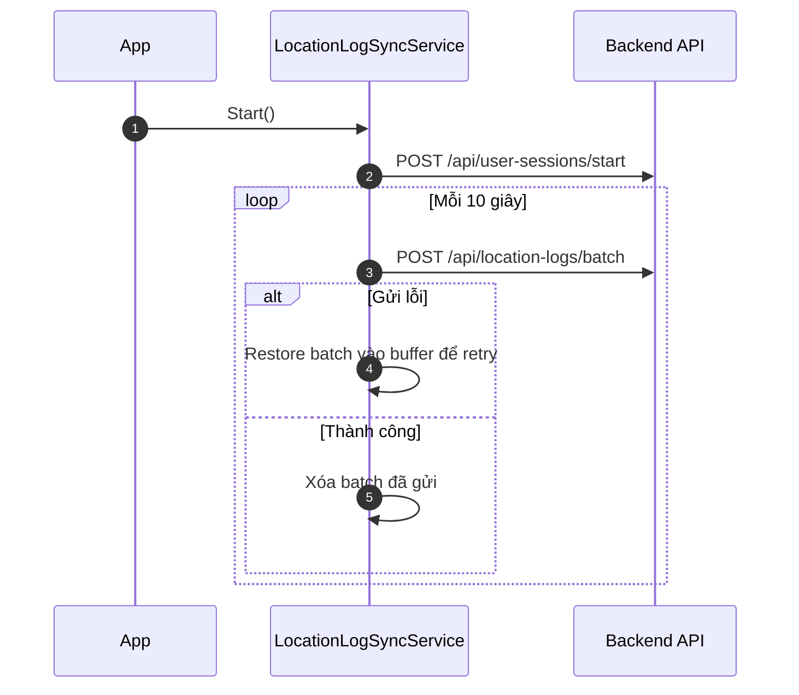
```mermaid
sequenceDiagram
    autonumber
    participant APP as App
    participant LSYNC as LocationLogSyncService
    participant API as Backend API

    APP->>LSYNC: Start()
    LSYNC->>API: POST /api/user-sessions/start
    loop Mỗi 10 giây
        LSYNC->>API: POST /api/location-logs/batch
        alt Gửi lỗi
            LSYNC->>LSYNC: Restore batch vào buffer để retry
        else Thành công
            LSYNC->>LSYNC: Xóa batch đã gửi
        end
    end
```

## 6. Geofence enter/exit/switch

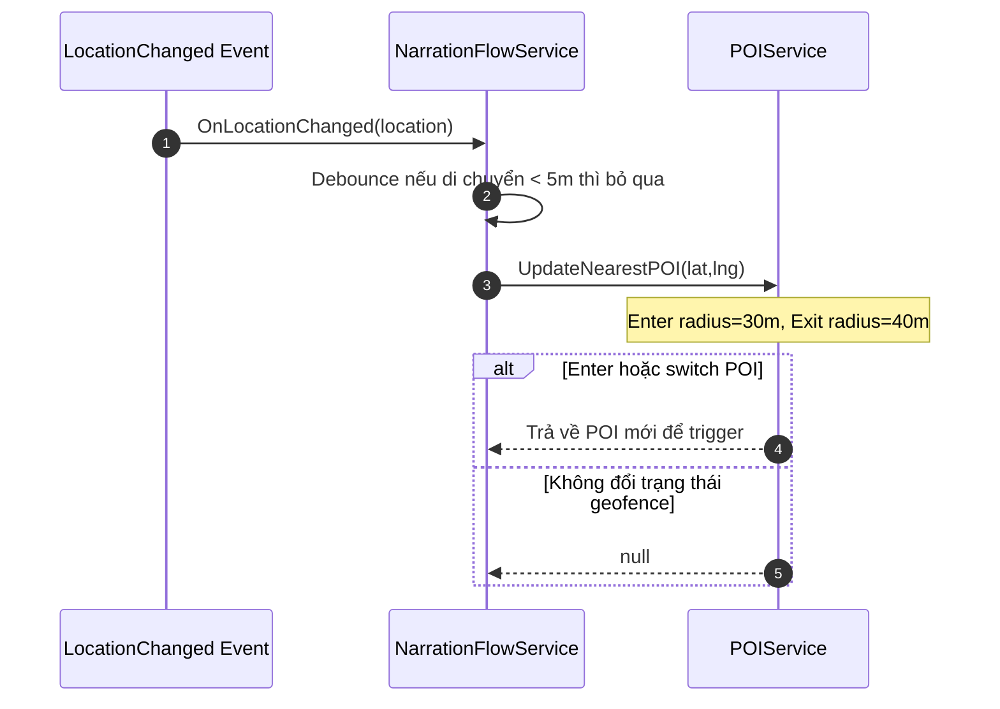
```mermaid
sequenceDiagram
    autonumber
    participant LOC as LocationChanged Event
    participant NF as NarrationFlowService
    participant POI as POIService

    LOC->>NF: OnLocationChanged(location)
    NF->>NF: Debounce nếu di chuyển < 5m thì bỏ qua
    NF->>POI: UpdateNearestPOI(lat,lng)
    Note over POI: Enter radius=30m, Exit radius=40m
    alt Enter hoặc switch POI
        POI-->>NF: Trả về POI mới để trigger
    else Không đổi trạng thái geofence
        POI-->>NF: null
    end
```

## 7. Bật/tắt narration tự động

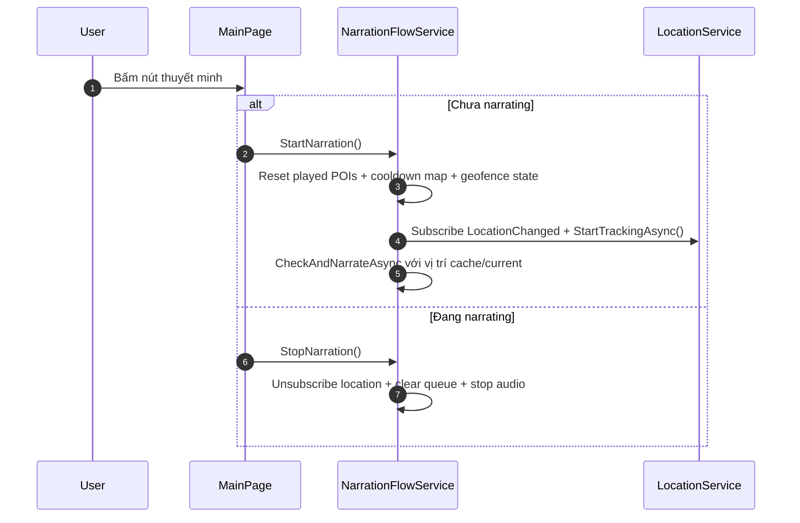
```mermaid
sequenceDiagram
    autonumber
    participant U as User
    participant MAIN as MainPage
    participant NF as NarrationFlowService
    participant LOC as LocationService

    U->>MAIN: Bấm nút thuyết minh
    alt Chưa narrating
        MAIN->>NF: StartNarration()
        NF->>NF: Reset played POIs + cooldown map + geofence state
        NF->>LOC: Subscribe LocationChanged + StartTrackingAsync()
        NF->>NF: CheckAndNarrateAsync với vị trí cache/current
    else Đang narrating
        MAIN->>NF: StopNarration()
        NF->>NF: Unsubscribe location + clear queue + stop audio
    end
```

## 8. Trigger phát audio theo POI

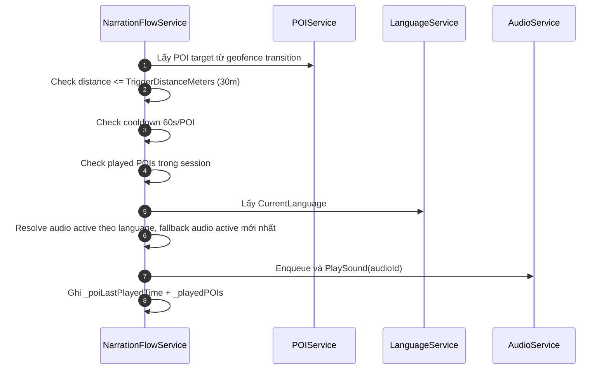
```mermaid
sequenceDiagram
    autonumber
    participant NF as NarrationFlowService
    participant POI as POIService
    participant LANG as LanguageService
    participant AUD as AudioService

    NF->>POI: Lấy POI target từ geofence transition
    NF->>NF: Check distance <= TriggerDistanceMeters (30m)
    NF->>NF: Check cooldown 60s/POI
    NF->>NF: Check played POIs trong session
    NF->>LANG: Lấy CurrentLanguage
    NF->>NF: Resolve audio active theo language, fallback audio active mới nhất
    NF->>AUD: Enqueue và PlaySound(audioId)
    NF->>NF: Ghi _poiLastPlayedTime + _playedPOIs
```

## 9. Playback nguồn audio và cache

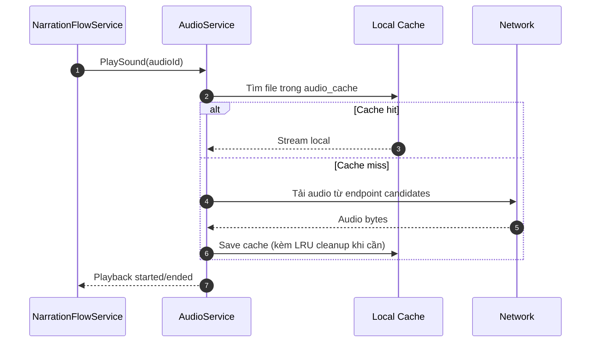
```mermaid
sequenceDiagram
    autonumber
    participant NF as NarrationFlowService
    participant AUD as AudioService
    participant CACHE as Local Cache
    participant NET as Network

    NF->>AUD: PlaySound(audioId)
    AUD->>CACHE: Tìm file trong audio_cache
    alt Cache hit
        CACHE-->>AUD: Stream local
    else Cache miss
        AUD->>NET: Tải audio từ endpoint candidates
        NET-->>AUD: Audio bytes
        AUD->>CACHE: Save cache (kèm LRU cleanup khi cần)
    end
    AUD-->>NF: Playback started/ended
```

## 10. Ghi audio logs khi phát

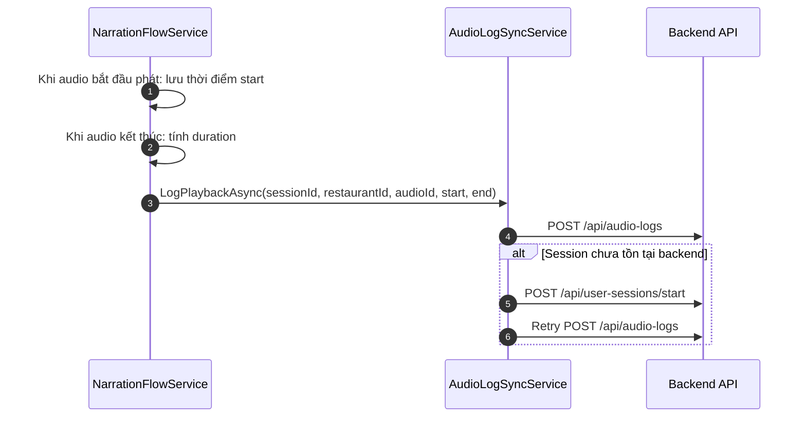
```mermaid
sequenceDiagram
    autonumber
    participant NF as NarrationFlowService
    participant ASYNC as AudioLogSyncService
    participant API as Backend API

    NF->>NF: Khi audio bắt đầu phát: lưu thời điểm start
    NF->>NF: Khi audio kết thúc: tính duration
    NF->>ASYNC: LogPlaybackAsync(sessionId, restaurantId, audioId, start, end)
    ASYNC->>API: POST /api/audio-logs
    alt Session chưa tồn tại backend
        ASYNC->>API: POST /api/user-sessions/start
        ASYNC->>API: Retry POST /api/audio-logs
    end
```

## 11. MainPage: danh sách POI và điều hướng chi tiết

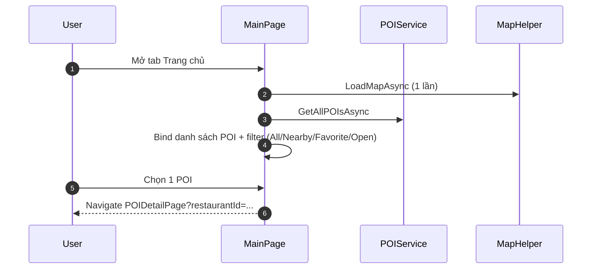
```mermaid
sequenceDiagram
    autonumber
    participant U as User
    participant MAIN as MainPage
    participant POI as POIService
    participant MAP as MapHelper

    U->>MAIN: Mở tab Trang chủ
    MAIN->>MAP: LoadMapAsync (1 lần)
    MAIN->>POI: GetAllPOIsAsync
    MAIN->>MAIN: Bind danh sách POI + filter (All/Nearby/Favorite/Open)
    U->>MAIN: Chọn 1 POI
    MAIN-->>U: Navigate POIDetailPage?restaurantId=...
```

## 12. MapPage: lọc/scope POI và map interaction

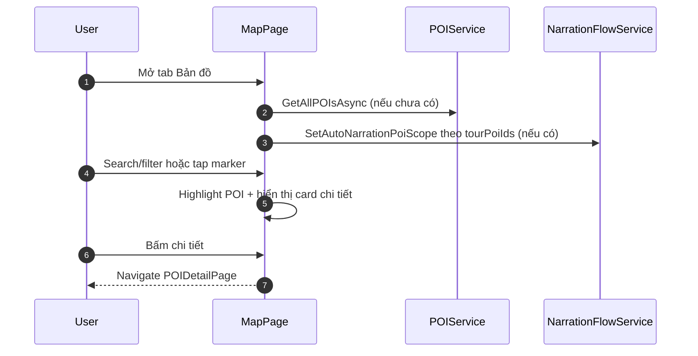
```mermaid
sequenceDiagram
    autonumber
    participant U as User
    participant MAP as MapPage
    participant POI as POIService
    participant NF as NarrationFlowService

    U->>MAP: Mở tab Bản đồ
    MAP->>POI: GetAllPOIsAsync (nếu chưa có)
    MAP->>NF: SetAutoNarrationPoiScope theo tourPoiIds (nếu có)
    U->>MAP: Search/filter hoặc tap marker
    MAP->>MAP: Highlight POI + hiển thị card chi tiết
    U->>MAP: Bấm chi tiết
    MAP-->>U: Navigate POIDetailPage
```

## 13. POIDetail: phát audio thủ công, favorite, direction

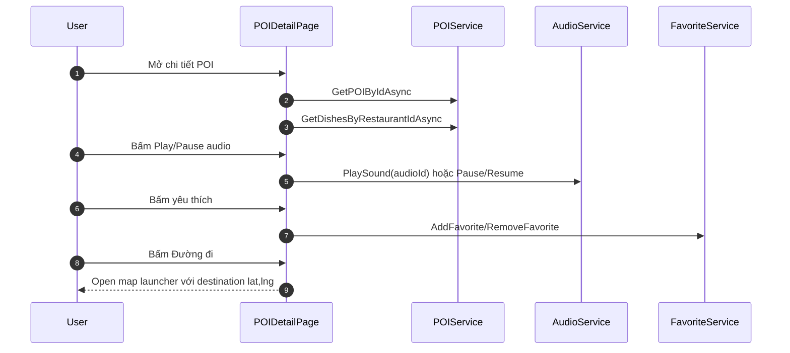
```mermaid
sequenceDiagram
    autonumber
    participant U as User
    participant DETAIL as POIDetailPage
    participant POI as POIService
    participant AUD as AudioService
    participant FAV as FavoriteService

    U->>DETAIL: Mở chi tiết POI
    DETAIL->>POI: GetPOIByIdAsync
    DETAIL->>POI: GetDishesByRestaurantIdAsync
    U->>DETAIL: Bấm Play/Pause audio
    DETAIL->>AUD: PlaySound(audioId) hoặc Pause/Resume
    U->>DETAIL: Bấm yêu thích
    DETAIL->>FAV: AddFavorite/RemoveFavorite
    U->>DETAIL: Bấm Đường đi
    DETAIL-->>U: Open map launcher với destination lat,lng
```

## 14. Tour flow

```mermaid
sequenceDiagram
    autonumber
    participant U as User
    participant TOURP as TourPage
    participant TS as TourService
    participant MAP as MapPage

    U->>TOURP: Mở tab Hành trình
    TOURP->>TS: GetToursAsync
    TS->>TS: Dùng memory/disk cache; refresh network nếu cần
    TOURP-->>U: Hiển thị tour active
    U->>TOURP: Bấm Bắt đầu hoặc Xem chi tiết
    alt Bắt đầu
        TOURP-->>MAP: Navigate //MapPage?tourPoiIds&tourName&tourStopOrders
    else Xem chi tiết
        TOURP-->>U: Navigate TourDetailPage?tourId
    end
```

## 15. Favorites và History flow

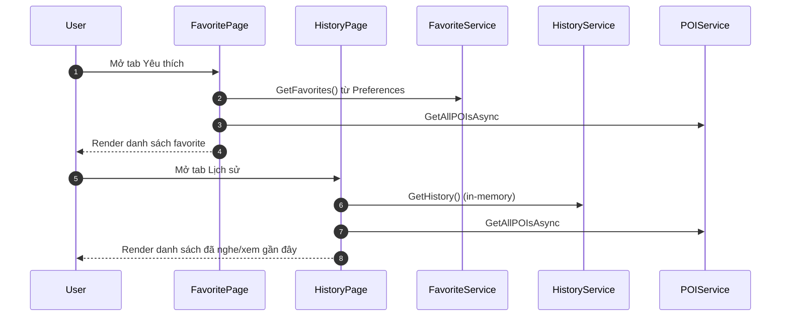
```mermaid
sequenceDiagram
    autonumber
    participant U as User
    participant FAVP as FavoritePage
    participant HISTP as HistoryPage
    participant FAV as FavoriteService
    participant HIST as HistoryService
    participant POI as POIService

    U->>FAVP: Mở tab Yêu thích
    FAVP->>FAV: GetFavorites() từ Preferences
    FAVP->>POI: GetAllPOIsAsync
    FAVP-->>U: Render danh sách favorite

    U->>HISTP: Mở tab Lịch sử
    HISTP->>HIST: GetHistory() (in-memory)
    HISTP->>POI: GetAllPOIsAsync
    HISTP-->>U: Render danh sách đã nghe/xem gần đây
```

## 16. Settings flow

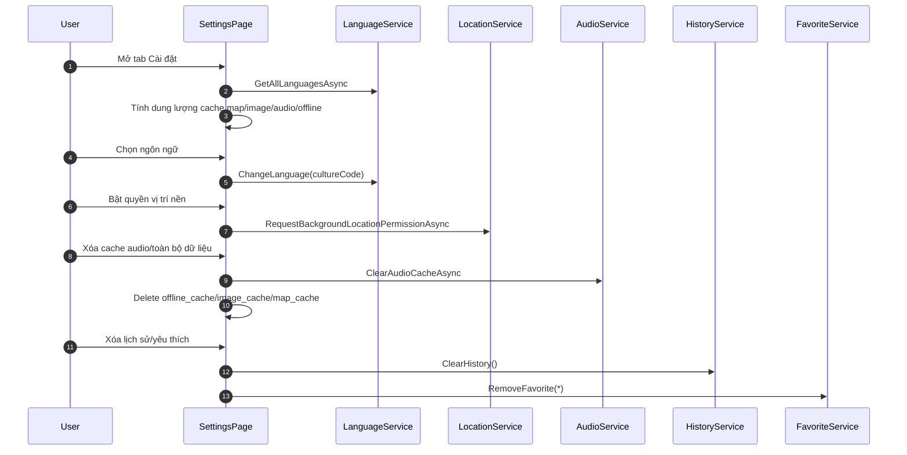
```mermaid
sequenceDiagram
    autonumber
    participant U as User
    participant SET as SettingsPage
    participant LANG as LanguageService
    participant LOC as LocationService
    participant AUD as AudioService
    participant HIST as HistoryService
    participant FAV as FavoriteService

    U->>SET: Mở tab Cài đặt
    SET->>LANG: GetAllLanguagesAsync
    SET->>SET: Tính dung lượng cache map/image/audio/offline

    U->>SET: Chọn ngôn ngữ
    SET->>LANG: ChangeLanguage(cultureCode)

    U->>SET: Bật quyền vị trí nền
    SET->>LOC: RequestBackgroundLocationPermissionAsync

    U->>SET: Xóa cache audio/toàn bộ dữ liệu
    SET->>AUD: ClearAudioCacheAsync
    SET->>SET: Delete offline_cache/image_cache/map_cache

    U->>SET: Xóa lịch sử/yêu thích
    SET->>HIST: ClearHistory()
    SET->>FAV: RemoveFavorite(*)
```

## 17. Deep link QR flow

```mermaid
sequenceDiagram
    autonumber
    participant U as User
    participant AND as Android Intent
    participant MA as MainActivity
    participant DISP as AppLinkDispatcher
    participant APP as App
    participant QR as QrAccessService

    U->>AND: Mở link foodmarketnarrator://open
    AND->>MA: OnCreate/OnNewIntent
    MA->>DISP: Dispatch(url)
    DISP->>APP: DeepLinkReceived event
    APP->>QR: ApplyDeepLink(url)
    QR->>QR: Validate scheme=foodmarketnarrator, host=open
    QR-->>APP: Accept/ignore deep link
```

---

## Endpoint chính app đang gọi

- GET /restaurant
- GET /language
- GET /tour
- GET /tour/{id}
- GET /Restaurant/{restaurantId}/dishes
- POST /api/user-sessions/start
- POST /api/location-logs/batch
- POST /api/audio-logs

---

## Các flow đã bỏ hoặc đã đổi so với bản cũ

- Deep link hiện mới dừng ở bước validate URL hợp lệ, chưa có nhánh điều hướng nghiệp vụ chi tiết theo tham số.
- History đang lưu in-memory (reset khi app đóng), còn favorite lưu bằng Preferences (persist qua phiên).
- Audio playback ưu tiên local cache trước, không phụ thuộc mạng nếu file đã được prefetch.

## Sequence bổ sung

## 18. Use case: Xem danh sách POI

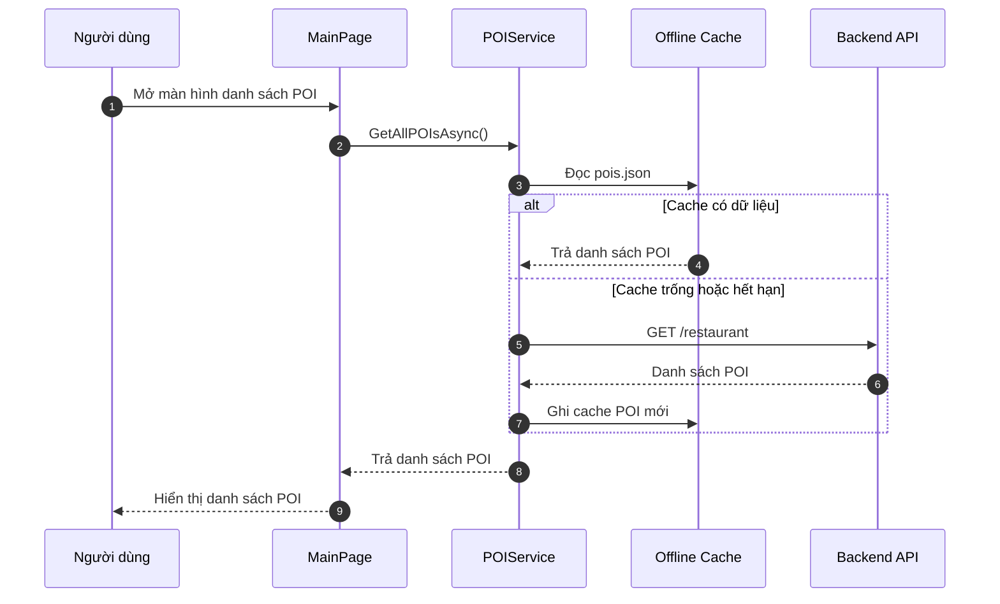
```mermaid
sequenceDiagram
    autonumber
    participant U as Người dùng
    participant MAIN as MainPage
    participant POI as POIService
    participant CACHE as Offline Cache
    participant API as Backend API

    U->>MAIN: Mở màn hình danh sách POI
    MAIN->>POI: GetAllPOIsAsync()
    POI->>CACHE: Đọc pois.json
    alt Cache có dữ liệu
        CACHE-->>POI: Trả danh sách POI
    else Cache trống hoặc hết hạn
        POI->>API: GET /restaurant
        API-->>POI: Danh sách POI
        POI->>CACHE: Ghi cache POI mới
    end
    POI-->>MAIN: Trả danh sách POI
    MAIN-->>U: Hiển thị danh sách POI
```

## 19. Use case: Lọc POI (extend Xem danh sách POI)

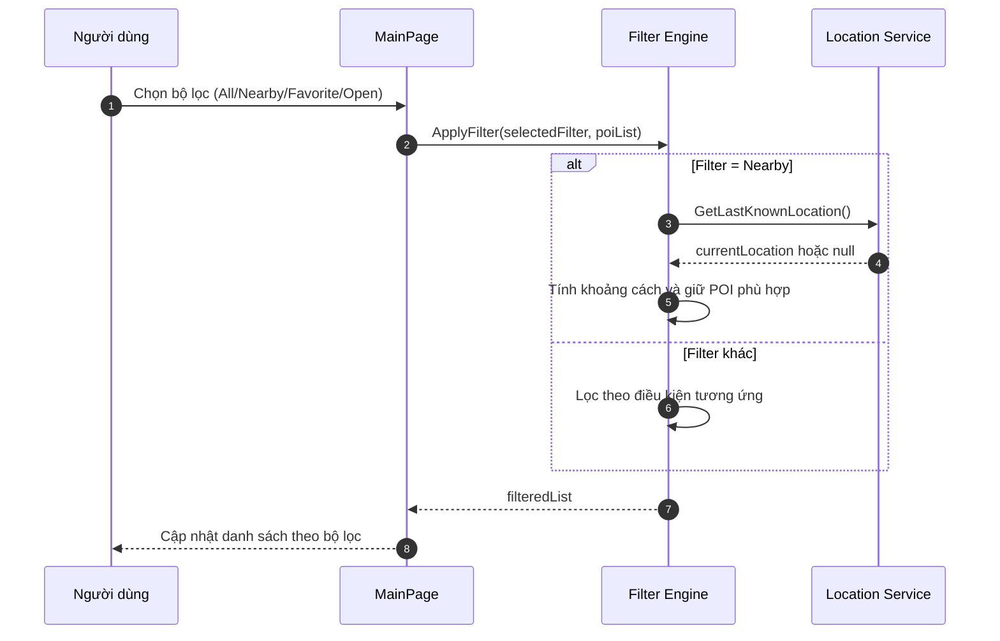
```mermaid
sequenceDiagram
    autonumber
    participant U as Người dùng
    participant MAIN as MainPage
    participant FILTER as Filter Engine
    participant LOC as Location Service

    U->>MAIN: Chọn bộ lọc (All/Nearby/Favorite/Open)
    MAIN->>FILTER: ApplyFilter(selectedFilter, poiList)
    alt Filter = Nearby
        FILTER->>LOC: GetLastKnownLocation()
        LOC-->>FILTER: currentLocation hoặc null
        FILTER->>FILTER: Tính khoảng cách và giữ POI phù hợp
    else Filter khác
        FILTER->>FILTER: Lọc theo điều kiện tương ứng
    end
    FILTER-->>MAIN: filteredList
    MAIN-->>U: Cập nhật danh sách theo bộ lọc
```

## 20. Use case: Tìm kiếm POI (extend Xem danh sách POI)

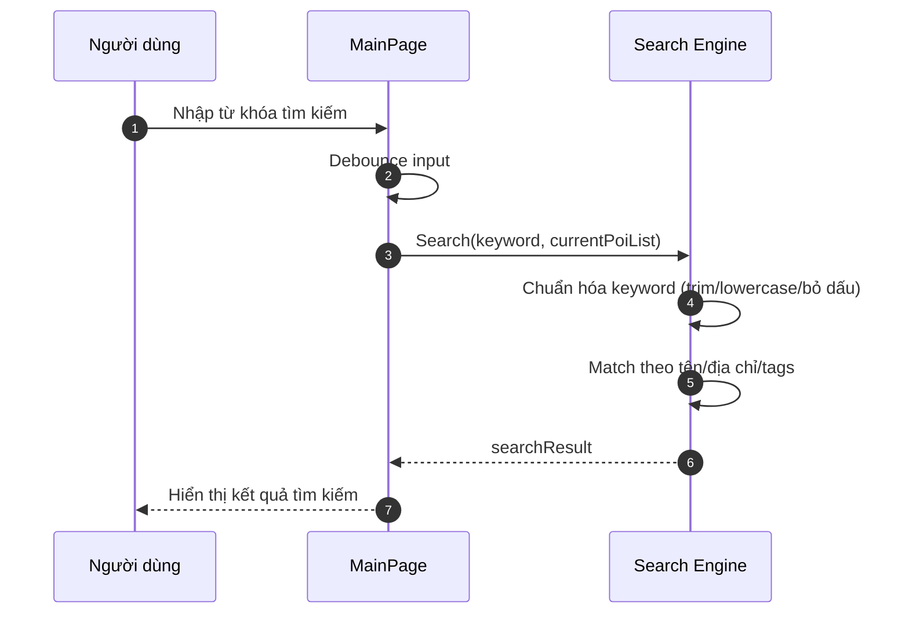
```mermaid
sequenceDiagram
    autonumber
    participant U as Người dùng
    participant MAIN as MainPage
    participant SEARCH as Search Engine

    U->>MAIN: Nhập từ khóa tìm kiếm
    MAIN->>MAIN: Debounce input
    MAIN->>SEARCH: Search(keyword, currentPoiList)
    SEARCH->>SEARCH: Chuẩn hóa keyword (trim/lowercase/bỏ dấu)
    SEARCH->>SEARCH: Match theo tên/địa chỉ/tags
    SEARCH-->>MAIN: searchResult
    MAIN-->>U: Hiển thị kết quả tìm kiếm
```

## 21. Use case: Xem chi tiết POI

```mermaid
sequenceDiagram
    autonumber
    participant U as Người dùng
    participant MAIN as MainPage/MapPage
    participant DETAIL as POIDetailPage
    participant POI as POIService

    U->>MAIN: Chọn một POI từ danh sách/bản đồ
    MAIN->>DETAIL: Navigate POIDetailPage?restaurantId=...
    DETAIL->>POI: GetPOIByIdAsync(restaurantId)
    DETAIL->>POI: GetDishesByRestaurantIdAsync(restaurantId)
    DETAIL->>POI: GetImagesByRestaurantIdAsync(restaurantId)
    DETAIL->>POI: GetAudiosByRestaurantIdAsync(restaurantId)
    POI-->>DETAIL: Trả dữ liệu chi tiết POI
    DETAIL-->>U: Render thông tin + action (nghe/chia sẻ/yêu thích/đường đi/liên hệ)
```

## 22. Use case: Nghe thuyết minh (extend Xem chi tiết POI)

```mermaid
sequenceDiagram
    autonumber
    participant U as Người dùng
    participant DETAIL as POIDetailPage
    participant LANG as LanguageService
    participant AUD as AudioService
    participant CACHE as Audio Cache
    participant NET as Backend API

    U->>DETAIL: Bấm nút Nghe thuyết minh
    DETAIL->>LANG: Lấy ngôn ngữ hiện tại
    LANG-->>DETAIL: languageCode
    DETAIL->>DETAIL: Resolve audio theo language
    DETAIL->>AUD: PlaySound(audioId)
    AUD->>CACHE: Kiểm tra audio cache
    alt Cache hit
        CACHE-->>AUD: Trả file local
    else Cache miss
        AUD->>NET: Tải audio theo endpoint công khai
        NET-->>AUD: Audio bytes
        AUD->>CACHE: Lưu cache audio
    end
    AUD-->>DETAIL: Playback started/ended
    DETAIL-->>U: Cập nhật trạng thái phát
```

## 23. Use case: Yêu thích POI (extend Xem chi tiết POI)

```mermaid
sequenceDiagram
    autonumber
    participant U as Người dùng
    participant DETAIL as POIDetailPage
    participant FAV as FavoriteService
    participant PREF as Preferences

    U->>DETAIL: Bấm Yêu thích/Bỏ yêu thích
    DETAIL->>FAV: ToggleFavorite(restaurantId)
    FAV->>PREF: Đọc danh sách favorites hiện tại
    PREF-->>FAV: favoriteIds
    FAV->>FAV: Add hoặc Remove restaurantId
    FAV->>PREF: Lưu favoriteIds mới
    FAV-->>DETAIL: Trả trạng thái đã cập nhật
    DETAIL-->>U: Đổi icon và thông báo thành công
```

## 24. Use case: Chia sẻ POI (extend Xem chi tiết POI)

```mermaid
    sequenceDiagram
        autonumber
        participant U as Người dùng
        participant DETAIL as POIDetailPage
        participant SHARE as Share Service
        participant OS as Share Sheet (Android)

        U->>DETAIL: Bấm Chia sẻ POI
        DETAIL->>DETAIL: Build nội dung chia sẻ (tên, địa chỉ, link/deep link)
        DETAIL->>SHARE: RequestShareAsync(payload)
        SHARE->>OS: Mở native share sheet
        OS-->>U: Người dùng chọn app nhận chia sẻ
        OS-->>DETAIL: Trạng thái hoàn tất/hủy
        DETAIL-->>U: Giữ nguyên màn hình chi tiết
```

## 25. Use case: Xem đường đi (extend Xem chi tiết POI)

```mermaid
sequenceDiagram
    autonumber
    participant U as Người dùng
    participant DETAIL as POIDetailPage
    participant MAP as Map Launcher
    participant EXT as Ứng dụng bản đồ ngoài

    U->>DETAIL: Bấm Xem đường đi
    DETAIL->>DETAIL: Lấy lat,lng của POI
    DETAIL->>MAP: OpenMapAsync(destination)
    MAP->>EXT: Mở Google Maps/Apple Maps với destination
    EXT-->>U: Hiển thị route từ vị trí hiện tại
```

## 26. Use case: Liên hệ nhà hàng (extend Xem chi tiết POI)

```mermaid
sequenceDiagram
    autonumber
    participant U as Người dùng
    participant DETAIL as POIDetailPage
    participant CONTACT as Contact Launcher
    participant OS as Android Dialer

    U->>DETAIL: Bấm Liên hệ nhà hàng
    DETAIL->>DETAIL: Lấy phone number của POI
    alt Có số điện thoại
        DETAIL->>CONTACT: OpenDialer(phone)
        CONTACT->>OS: Launch tel:phone
        OS-->>U: Hiển thị màn hình gọi điện
    else Không có số điện thoại
        DETAIL-->>U: Thông báo POI chưa có thông tin liên hệ
    end
```

## 27. Use case: Xem danh sách tour

```mermaid
sequenceDiagram
    autonumber
    participant U as Người dùng
    participant TOURP as TourPage
    participant TS as TourService
    participant CACHE as Tour Cache
    participant API as Backend API

    U->>TOURP: Mở tab Hành trình
    TOURP->>TS: GetToursAsync()
    TS->>CACHE: Đọc tour cache (memory/disk)
    alt Cache có dữ liệu hợp lệ
        CACHE-->>TS: tours
    else Cache trống hoặc hết hạn
        TS->>API: GET /tour
        API-->>TS: tours
        TS->>CACHE: Cập nhật tour cache
    end
    TS-->>TOURP: Danh sách tour
    TOURP-->>U: Hiển thị danh sách tour
```

## 28. Use case: Xem chi tiết tour (extend Xem danh sách tour)

```mermaid
sequenceDiagram
    autonumber
    participant U as Người dùng
    participant TOURP as TourPage
    participant DETAIL as TourDetailPage
    participant TS as TourService
    participant POI as POIService

    U->>TOURP: Chọn một tour
    TOURP->>DETAIL: Navigate TourDetailPage?tourId=...
    DETAIL->>TS: GetTourByIdAsync(tourId)
    TS-->>DETAIL: Thông tin tour + danh sách stopIds
    DETAIL->>POI: GetPOIsByIdsAsync(stopIds)
    POI-->>DETAIL: Danh sách POI theo thứ tự điểm dừng
    DETAIL-->>U: Hiển thị mô tả tour, số điểm dừng, thời lượng
```

## 29. Use case: Xem POI trên bản đồ (extend Xem chi tiết tour)

```mermaid
sequenceDiagram
    autonumber
    participant U as Người dùng
    participant DETAIL as TourDetailPage
    participant MAP as MapPage
    participant NF as NarrationFlowService

    U->>DETAIL: Bấm Xem POI trên bản đồ
    DETAIL->>MAP: Navigate //MapPage?tourPoiIds&tourName&tourStopOrders
    MAP->>MAP: Render marker theo tourPoiIds
    MAP->>NF: SetAutoNarrationPoiScope(tourPoiIds)
    MAP-->>U: Hiển thị POI thuộc tour trên bản đồ
```

## 30. Use case: Xem chi tiết POI (extend Xem chi tiết tour)

```mermaid
sequenceDiagram
    autonumber
    participant U as Người dùng
    participant DETAIL as TourDetailPage
    participant MAP as MapPage
    participant POID as POIDetailPage
    participant POI as POIService

    U->>DETAIL: Chọn một điểm dừng trong tour
    alt Chọn từ danh sách điểm dừng
        DETAIL->>POID: Navigate POIDetailPage?restaurantId=...
    else Chọn marker từ bản đồ tour
        DETAIL->>MAP: Navigate //MapPage?tourPoiIds...
        MAP->>POID: Navigate POIDetailPage?restaurantId=...
    end
    POID->>POI: GetPOIByIdAsync(restaurantId)
    POI-->>POID: Dữ liệu chi tiết POI
    POID-->>U: Hiển thị chi tiết POI và các hành động liên quan
```

## 31. Use case: Nghe thuyết minh

```mermaid
sequenceDiagram
    autonumber
    participant U as Người dùng
    participant MAIN as MainPage/MapPage/POIDetailPage
    participant NF as NarrationFlowService
    participant POI as POIService
    participant LANG as LanguageService
    participant AUD as AudioService

    U->>MAIN: Bật chức năng nghe thuyết minh
    MAIN->>NF: StartNarration() hoặc TriggerManualNarration(restaurantId)
    NF->>POI: Resolve POI mục tiêu (theo geofence hoặc theo POI người dùng chọn)
    NF->>LANG: Lấy ngôn ngữ hiện tại
    NF->>NF: Resolve audio phù hợp theo language
    NF->>AUD: Enqueue và PlaySound(audioId)
    AUD-->>NF: Playback started/ended
    NF-->>MAIN: Cập nhật trạng thái phát
    MAIN-->>U: Hiển thị đang phát thuyết minh
```

## 32. Use case: Nghe thuyết minh tự động (extend Nghe thuyết minh)

```mermaid
sequenceDiagram
    autonumber
    participant LOC as LocationChanged Event
    participant NF as NarrationFlowService
    participant POI as POIService
    participant AUD as AudioService

    LOC->>NF: OnLocationChanged(location)
    NF->>POI: UpdateNearestPOI(lat,lng)
    alt Enter hoặc Switch POI trong geofence
        POI-->>NF: targetPoi
        NF->>NF: Check distance/cooldown/played list
        alt Đủ điều kiện tự động phát
            NF->>AUD: PlaySound(audioId của targetPoi)
            AUD-->>NF: Playback started
        else Không đủ điều kiện
            NF->>NF: Bỏ qua lần trigger này
        end
    else Không có geofence transition
        POI-->>NF: null
    end
```

## 33. Use case: Nghe thủ công (extend Nghe thuyết minh)

```mermaid
sequenceDiagram
    autonumber
    participant U as Người dùng
    participant DETAIL as POIDetailPage
    participant NF as NarrationFlowService
    participant AUD as AudioService

    U->>DETAIL: Bấm nút Nghe
    DETAIL->>NF: TriggerManualNarration(restaurantId)
    NF->>NF: Bỏ qua rule auto (distance/cooldown) cho manual trigger
    NF->>AUD: Stop audio hiện tại (nếu có)
    NF->>AUD: PlaySound(audioId)
    AUD-->>DETAIL: Playback started/ended
    DETAIL-->>U: Cập nhật Play/Pause/Progress
```

## 34. Use case: Chọn ngôn ngữ thuyết minh (extend Nghe thuyết minh)

```mermaid
sequenceDiagram
    autonumber
    participant U as Người dùng
    participant SET as SettingsPage
    participant LANG as LanguageService
    participant NF as NarrationFlowService
    participant AUD as AudioService

    U->>SET: Chọn ngôn ngữ thuyết minh
    SET->>LANG: ChangeLanguage(cultureCode)
    LANG-->>SET: Đổi ngôn ngữ thành công
    alt Đang phát audio
        SET->>NF: RequestReloadCurrentPoiNarration()
        NF->>AUD: Stop audio hiện tại
        NF->>NF: Resolve audio mới theo language vừa chọn
        NF->>AUD: PlaySound(audioId mới)
    else Chưa phát audio
        SET->>SET: Lưu preference cho lần phát kế tiếp
    end
    SET-->>U: Thông báo đã cập nhật ngôn ngữ
```

## 35. Use case: Phát lại audio (extend Nghe thuyết minh)

```mermaid
sequenceDiagram
    autonumber
    participant U as Người dùng
    participant DETAIL as POIDetailPage
    participant AUD as AudioService
    participant CACHE as Audio Cache

    U->>DETAIL: Bấm Phát lại
    DETAIL->>AUD: Replay(audioId)
    AUD->>CACHE: Kiểm tra file local đã cache
    alt Có file local
        CACHE-->>AUD: Trả stream local
        AUD->>AUD: Seek(0) và phát lại
    else Không có cache
        AUD->>AUD: Tải lại audio rồi phát từ đầu
    end
    AUD-->>DETAIL: Playback restarted
    DETAIL-->>U: Hiển thị audio đang phát lại
```

## 36. Use case: Xem dung lượng bộ nhớ đệm

```mermaid
sequenceDiagram
    autonumber
    participant U as Người dùng
    participant SET as SettingsPage
    participant CM as CacheManager
    participant FS as File System

    U->>SET: Mở Cài đặt và vào mục bộ nhớ đệm
    SET->>CM: GetCacheUsageSummaryAsync()
    CM->>FS: Scan thư mục audio/image/map/offline cache
    FS-->>CM: Kích thước từng thư mục
    CM-->>SET: Tổng dung lượng + breakdown theo loại
    SET-->>U: Hiển thị dung lượng bộ nhớ đệm
```

## 37. Use case: Xem chi tiết dung lượng (extend Xem dung lượng bộ nhớ đệm)

```mermaid
sequenceDiagram
    autonumber
    participant U as Người dùng
    participant SET as SettingsPage
    participant CM as CacheManager
    participant FS as File System

    U->>SET: Bấm xem chi tiết dung lượng
    SET->>CM: GetCacheUsageDetailsAsync()
    CM->>FS: Liệt kê file theo từng vùng cache
    FS-->>CM: Danh sách file + size + modified time
    CM->>CM: Gom nhóm theo loại và sắp xếp dung lượng giảm dần
    CM-->>SET: Chi tiết từng nhóm cache
    SET-->>U: Hiển thị màn hình chi tiết dung lượng
```

## 38. Use case: Xóa bộ nhớ đệm (extend Xem dung lượng bộ nhớ đệm)

```mermaid
sequenceDiagram
    autonumber
    participant U as Người dùng
    participant SET as SettingsPage
    participant CM as CacheManager
    participant AUD as AudioService
    participant FS as File System

    U->>SET: Chọn xóa bộ nhớ đệm
    SET->>SET: Hiển thị confirm dialog
    alt Người dùng xác nhận
        SET->>AUD: ClearAudioCacheAsync()
        SET->>CM: ClearCacheAsync(selectedScopes)
        CM->>FS: Xóa file trong audio/image/map/offline cache
        FS-->>CM: Kết quả xóa
        CM-->>SET: Success + dung lượng đã giải phóng
        SET-->>U: Thông báo xóa thành công
    else Người dùng hủy
        SET-->>U: Giữ nguyên dữ liệu cache
    end
```

## 39. Use case: Xem danh sách POI yêu thích

```mermaid
sequenceDiagram
    autonumber
    participant U as Người dùng
    participant FAVP as FavoritePage
    participant FAV as FavoriteService
    participant POI as POIService

    U->>FAVP: Mở tab Yêu thích
    FAVP->>FAV: GetFavorites()
    FAV-->>FAVP: Danh sách favoriteIds
    FAVP->>POI: GetAllPOIsAsync()
    POI-->>FAVP: Danh sách POI
    FAVP->>FAVP: Join favoriteIds với POI data
    FAVP-->>U: Hiển thị danh sách POI yêu thích
```

## 40. Use case: Xóa POI khỏi danh sách yêu thích

```mermaid
sequenceDiagram
    autonumber
    participant U as Người dùng
    participant FAVP as FavoritePage/POIDetailPage
    participant FAV as FavoriteService
    participant PREF as Preferences

    U->>FAVP: Bấm bỏ yêu thích một POI
    FAVP->>FAV: RemoveFavorite(restaurantId)
    FAV->>PREF: Đọc danh sách favoriteIds hiện tại
    PREF-->>FAV: favoriteIds
    FAV->>FAV: Remove restaurantId khỏi danh sách
    FAV->>PREF: Lưu favoriteIds mới
    FAV-->>FAVP: Trả trạng thái đã cập nhật
    FAVP-->>U: POI biến mất khỏi danh sách yêu thích
```

## 41. Use case: Xem chi tiết POI (extend Xem danh sách POI yêu thích)

```mermaid
sequenceDiagram
    autonumber
    participant U as Người dùng
    participant FAVP as FavoritePage
    participant DETAIL as POIDetailPage
    participant POI as POIService

    U->>FAVP: Chọn một POI yêu thích
    FAVP->>DETAIL: Navigate POIDetailPage?restaurantId=...
    DETAIL->>POI: GetPOIByIdAsync(restaurantId)
    DETAIL->>POI: GetDishesByRestaurantIdAsync(restaurantId)
    DETAIL->>POI: GetAudiosByRestaurantIdAsync(restaurantId)
    POI-->>DETAIL: Dữ liệu chi tiết POI
    DETAIL-->>U: Hiển thị thông tin chi tiết POI
```

## 42. Use case: Xem lịch sử đã nghe

```mermaid
sequenceDiagram
    autonumber
    participant U as Người dùng
    participant HISTP as HistoryPage
    participant HIST as HistoryService
    participant POI as POIService

    U->>HISTP: Mở tab Lịch sử
    HISTP->>HIST: GetHistory()
    HIST-->>HISTP: Danh sách lịch sử đã nghe
    HISTP->>POI: GetAllPOIsAsync()
    POI-->>HISTP: Danh sách POI
    HISTP->>HISTP: Mapping history entries với POI data
    HISTP-->>U: Hiển thị lịch sử đã nghe
```

## 43. Use case: Xóa lịch sử (extend Xem lịch sử đã nghe)

```mermaid
sequenceDiagram
    autonumber
    participant U as Người dùng
    participant HISTP as HistoryPage
    participant HIST as HistoryService

    U->>HISTP: Bấm Xóa lịch sử
    HISTP->>HISTP: Hiển thị confirm dialog
    alt Người dùng xác nhận
        HISTP->>HIST: ClearHistory()
        HIST-->>HISTP: Clear thành công
        HISTP-->>U: Danh sách lịch sử trống
    else Người dùng hủy
        HISTP-->>U: Giữ nguyên dữ liệu lịch sử
    end
```

## 44. Use case: Xem chi tiết POI (extend Xem lịch sử đã nghe)

```mermaid
sequenceDiagram
    autonumber
    participant U as Người dùng
    participant HISTP as HistoryPage
    participant DETAIL as POIDetailPage
    participant POI as POIService

    U->>HISTP: Chọn một item trong lịch sử đã nghe
    HISTP->>DETAIL: Navigate POIDetailPage?restaurantId=...
    DETAIL->>POI: GetPOIByIdAsync(restaurantId)
    DETAIL->>POI: GetDishesByRestaurantIdAsync(restaurantId)
    DETAIL->>POI: GetAudiosByRestaurantIdAsync(restaurantId)
    POI-->>DETAIL: Dữ liệu chi tiết POI
    DETAIL-->>U: Hiển thị chi tiết POI
```

## 45. Use case: Theo dõi vị trí

```mermaid
sequenceDiagram
    autonumber
    participant U as Người dùng
    participant MAIN as MainPage
    participant LOC as LocationService
    participant OS as Android Permissions
    participant FG as TrackingForegroundService

    U->>MAIN: Bật theo dõi vị trí
    MAIN->>LOC: StartTrackingAsync()
    LOC->>OS: Check LocationWhenInUse permission
    alt Đã có quyền truy cập
        LOC->>FG: Start foreground service
        LOC->>LOC: RunTrackingLoop mỗi 2s
        LOC-->>MAIN: Publish LocationChanged/LocationSampled
        MAIN-->>U: Trạng thái đang theo dõi vị trí
    else Chưa có quyền
        LOC-->>MAIN: Yêu cầu xin quyền truy cập trước
        MAIN-->>U: Hiển thị trạng thái chưa thể theo dõi
    end
```

## 46. Use case: Xin quyền truy cập (include Theo dõi vị trí)

```mermaid
sequenceDiagram
    autonumber
    participant U as Người dùng
    participant MAIN as MainPage
    participant LOC as LocationService
    participant OS as Android Permissions

    U->>MAIN: Bật theo dõi vị trí khi chưa có quyền
    MAIN->>LOC: RequestLocationPermissionAsync()
    LOC->>OS: Request LocationWhenInUse
    alt Người dùng cấp quyền
        OS-->>LOC: Granted
        LOC-->>MAIN: PermissionGranted
        MAIN-->>U: Cho phép bật tracking
    else Người dùng từ chối
        OS-->>LOC: Denied
        LOC-->>MAIN: PermissionDenied
        MAIN-->>U: Hướng dẫn cấp quyền trong cài đặt hệ thống
    end
```

## 47. Use case: Xin quyền chạy nền (extend Theo dõi vị trí)

```mermaid
sequenceDiagram
    autonumber
    participant U as Người dùng
    participant SET as SettingsPage
    participant LOC as LocationService
    participant OS as Android Permissions

    U->>SET: Bật quyền chạy nền cho tracking
    SET->>LOC: RequestBackgroundLocationPermissionAsync()
    LOC->>OS: Request LocationAlways (Android 10+)
    alt Người dùng cấp quyền
        OS-->>LOC: Granted
        LOC-->>SET: BackgroundPermissionGranted
        SET-->>U: Tracking có thể chạy nền ổn định
    else Người dùng từ chối
        OS-->>LOC: Denied
        LOC-->>SET: BackgroundPermissionDenied
        SET-->>U: Thông báo giới hạn tracking khi app nền
    end
```

## 48. Use case: Tắt theo dõi vị trí (extend Theo dõi vị trí)

```mermaid
sequenceDiagram
    autonumber
    participant U as Người dùng
    participant MAIN as MainPage/SettingsPage
    participant LOC as LocationService
    participant FG as TrackingForegroundService

    U->>MAIN: Tắt theo dõi vị trí
    MAIN->>LOC: StopTrackingAsync()
    LOC->>LOC: Hủy timer/loop và unsubscribe event
    LOC->>FG: Stop foreground service
    LOC-->>MAIN: TrackingStopped
    MAIN-->>U: Trạng thái đã tắt theo dõi vị trí
```

## 49. Use case: Chọn ngôn ngữ ứng dụng (dịch UI + dữ liệu theo ngôn ngữ)

```mermaid
sequenceDiagram
    autonumber
    participant U as Người dùng
    participant SET as SettingsPage
    participant LANG as LanguageService
    participant PREF as Preferences
    participant LRM as LocalizationResourceManager
    participant RES as Resource Files (.resx)
    participant PAGE as MainPage/MapPage/POIDetailPage/TourPage
    participant POI as POIService/TourService
    participant API as Backend API
    participant CACHE as Offline Cache

    U->>SET: Chọn ngôn ngữ mới (vd: en, vi, ja)
    SET->>LANG: ChangeLanguage(cultureCode)
    LANG->>PREF: Lưu app_language = cultureCode
    LANG->>LRM: SetCulture(cultureCode)

    PAGE->>LRM: Resolve text theo cultureCode
    LRM->>RES: Lấy text resource theo ngôn ngữ
    alt Có resource đúng ngôn ngữ
        RES-->>LRM: Localized strings
    else Thiếu key hoặc thiếu culture
        RES-->>LRM: Fallback strings (default language)
    end
    LRM-->>PAGE: Trả text đã localize

    PAGE->>LANG: GetCurrentLanguage()
    LANG-->>PAGE: languageCode
    PAGE->>POI: LoadDataAsync(languageCode)
    POI->>API: GET data kèm languageCode (header/query/path)
    alt API trả dữ liệu đúng ngôn ngữ
        API-->>POI: POI/Tour/Dishes đã localize
        POI->>CACHE: Cập nhật cache theo languageCode
        POI-->>PAGE: Trả data theo ngôn ngữ đã chọn
    else Offline hoặc thiếu bản dịch
        POI->>CACHE: Đọc cache theo languageCode
        alt Có cache cùng language
            CACHE-->>POI: Data localized từ cache
        else Không có cache cùng language
            CACHE-->>POI: Fallback cache mặc định
        end
        POI-->>PAGE: Trả data fallback
    end
    PAGE->>PAGE: Re-render UI text + danh sách/chi tiết theo ngôn ngữ mới
    SET-->>U: Hoàn tất đổi ngôn ngữ toàn ứng dụng
```
