# Flow Sequence App

Tài liệu mô tả flow thực tế của ứng dụng mobile trong thư mục FoodMarketNarrator.Maui (snapshot theo code hiện tại).

## Phạm vi và ghi chú

- App dùng .NET MAUI, điều hướng bằng AppShell với 6 tab: MainPage, MapPage, TourPage, FavoritePage, HistoryPage, SettingsPage.
- Khi app start sẽ chạy warm-up nền, khởi động tracking GPS và đồng bộ log location.
- Narration tự chạy theo geofence khi bật narration flow.
- Deep link hiện nhận scheme foodmarketnarrator://open, validate hợp lệ rồi apply qua QrAccessService.
- Dữ liệu có cơ chế offline cache cho POI, language, dishes, tours, images, audio.

## Tóm tắt chức năng theo sequence

1.Khởi Động App
Khởi tạo AppShell và giao diện tab, xử lý deep link đầu vào (nếu có), đồng thời kích hoạt các dịch vụ nền quan trọng gồm warm-up dữ liệu, khởi tạo audio, đồng bộ location log và bắt đầu tracking GPS.

2.Warm-up dữ liệu nền
Tải sẵn language, tour, POI và khởi chạy job làm ấm dữ liệu phụ (ảnh, món ăn) để giảm độ trễ khi người dùng mở các tab.

3.Bootstrap audio library khi startup
Chuẩn bị audio theo trạng thái online/offline, đồng bộ bản mới, đặt cờ sẵn sàng phát để narration không bị khựng.

4.Theo dõi vị trí và quyền truy cập
Xin quyền location/notification theo đúng Android version, bật foreground service và publish sự kiện vị trí theo ngưỡng di chuyển.

5.Đồng bộ session và location logs
Mở phiên theo dõi, gửi log vị trí định kỳ; nếu lỗi thì giữ batch để retry, tránh mất dữ liệu tracking.

6.Geofence enter/exit/switch
Từ luồng vị trí, xác định vào vùng, ra vùng, hoặc chuyển POI; có hysteresis để tránh rung biên.

7.Bật/tắt narration tự động
Quản lý vòng đời chế độ thuyết minh: start thì subscribe tracking và reset state, stop thì dọn queue và dừng audio.

8.Trigger phát audio theo POI
Áp dụng rule chống lặp (distance, cooldown, played list), chọn audio theo ngôn ngữ rồi phát và ghi nhận đã phát.

9.Playback nguồn audio và cache
Ưu tiên cache local, nếu thiếu mới tải mạng và lưu lại theo chính sách LRU để dùng lại offline.

10.Ghi audio logs khi phát
Ghi lại thời điểm bắt đầu/kết thúc playback, gửi backend phục vụ thống kê và phân tích hành vi nghe.

11.MainPage: danh sách POI và điều hướng chi tiết
Tải danh sách POI, filter theo ngữ cảnh và điều hướng vào trang chi tiết từng địa điểm.

12.MapPage: lọc/scope POI và tương tác bản đồ
Hiển thị marker, hỗ trợ tìm kiếm/lọc, giới hạn scope theo tour và điều hướng nhanh sang chi tiết.

13.POIDetail: phát thủ công, favorite, chỉ đường
Cung cấp thao tác trực tiếp trên một POI: nghe audio thủ công, thêm yêu thích, mở app bản đồ để dẫn đường.

14.Tour flow
Tải danh sách tour, cho phép bắt đầu tour để nhảy sang map với danh sách điểm dừng đúng thứ tự.

15.Favorites và History flow
Hiển thị danh sách yêu thích và lịch sử đã xem/nghe, kết hợp dữ liệu POI để render thông tin đầy đủ.

16.Settings flow
Đổi ngôn ngữ, xin quyền vị trí nền, xóa cache/dữ liệu cục bộ, dọn lịch sử/yêu thích.

17.Deep link QR flow
Nhận link từ Android intent, dispatch vào app, validate scheme/host rồi apply qua QrAccessService.

## 1. Khởi tạo ứng dụng

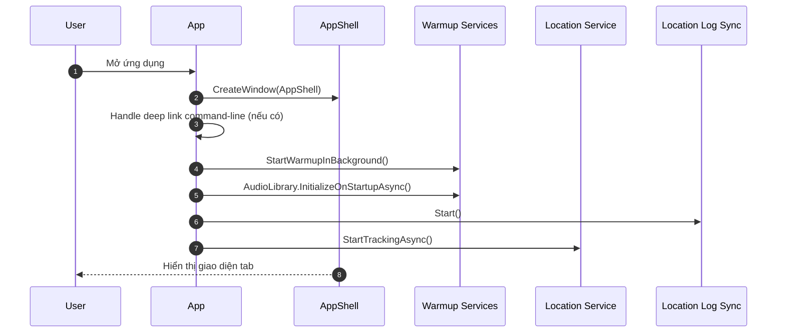

## 2. Warm-up dữ liệu nền

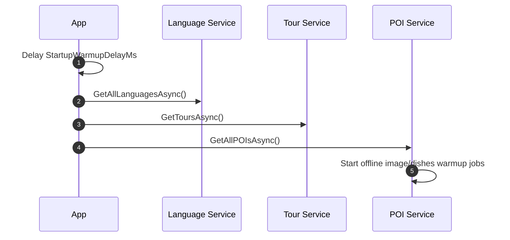

## 3. Bootstrap audio library khi startup

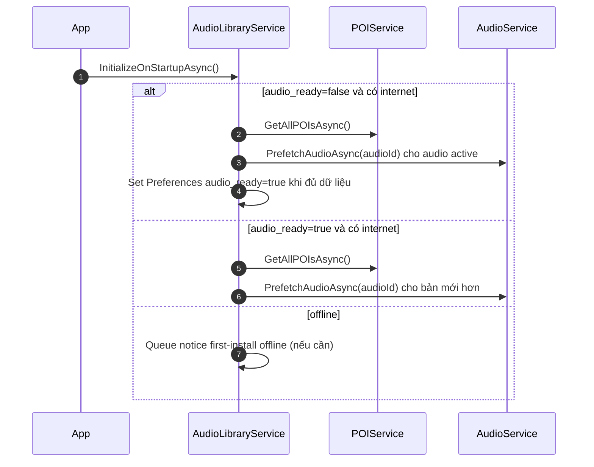

## 4. Theo dõi vị trí và quyền truy cập

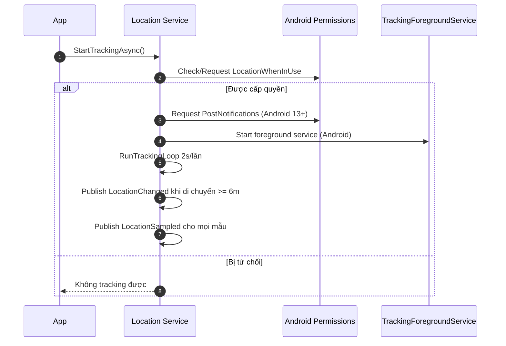

## 5. Đồng bộ session và location logs

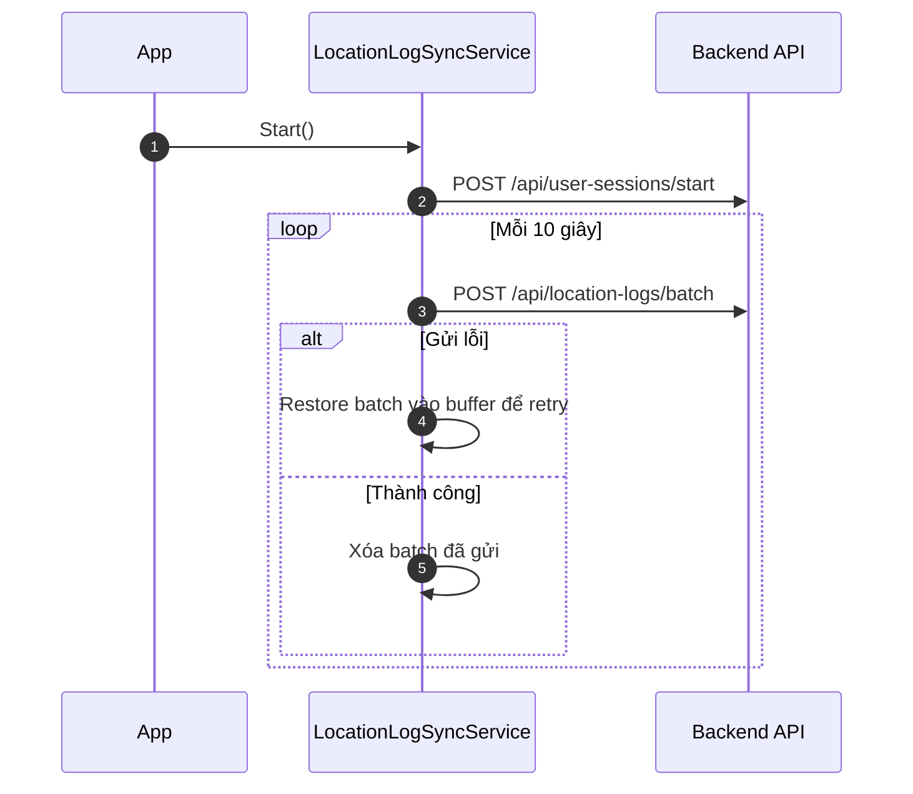

## 6. Geofence enter/exit/switch

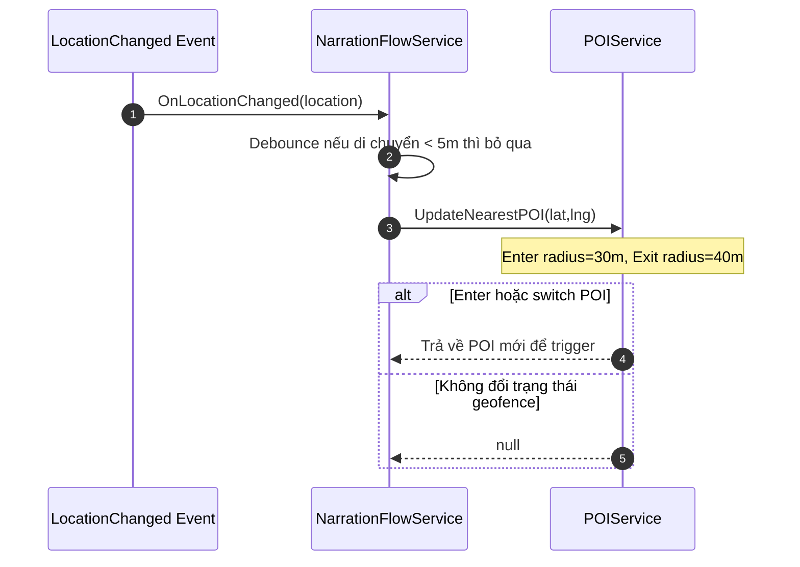

## 7. Bật/tắt narration tự động

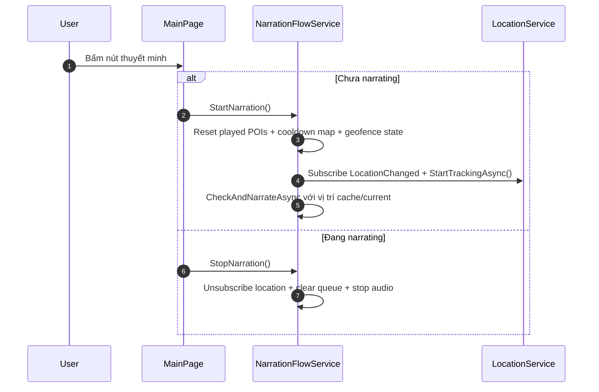

## 8. Trigger phát audio theo POI

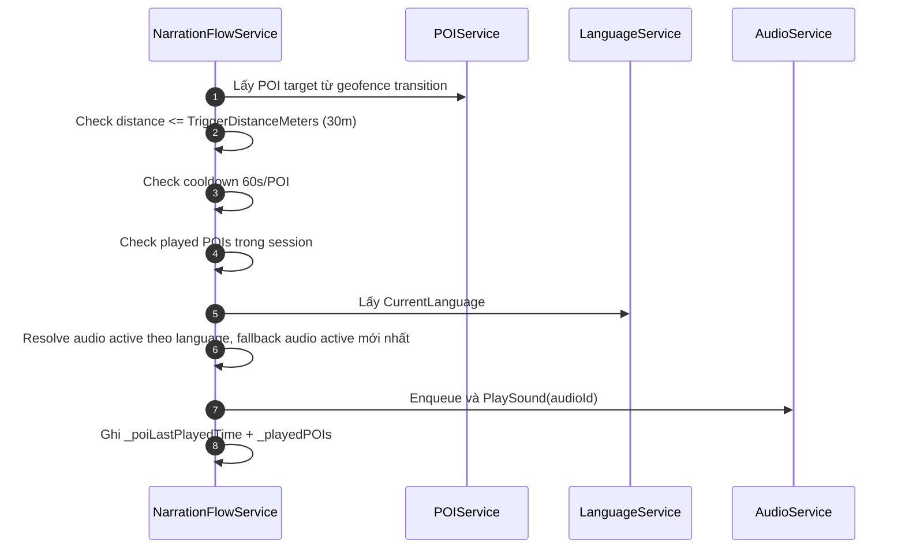

## 9. Playback nguồn audio và cache

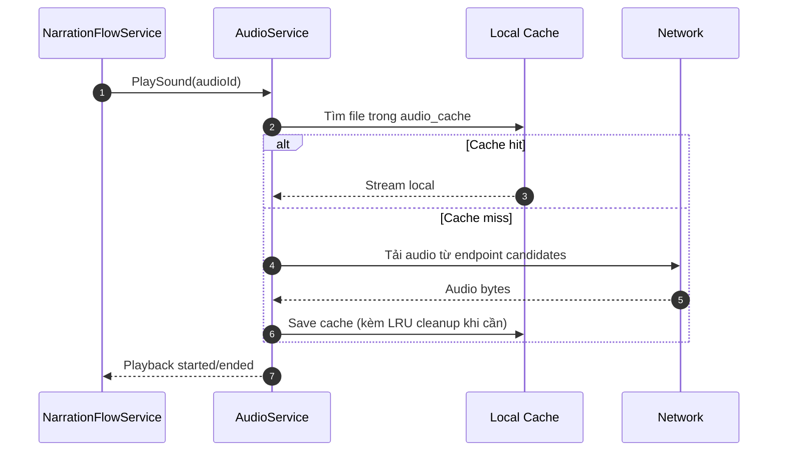

## 10. Ghi audio logs khi phát

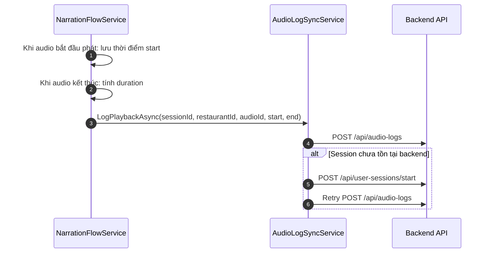

## 11. MainPage: danh sách POI và điều hướng chi tiết

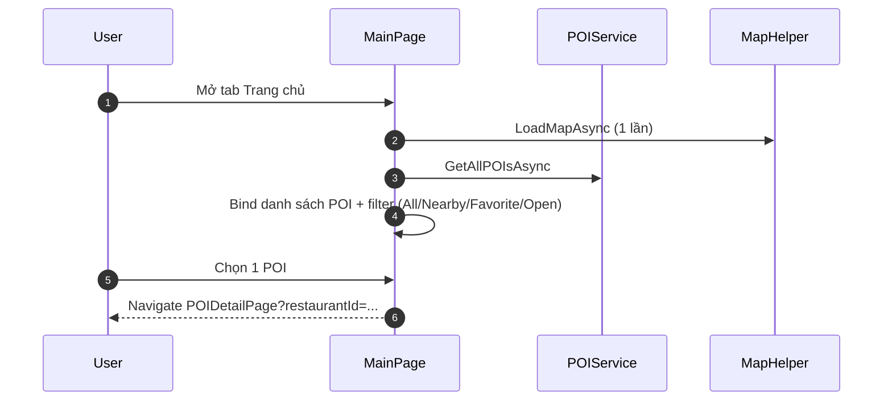

## 12. MapPage: lọc/scope POI và map interaction

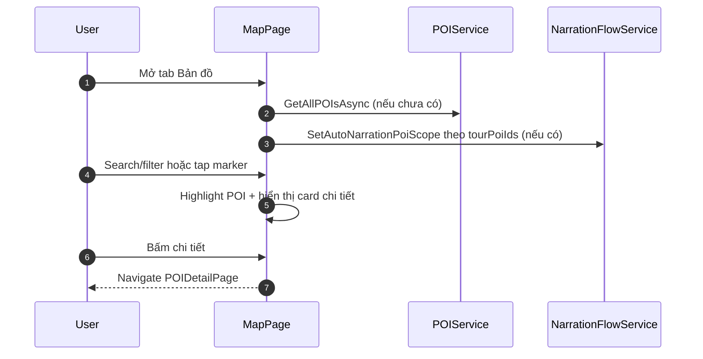

## 13. POIDetail: phát audio thủ công, favorite, direction

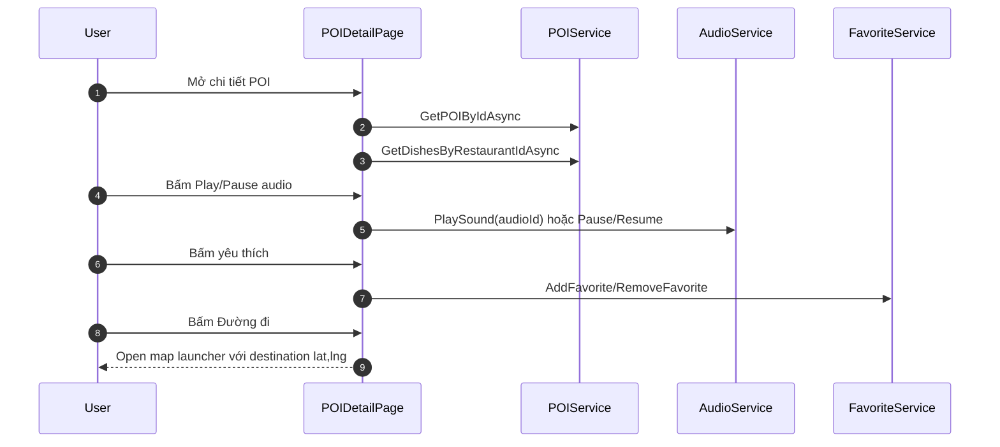

## 14. Tour flow

```mermaid
sequenceDiagram
    autonumber
    participant U as User
    participant TOURP as TourPage
    participant TS as TourService
    participant MAP as MapPage

    U->>TOURP: Mở tab Hành trình
    TOURP->>TS: GetToursAsync
    TS->>TS: Dùng memory/disk cache; refresh network nếu cần
    TOURP-->>U: Hiển thị tour active
    U->>TOURP: Bấm Bắt đầu hoặc Xem chi tiết
    alt Bắt đầu
        TOURP-->>MAP: Navigate //MapPage?tourPoiIds&tourName&tourStopOrders
    else Xem chi tiết
        TOURP-->>U: Navigate TourDetailPage?tourId
    end
```

## 15. Favorites và History flow

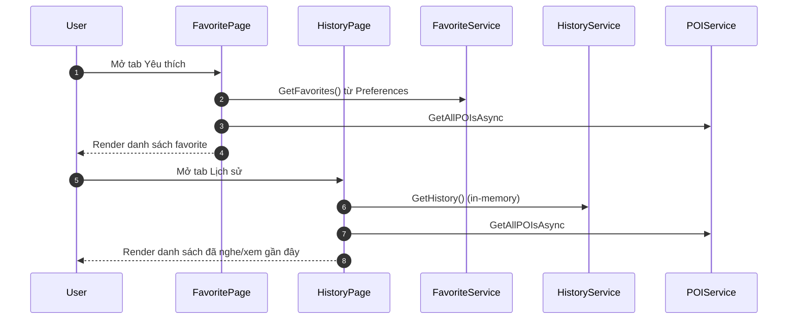

## 16. Settings flow

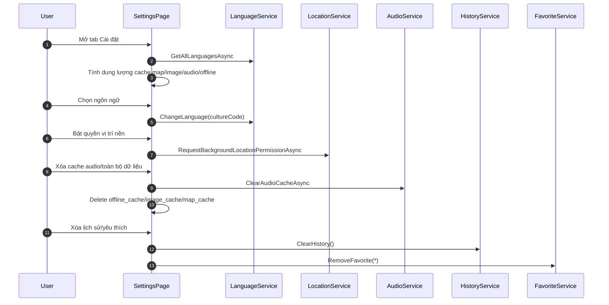

## 17. Deep link QR flow

```mermaid
sequenceDiagram
    autonumber
    participant U as User
    participant AND as Android Intent
    participant MA as MainActivity
    participant DISP as AppLinkDispatcher
    participant APP as App
    participant QR as QrAccessService

    U->>AND: Mở link foodmarketnarrator://open
    AND->>MA: OnCreate/OnNewIntent
    MA->>DISP: Dispatch(url)
    DISP->>APP: DeepLinkReceived event
    APP->>QR: ApplyDeepLink(url)
    QR->>QR: Validate scheme=foodmarketnarrator, host=open
    QR-->>APP: Accept/ignore deep link
```

---

## Endpoint chính app đang gọi

- GET /restaurant
- GET /language
- GET /tour
- GET /tour/{id}
- GET /Restaurant/{restaurantId}/dishes
- POST /api/user-sessions/start
- POST /api/location-logs/batch
- POST /api/audio-logs

---

## Các flow đã bỏ hoặc đã đổi so với bản cũ

- Deep link hiện mới dừng ở bước validate URL hợp lệ, chưa có nhánh điều hướng nghiệp vụ chi tiết theo tham số.
- History đang lưu in-memory (reset khi app đóng), còn favorite lưu bằng Preferences (persist qua phiên).
- Audio playback ưu tiên local cache trước, không phụ thuộc mạng nếu file đã được prefetch.