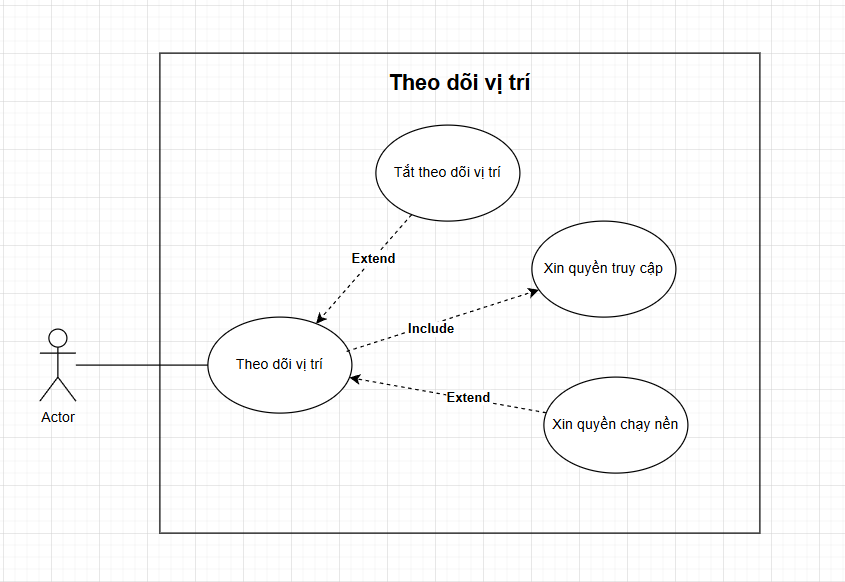
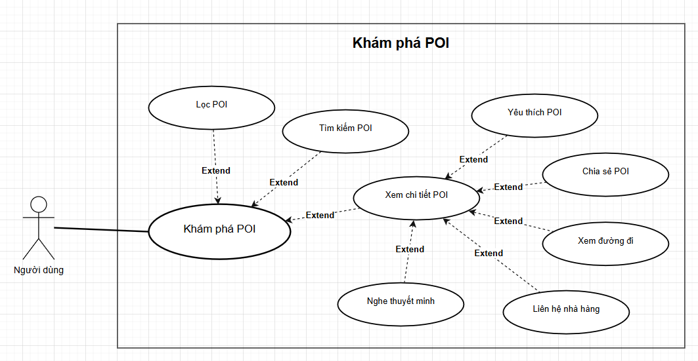
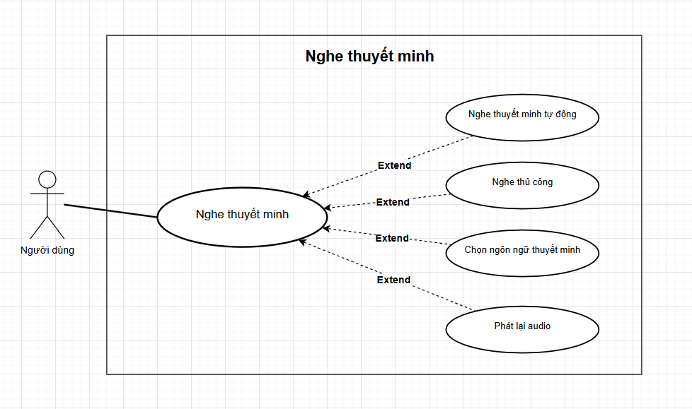
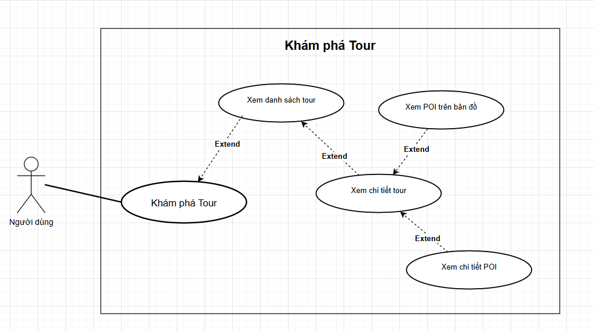
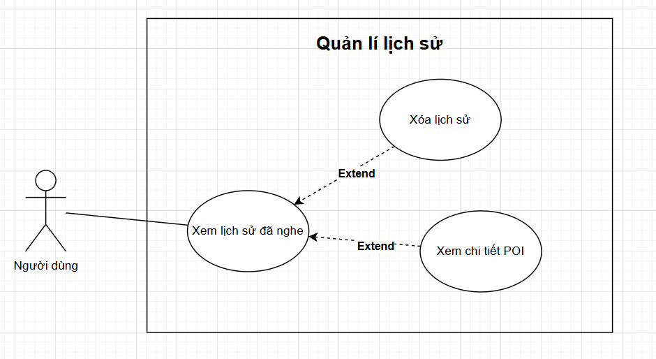
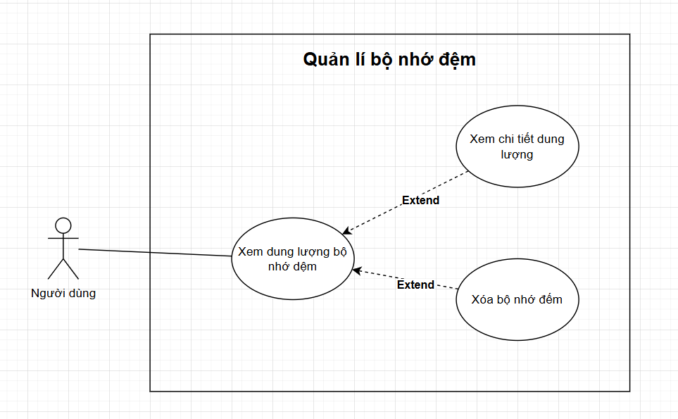

# ĐẶC TẢ USE CASE APP (CẬP NHẬT)

Tài liệu này cập nhật đặc tả use case theo phiên bản mới trong file `usecase_app.drawio` và các ảnh minh họa trong cùng thư mục.

## 1. Usecase App - Tổng quát

Ảnh use case: 

- Tên use case: Usecase tổng quát App
- Tác nhân: Người dùng
- Mô tả: Người dùng sử dụng các chức năng chính của app gồm theo dõi vị trí, khám phá POI/tour, nghe thuyết minh, quản lý yêu thích/lịch sử và quản lí bộ nhớ đệm.
- Tiền điều kiện: App đã cài đặt và mở thành công.
- Hậu điều kiện: Người dùng hoàn thành một hoặc nhiều thao tác chính trong hệ thống.
- Luồng chính:

1. Người dùng vào app.
2. Người dùng chọn một chức năng cần dùng.
3. Hệ thống mở màn hình chức năng tương ứng.
4. Người dùng thực hiện thao tác và nhận kết quả.

- Luồng thay thế:

1. Người dùng bỏ qua một số chức năng và chỉ dùng chức năng cần thiết.
2. Nếu thiếu quyền hoặc thiếu dữ liệu, một số chức năng liên quan bị hạn chế.

## 2. Usecase App - Theo dõi vị trí

Ảnh use case: 

- Tên use case: Theo dõi vị trí
- Tác nhân: Người dùng
- Mô tả: Người dùng bật theo dõi vị trí để app hỗ trợ các chức năng liên quan địa điểm.
- Tiền điều kiện: Thiết bị hỗ trợ GPS.
- Hậu điều kiện: Theo dõi vị trí được bật/tắt theo thao tác người dùng.
- Luồng chính:

1. Người dùng bật theo dõi vị trí.
2. Hệ thống yêu cầu quyền truy cập vị trí (`include`).
3. Người dùng chấp nhận quyền.
4. Hệ thống kích hoạt theo dõi vị trí.

- Luồng thay thế:

1. Người dùng từ chối quyền truy cập thì hệ thống thông báo không thể theo dõi vị trí.
2. Người dùng bật quyền chạy nền (`extend`) khi cần theo dõi ổn định ngoài màn hình chính.
3. Người dùng tắt theo dõi vị trí (`extend`).

## 3. Usecase App - Khám phá POI

Ảnh use case: 

- Tên use case: Khám phá POI
- Tác nhân: Người dùng
- Mô tả: Người dùng duyệt, tìm kiếm, lọc và xem chi tiết POI để thực hiện các thao tác liên quan.
- Tiền điều kiện: Danh sách POI có sẵn.
- Hậu điều kiện: Người dùng xác định được POI mong muốn và thực hiện thao tác kế tiếp.
- Luồng chính:

1. Người dùng mở chức năng khám phá POI.
2. Người dùng có thể tìm kiếm hoặc lọc POI (`extend`).
3. Người dùng xem chi tiết POI (`extend`).
4. Từ chi tiết POI, người dùng có thể yêu thích/chia sẻ/xem đường đi/liên hệ nhà hàng/nghe thuyết minh (`extend`).

- Luồng thay thế:

1. Không có kết quả phù hợp, hệ thống hiển thị trạng thái rỗng.
2. Không tải được chi tiết POI, hệ thống thông báo và cho thử lại.

## 4. Usecase App - Nghe thuyết minh

Ảnh use case: 

- Tên use case: Nghe thuyết minh
- Tác nhân: Người dùng
- Mô tả: Người dùng nghe thuyết minh cho POI theo nhu cầu và ngôn ngữ mong muốn.
- Tiền điều kiện: POI có nội dung audio khả dụng.
- Hậu điều kiện: Người dùng nghe được nội dung thuyết minh mong muốn.
- Luồng chính:

1. Người dùng mở chức năng nghe thuyết minh.
2. Người dùng chọn cách nghe: tự động hoặc thủ công (`extend`).
3. Người dùng chọn ngôn ngữ thuyết minh (`extend`).
4. Hệ thống phát audio.
5. Người dùng có thể phát lại audio (`extend`).

- Luồng thay thế:

1. Không có audio phù hợp, hệ thống thông báo.
2. Lỗi phát audio, hệ thống hiển thị thông báo và cho thử lại.

## 5. Usecase App - Khám phá Tour

Ảnh use case: 

- Tên use case: Khám phá Tour
- Tác nhân: Người dùng
- Mô tả: Người dùng xem danh sách tour, xem chi tiết tour và khám phá POI của tour.
- Tiền điều kiện: Dữ liệu tour khả dụng.
- Hậu điều kiện: Người dùng chọn được tour và nắm thông tin POI liên quan.
- Luồng chính:

1. Người dùng mở chức năng khám phá tour.
2. Người dùng xem danh sách tour (`extend`).
3. Người dùng xem chi tiết tour (`extend`).
4. Người dùng xem POI trên bản đồ (`extend`).
5. Người dùng có thể xem chi tiết POI trong tour (`extend`).

- Luồng thay thế:

1. Không có tour phù hợp, hệ thống thông báo không có dữ liệu.
2. Không tải được dữ liệu bản đồ/tour, hệ thống thông báo và cho quay lại.

## 6. Usecase App - Quản lí danh sách POI yêu thích

Ảnh use case: 

- Tên use case: Quản lí danh sách POI yêu thích
- Tác nhân: Người dùng
- Mô tả: Người dùng xem danh sách POI yêu thích, xem chi tiết và xóa POI khỏi danh sách.
- Tiền điều kiện: Người dùng đã có hoặc có thể tạo danh sách yêu thích.
- Hậu điều kiện: Danh sách yêu thích được cập nhật theo thao tác người dùng.
- Luồng chính:

1. Người dùng mở danh sách POI yêu thích.
2. Người dùng xem chi tiết POI (`extend`).
3. Người dùng xóa POI khỏi danh sách yêu thích.

- Luồng thay thế:

1. Danh sách rỗng thì hệ thống hiển thị trạng thái chưa có dữ liệu.
2. Xóa thất bại thì giữ nguyên dữ liệu và thông báo lỗi.

## 7. Usecase App - Quản lí lịch sử

Ảnh use case: 

- Tên use case: Quản lí lịch sử
- Tác nhân: Người dùng
- Mô tả: Người dùng xem lịch sử đã nghe, xem lại chi tiết POI và có thể xóa lịch sử.
- Tiền điều kiện: Đã có dữ liệu lịch sử trước đó.
- Hậu điều kiện: Lịch sử được hiển thị hoặc cập nhật sau thao tác xóa.
- Luồng chính:

1. Người dùng mở lịch sử đã nghe.
2. Người dùng xem chi tiết POI từ lịch sử (`extend`).
3. Người dùng xóa lịch sử (`extend`).

- Luồng thay thế:

1. Không có lịch sử thì hệ thống hiển thị trạng thái rỗng.
2. Xóa lịch sử thất bại thì hệ thống thông báo lỗi.

## 8. Usecase App - Cài đặt

- Tên use case: Cài đặt
- Tác nhân: Người dùng
- Mô tả: Người dùng điều chỉnh các cấu hình chính liên quan ngôn ngữ, quyền vị trí nền và dữ liệu cục bộ.
- Tiền điều kiện: Người dùng mở được trang Cài đặt.
- Hậu điều kiện: Cấu hình được cập nhật theo lựa chọn người dùng.
- Luồng chính:

1. Người dùng mở trang Cài đặt.
2. Người dùng chọn ngôn ngữ (`include`).
3. Người dùng bật/tắt quyền vị trí nền (`include`).
4. Người dùng mở quản lý bộ nhớ (`include`).
5. Người dùng xóa dữ liệu theo nhu cầu (`include`).

- Luồng thay thế:

1. Thiết bị không hỗ trợ một số quyền/chức năng thì hệ thống hiển thị thông báo tương ứng.
2. Người dùng hủy thao tác xóa dữ liệu thì hệ thống giữ nguyên trạng thái hiện tại.

## 9. Usecase App - Quản lí bộ nhớ đệm

Ảnh use case: 

- Tên use case: Quản lí bộ nhớ đệm
- Tác nhân: Người dùng
- Mô tả: Người dùng xem dung lượng bộ nhớ đệm, xem chi tiết theo loại dữ liệu và xóa bộ nhớ đệm.
- Tiền điều kiện: App đã phát sinh dữ liệu lưu cục bộ.
- Hậu điều kiện: Thông tin bộ nhớ được cập nhật sau thao tác xem/xóa.
- Luồng chính:

1. Người dùng mở màn hình quản lí bộ nhớ đệm.
2. Hệ thống hiển thị dung lượng bộ nhớ đệm hiện tại.
3. Người dùng xem chi tiết dung lượng (`extend`).
4. Người dùng xóa bộ nhớ đệm (`extend`).

- Luồng thay thế:

1. Bộ nhớ đệm đang trống thì hệ thống thông báo không có dữ liệu để xóa.
2. Xóa bộ nhớ đệm thất bại thì hệ thống thông báo lỗi và giữ nguyên dữ liệu.
