# Flow Sequence Admin

Tài liệu này mô tả sequence flow cho các chức năng hiện có của trang Admin trong `admin/`.

## 1. Bootstrap phiên đăng nhập

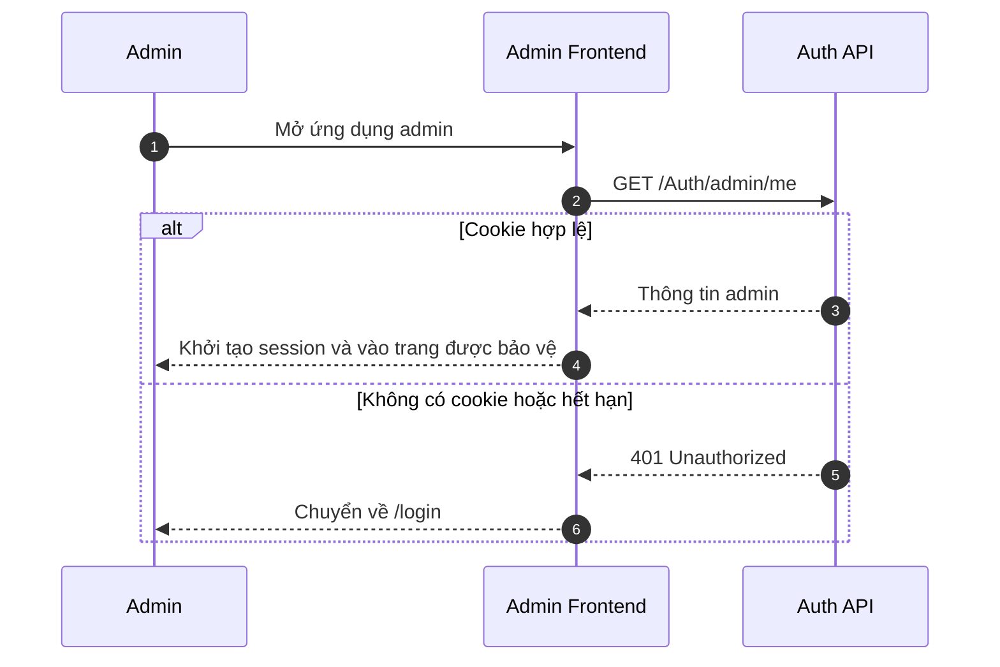
```mermaid
sequenceDiagram
    autonumber
    participant U as Admin
    participant FE as Admin Frontend
    participant AUTH as Auth API

    U->>FE: Mở ứng dụng admin
    FE->>AUTH: GET /Auth/admin/me
    alt Cookie hợp lệ
        AUTH-->>FE: Thông tin admin
        FE-->>U: Khởi tạo session và vào trang được bảo vệ
    else Không có cookie hoặc hết hạn
        AUTH-->>FE: 401 Unauthorized
        FE-->>U: Chuyển về /login
    end
```

## 2. Đăng nhập admin

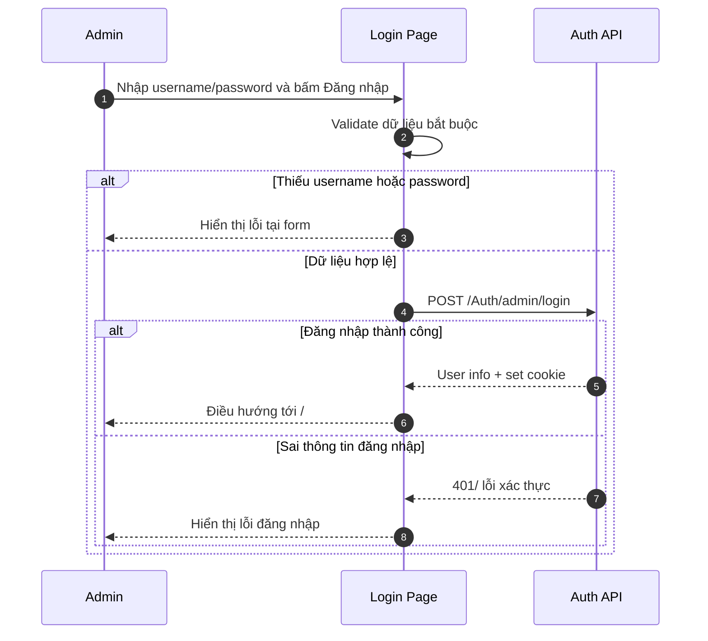
```mermaid
sequenceDiagram
    autonumber
    participant U as Admin
    participant FE as Login Page
    participant AUTH as Auth API

    U->>FE: Nhập username/password và bấm Đăng nhập
    FE->>FE: Validate dữ liệu bắt buộc
    alt Thiếu username hoặc password
        FE-->>U: Hiển thị lỗi tại form
    else Dữ liệu hợp lệ
        FE->>AUTH: POST /Auth/admin/login
        alt Đăng nhập thành công
            AUTH-->>FE: User info + set cookie
            FE-->>U: Điều hướng tới /
        else Sai thông tin đăng nhập
            AUTH-->>FE: 401/ lỗi xác thực
            FE-->>U: Hiển thị lỗi đăng nhập
        end
    end
```

## 3. Đăng xuất

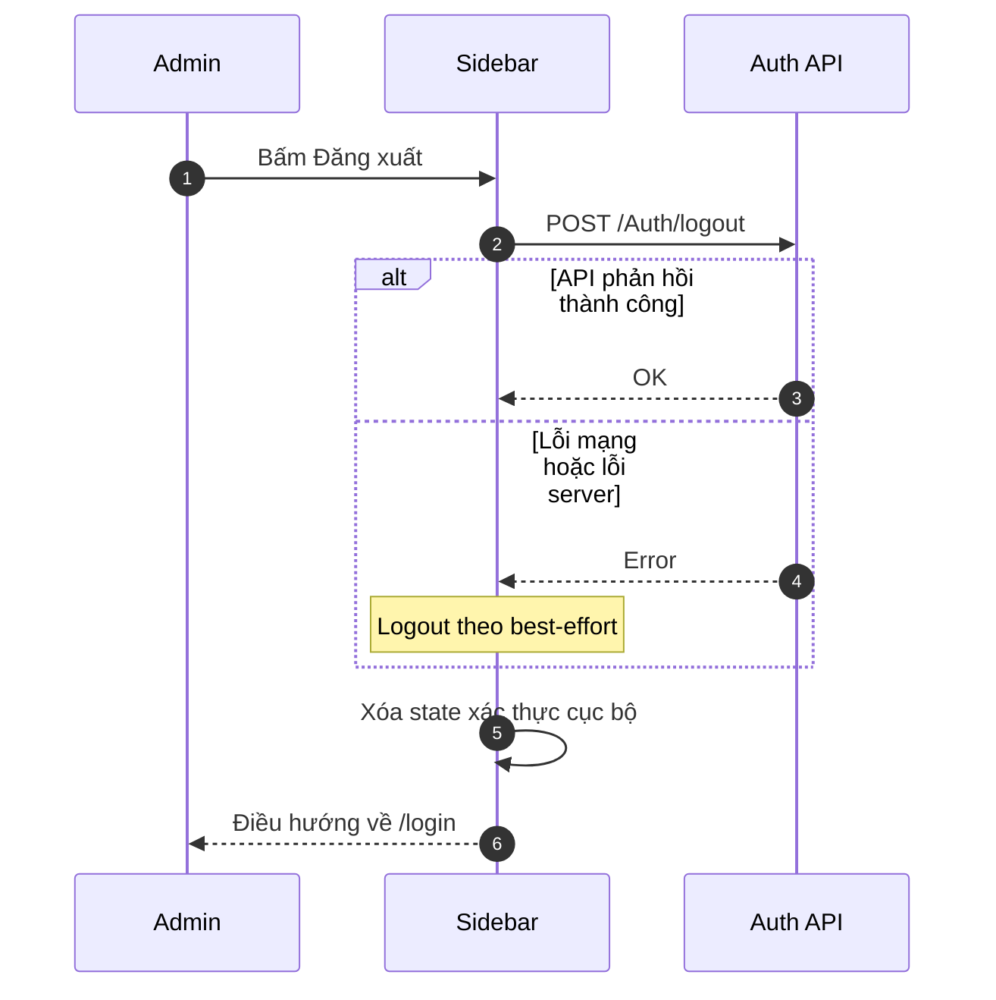
```mermaid
sequenceDiagram
    autonumber
    participant U as Admin
    participant FE as Sidebar
    participant AUTH as Auth API

    U->>FE: Bấm Đăng xuất
    FE->>AUTH: POST /Auth/logout
    alt API phản hồi thành công
        AUTH-->>FE: OK
    else Lỗi mạng hoặc lỗi server
        AUTH-->>FE: Error
        Note over FE: Logout theo best-effort
    end
    FE->>FE: Xóa state xác thực cục bộ
    FE-->>U: Điều hướng về /login
```

## 4. Xem dashboard tổng quan

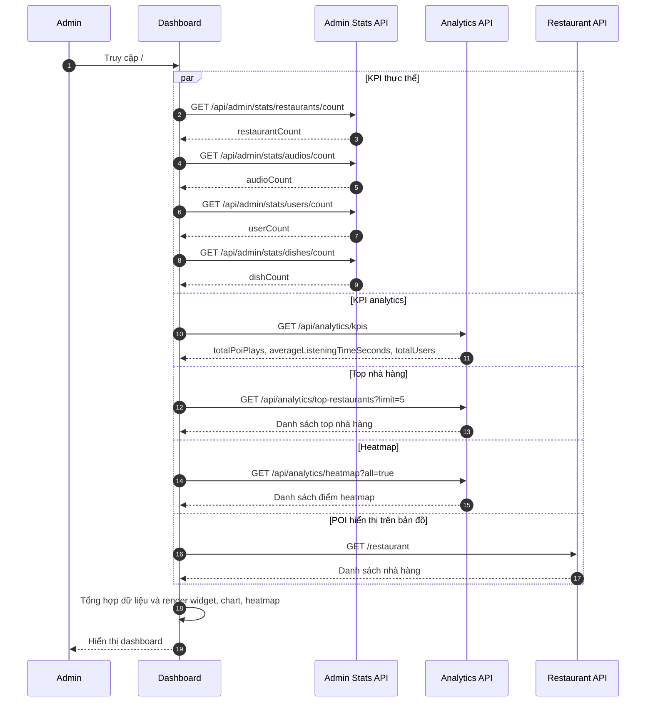
```mermaid
sequenceDiagram
    autonumber
    participant U as Admin
    participant FE as Dashboard
    participant STATS as Admin Stats API
    participant ANA as Analytics API
    participant RES as Restaurant API

    U->>FE: Truy cập /
    par KPI thực thể
        FE->>STATS: GET /api/admin/stats/restaurants/count
        STATS-->>FE: restaurantCount
        FE->>STATS: GET /api/admin/stats/audios/count
        STATS-->>FE: audioCount
        FE->>STATS: GET /api/admin/stats/users/count
        STATS-->>FE: userCount
        FE->>STATS: GET /api/admin/stats/dishes/count
        STATS-->>FE: dishCount
    and KPI analytics
        FE->>ANA: GET /api/analytics/kpis
        ANA-->>FE: totalPoiPlays, averageListeningTimeSeconds, totalUsers
    and Top nhà hàng
        FE->>ANA: GET /api/analytics/top-restaurants?limit=5
        ANA-->>FE: Danh sách top nhà hàng
    and Heatmap
        FE->>ANA: GET /api/analytics/heatmap?all=true
        ANA-->>FE: Danh sách điểm heatmap
    and POI hiển thị trên bản đồ
        FE->>RES: GET /restaurant
        RES-->>FE: Danh sách nhà hàng
    end
    FE->>FE: Tổng hợp dữ liệu và render widget, chart, heatmap
    FE-->>U: Hiển thị dashboard
```

## 5. Đổi bộ lọc heatmap trên dashboard

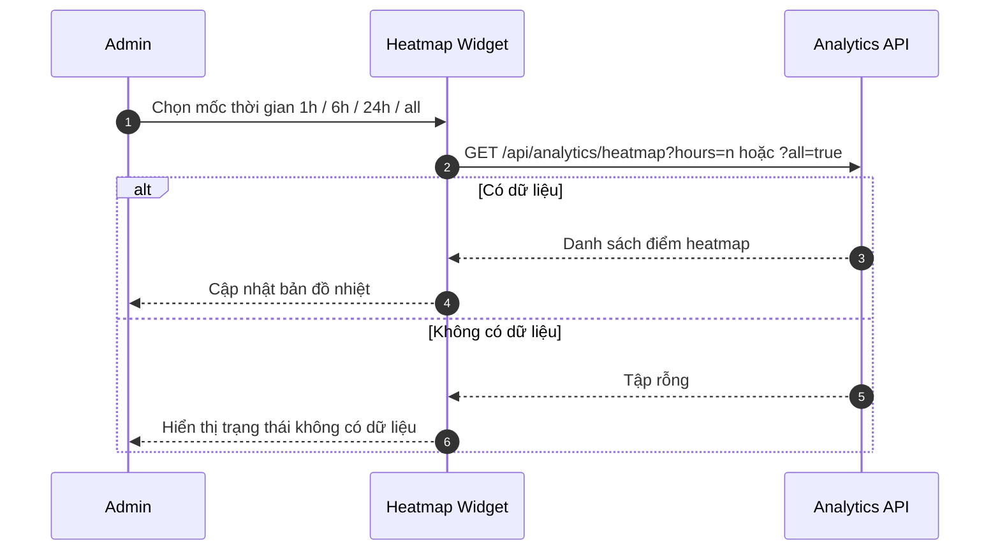
```mermaid
sequenceDiagram
    autonumber
    participant U as Admin
    participant FE as Heatmap Widget
    participant ANA as Analytics API

    U->>FE: Chọn mốc thời gian 1h / 6h / 24h / all
    FE->>ANA: GET /api/analytics/heatmap?hours=n hoặc ?all=true
    alt Có dữ liệu
        ANA-->>FE: Danh sách điểm heatmap
        FE-->>U: Cập nhật bản đồ nhiệt
    else Không có dữ liệu
        ANA-->>FE: Tập rỗng
        FE-->>U: Hiển thị trạng thái không có dữ liệu
    end
```

## 6. Xem tuyến di chuyển người dùng

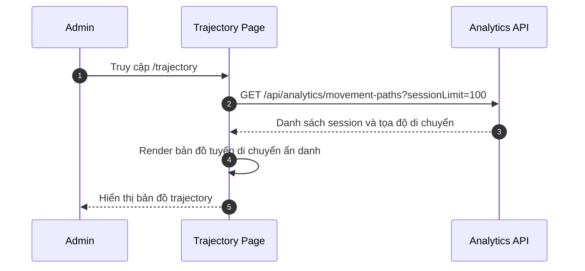
```mermaid
sequenceDiagram
    autonumber
    participant U as Admin
    participant FE as Trajectory Page
    participant ANA as Analytics API

    U->>FE: Truy cập /trajectory
    FE->>ANA: GET /api/analytics/movement-paths?sessionLimit=100
    ANA-->>FE: Danh sách session và tọa độ di chuyển
    FE->>FE: Render bản đồ tuyến di chuyển ẩn danh
    FE-->>U: Hiển thị bản đồ trajectory
```

## 7. Đổi số lượng session ở trang trajectory

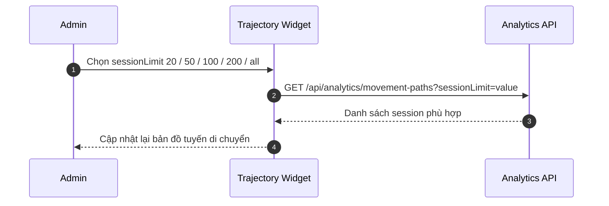
```mermaid
sequenceDiagram
    autonumber
    participant U as Admin
    participant FE as Trajectory Widget
    participant ANA as Analytics API

    U->>FE: Chọn sessionLimit 20 / 50 / 100 / 200 / all
    FE->>ANA: GET /api/analytics/movement-paths?sessionLimit=value
    ANA-->>FE: Danh sách session phù hợp
    FE-->>U: Cập nhật lại bản đồ tuyến di chuyển
```

## 8. Xem danh sách nhà hàng

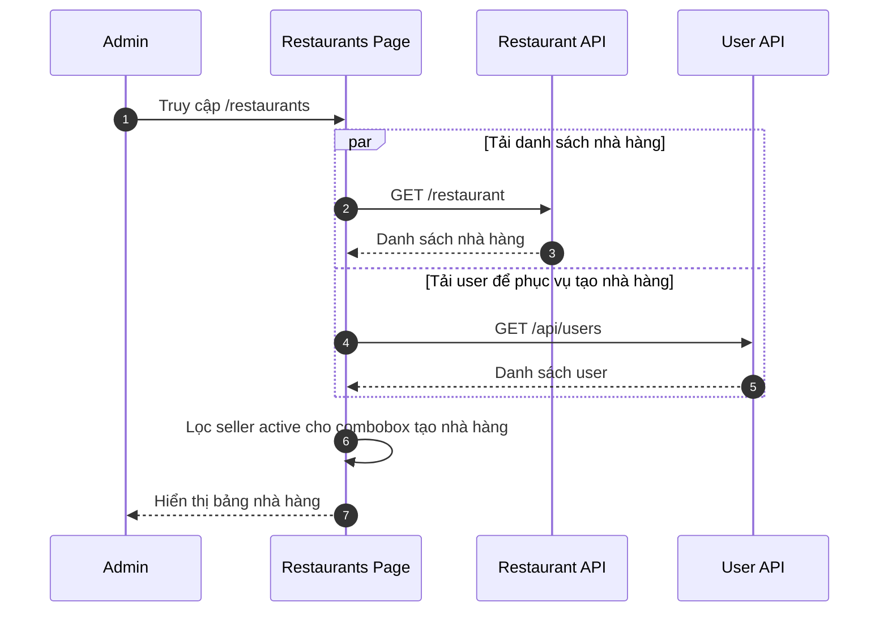
```mermaid
sequenceDiagram
    autonumber
    participant U as Admin
    participant FE as Restaurants Page
    participant RES as Restaurant API
    participant USER as User API

    U->>FE: Truy cập /restaurants
    par Tải danh sách nhà hàng
        FE->>RES: GET /restaurant
        RES-->>FE: Danh sách nhà hàng
    and Tải user để phục vụ tạo nhà hàng
        FE->>USER: GET /api/users
        USER-->>FE: Danh sách user
    end
    FE->>FE: Lọc seller active cho combobox tạo nhà hàng
    FE-->>U: Hiển thị bảng nhà hàng
```

## 9. Tìm kiếm nhà hàng

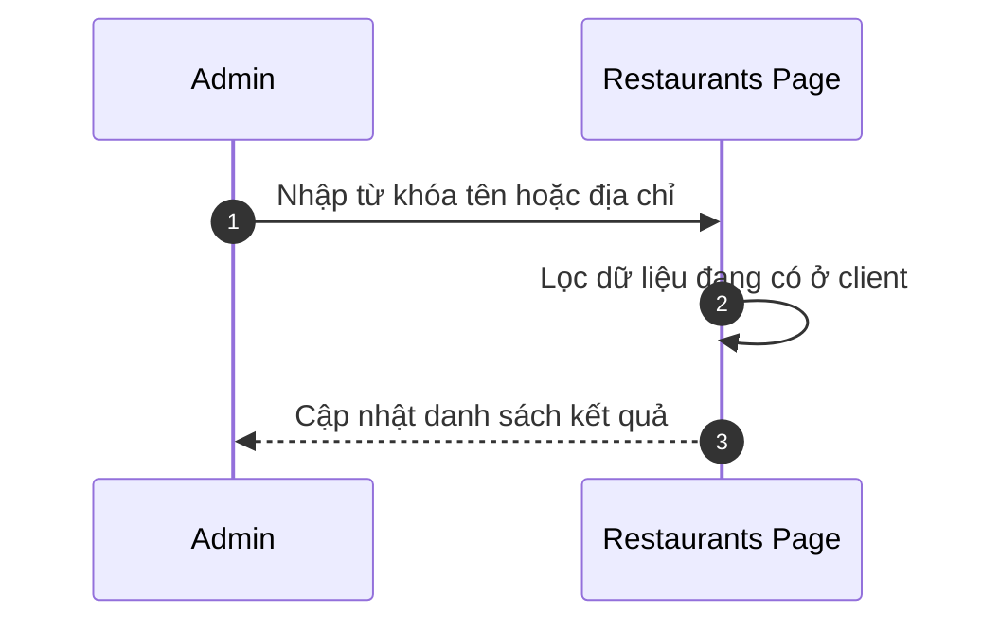
```mermaid
sequenceDiagram
    autonumber
    participant U as Admin
    participant FE as Restaurants Page

    U->>FE: Nhập từ khóa tên hoặc địa chỉ
    FE->>FE: Lọc dữ liệu đang có ở client
    FE-->>U: Cập nhật danh sách kết quả
```

## 10. Xem chi tiết nhà hàng

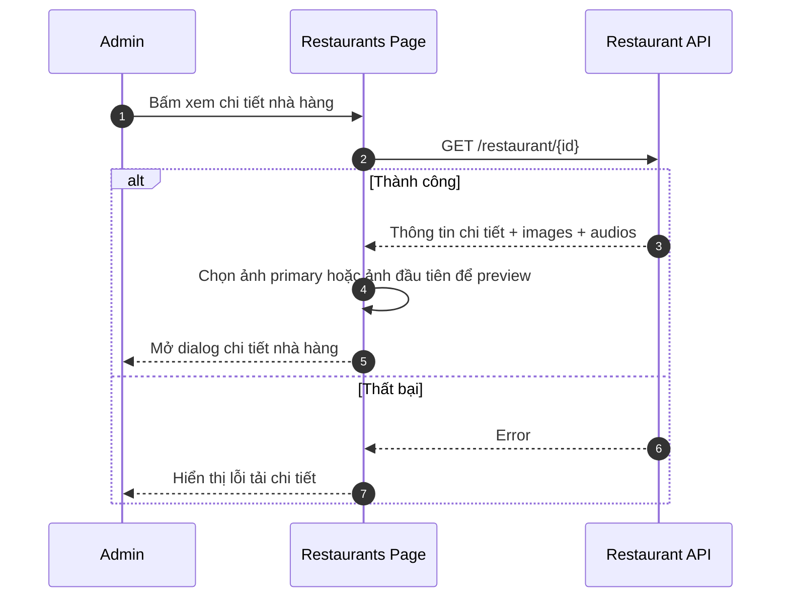
```mermaid
sequenceDiagram
    autonumber
    participant U as Admin
    participant FE as Restaurants Page
    participant RES as Restaurant API

    U->>FE: Bấm xem chi tiết nhà hàng
    FE->>RES: GET /restaurant/{id}
    alt Thành công
        RES-->>FE: Thông tin chi tiết + images + audios
        FE->>FE: Chọn ảnh primary hoặc ảnh đầu tiên để preview
        FE-->>U: Mở dialog chi tiết nhà hàng
    else Thất bại
        RES-->>FE: Error
        FE-->>U: Hiển thị lỗi tải chi tiết
    end
```

## 11. Tạo nhà hàng mới

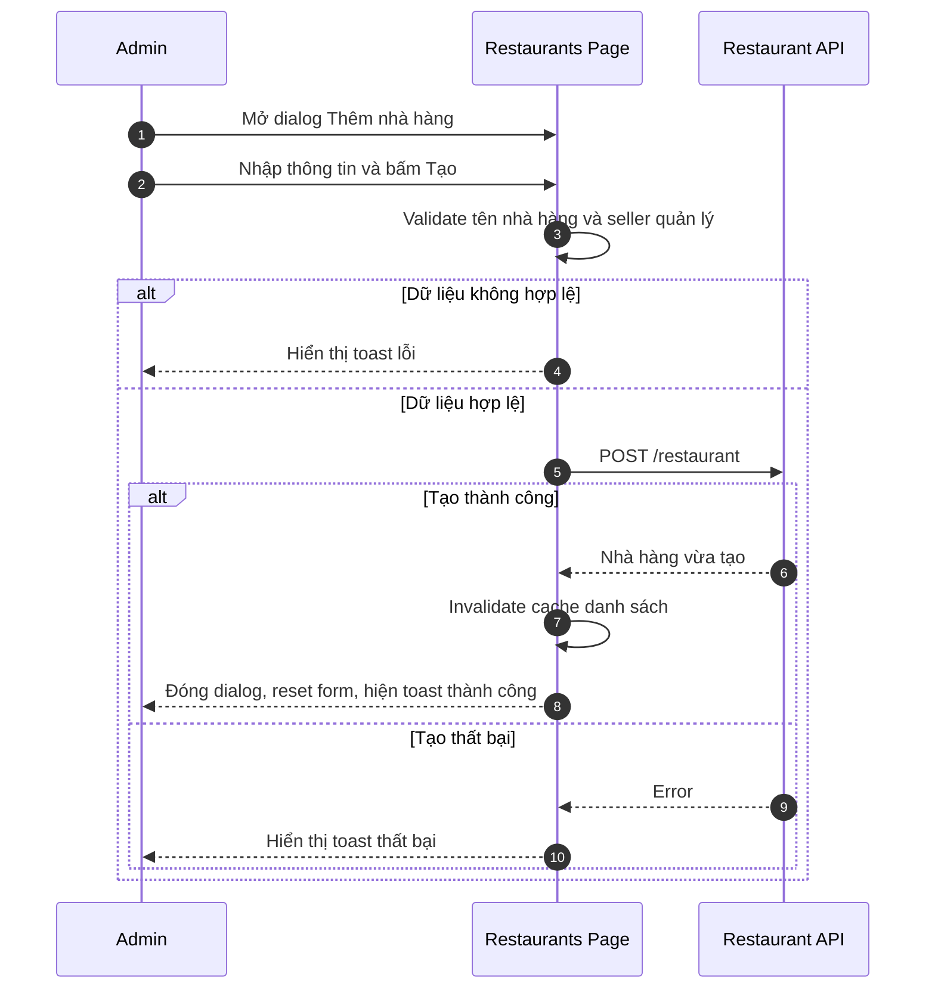
```mermaid
sequenceDiagram
    autonumber
    participant U as Admin
    participant FE as Restaurants Page
    participant RES as Restaurant API

    U->>FE: Mở dialog Thêm nhà hàng
    U->>FE: Nhập thông tin và bấm Tạo
    FE->>FE: Validate tên nhà hàng và seller quản lý
    alt Dữ liệu không hợp lệ
        FE-->>U: Hiển thị toast lỗi
    else Dữ liệu hợp lệ
        FE->>RES: POST /restaurant
        alt Tạo thành công
            RES-->>FE: Nhà hàng vừa tạo
            FE->>FE: Invalidate cache danh sách
            FE-->>U: Đóng dialog, reset form, hiện toast thành công
        else Tạo thất bại
            RES-->>FE: Error
            FE-->>U: Hiển thị toast thất bại
        end
    end
```

## 12. Khóa hoặc mở khóa nhà hàng

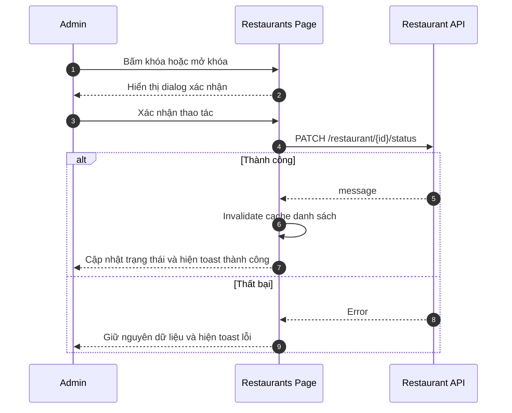
```mermaid
sequenceDiagram
    autonumber
    participant U as Admin
    participant FE as Restaurants Page
    participant RES as Restaurant API

    U->>FE: Bấm khóa hoặc mở khóa
    FE-->>U: Hiển thị dialog xác nhận
    U->>FE: Xác nhận thao tác
    FE->>RES: PATCH /restaurant/{id}/status
    alt Thành công
        RES-->>FE: message
        FE->>FE: Invalidate cache danh sách
        FE-->>U: Cập nhật trạng thái và hiện toast thành công
    else Thất bại
        RES-->>FE: Error
        FE-->>U: Giữ nguyên dữ liệu và hiện toast lỗi
    end
```

## 13. Xem danh sách người dùng

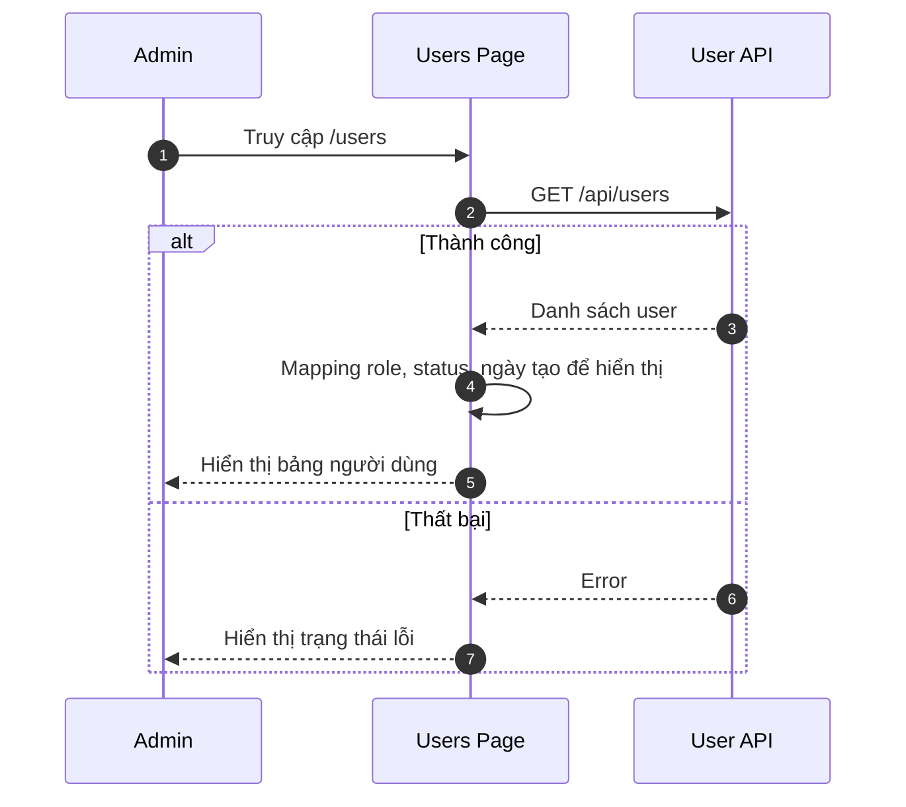
```mermaid
sequenceDiagram
    autonumber
    participant U as Admin
    participant FE as Users Page
    participant USER as User API

    U->>FE: Truy cập /users
    FE->>USER: GET /api/users
    alt Thành công
        USER-->>FE: Danh sách user
        FE->>FE: Mapping role, status, ngày tạo để hiển thị
        FE-->>U: Hiển thị bảng người dùng
    else Thất bại
        USER-->>FE: Error
        FE-->>U: Hiển thị trạng thái lỗi
    end
```

## 14. Tạo người dùng mới

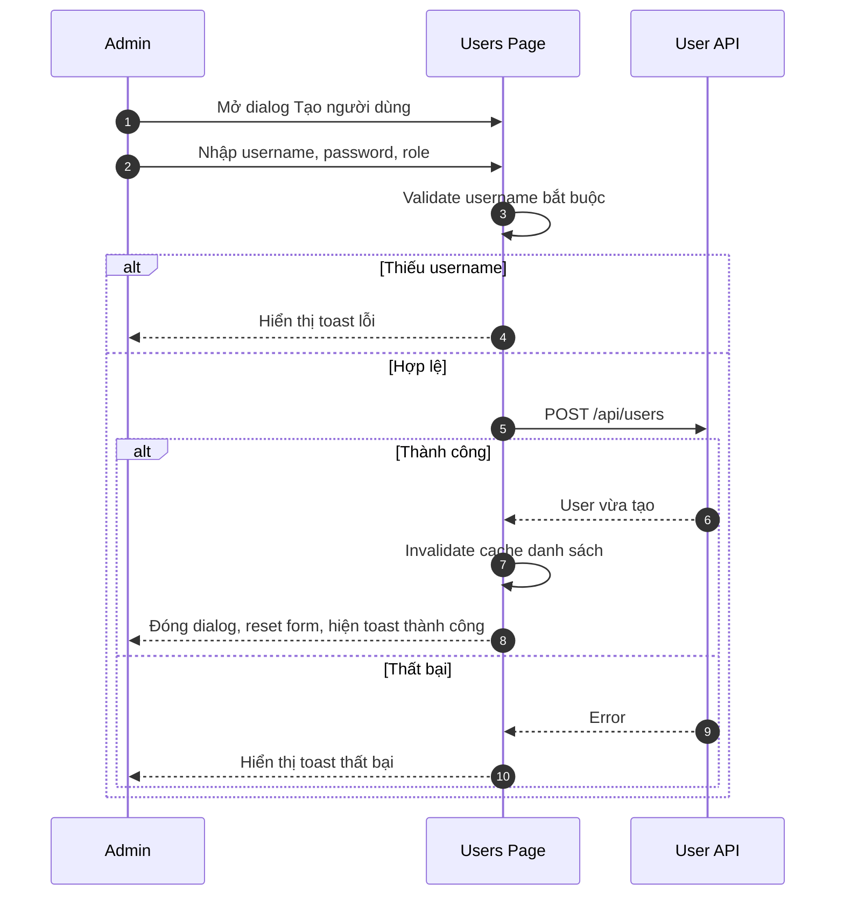
```mermaid
sequenceDiagram
    autonumber
    participant U as Admin
    participant FE as Users Page
    participant USER as User API

    U->>FE: Mở dialog Tạo người dùng
    U->>FE: Nhập username, password, role
    FE->>FE: Validate username bắt buộc
    alt Thiếu username
        FE-->>U: Hiển thị toast lỗi
    else Hợp lệ
        FE->>USER: POST /api/users
        alt Thành công
            USER-->>FE: User vừa tạo
            FE->>FE: Invalidate cache danh sách
            FE-->>U: Đóng dialog, reset form, hiện toast thành công
        else Thất bại
            USER-->>FE: Error
            FE-->>U: Hiển thị toast thất bại
        end
    end
```

## 15. Đổi vai trò người dùng

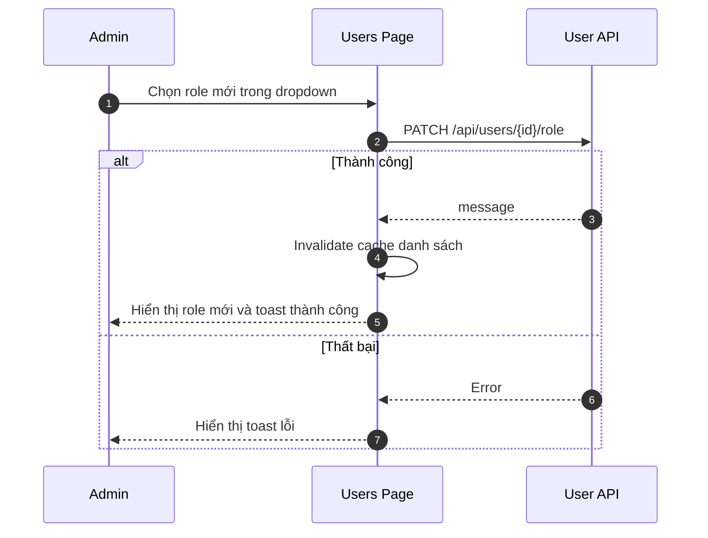
```mermaid
sequenceDiagram
    autonumber
    participant U as Admin
    participant FE as Users Page
    participant USER as User API

    U->>FE: Chọn role mới trong dropdown
    FE->>USER: PATCH /api/users/{id}/role
    alt Thành công
        USER-->>FE: message
        FE->>FE: Invalidate cache danh sách
        FE-->>U: Hiển thị role mới và toast thành công
    else Thất bại
        USER-->>FE: Error
        FE-->>U: Hiển thị toast lỗi
    end
```

## 16. Khóa hoặc mở khóa người dùng

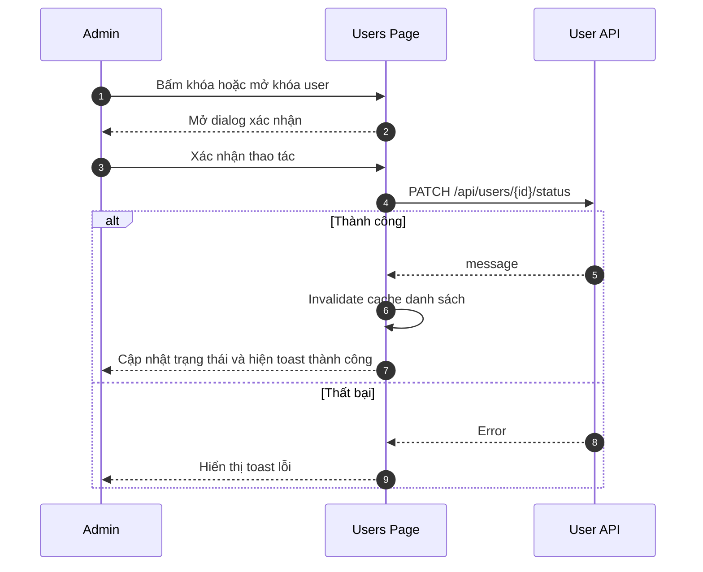
```mermaid
sequenceDiagram
    autonumber
    participant U as Admin
    participant FE as Users Page
    participant USER as User API

    U->>FE: Bấm khóa hoặc mở khóa user
    FE-->>U: Mở dialog xác nhận
    U->>FE: Xác nhận thao tác
    FE->>USER: PATCH /api/users/{id}/status
    alt Thành công
        USER-->>FE: message
        FE->>FE: Invalidate cache danh sách
        FE-->>U: Cập nhật trạng thái và hiện toast thành công
    else Thất bại
        USER-->>FE: Error
        FE-->>U: Hiển thị toast lỗi
    end
```

## 17. Xem nhật ký hệ thống

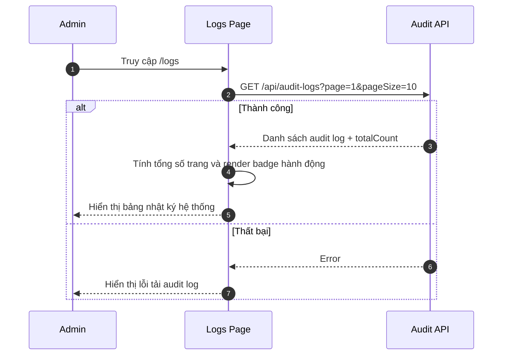
```mermaid
sequenceDiagram
    autonumber
    participant U as Admin
    participant FE as Logs Page
    participant AUD as Audit API

    U->>FE: Truy cập /logs
    FE->>AUD: GET /api/audit-logs?page=1&pageSize=10
    alt Thành công
        AUD-->>FE: Danh sách audit log + totalCount
        FE->>FE: Tính tổng số trang và render badge hành động
        FE-->>U: Hiển thị bảng nhật ký hệ thống
    else Thất bại
        AUD-->>FE: Error
        FE-->>U: Hiển thị lỗi tải audit log
    end
```

## 18. Phân trang nhật ký hệ thống

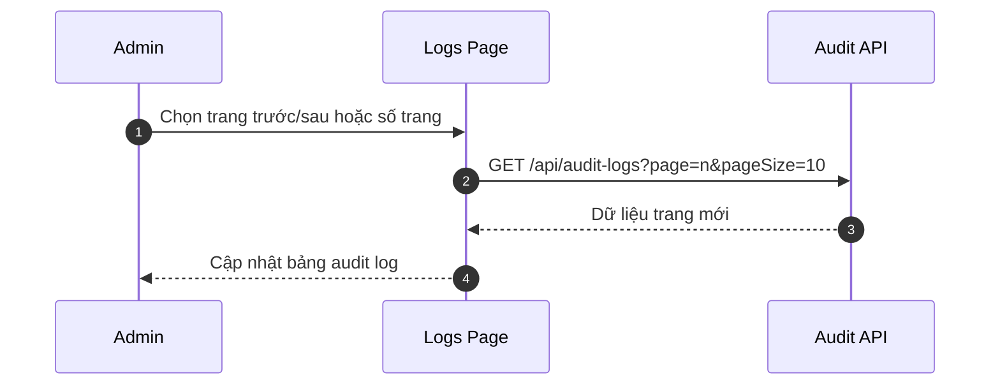
```mermaid
sequenceDiagram
    autonumber
    participant U as Admin
    participant FE as Logs Page
    participant AUD as Audit API

    U->>FE: Chọn trang trước/sau hoặc số trang
    FE->>AUD: GET /api/audit-logs?page=n&pageSize=10
    AUD-->>FE: Dữ liệu trang mới
    FE-->>U: Cập nhật bảng audit log
```

## 19. Xem nhật ký nghe audio

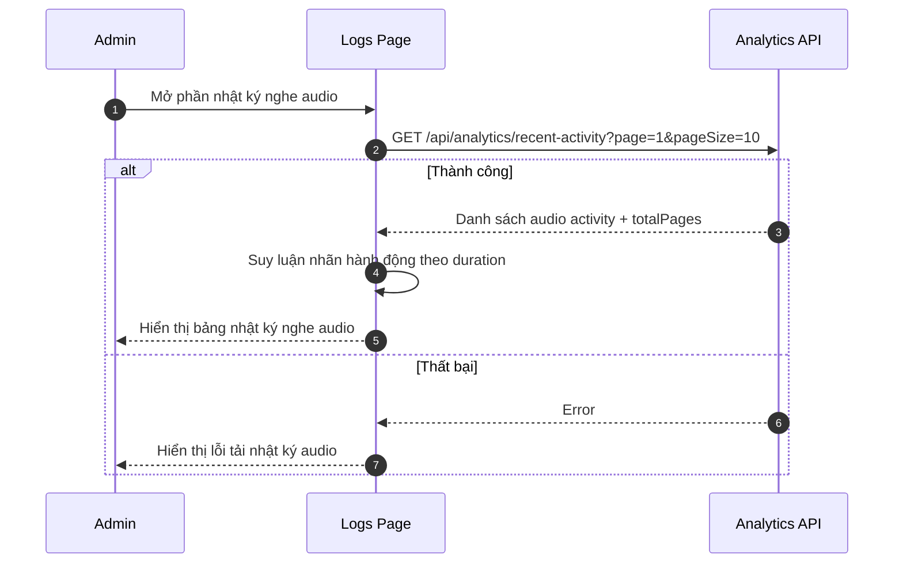
```mermaid
sequenceDiagram
    autonumber
    participant U as Admin
    participant FE as Logs Page
    participant ANA as Analytics API

    U->>FE: Mở phần nhật ký nghe audio
    FE->>ANA: GET /api/analytics/recent-activity?page=1&pageSize=10
    alt Thành công
        ANA-->>FE: Danh sách audio activity + totalPages
        FE->>FE: Suy luận nhãn hành động theo duration
        FE-->>U: Hiển thị bảng nhật ký nghe audio
    else Thất bại
        ANA-->>FE: Error
        FE-->>U: Hiển thị lỗi tải nhật ký audio
    end
```

## 20. Tự động làm mới trang nhật ký

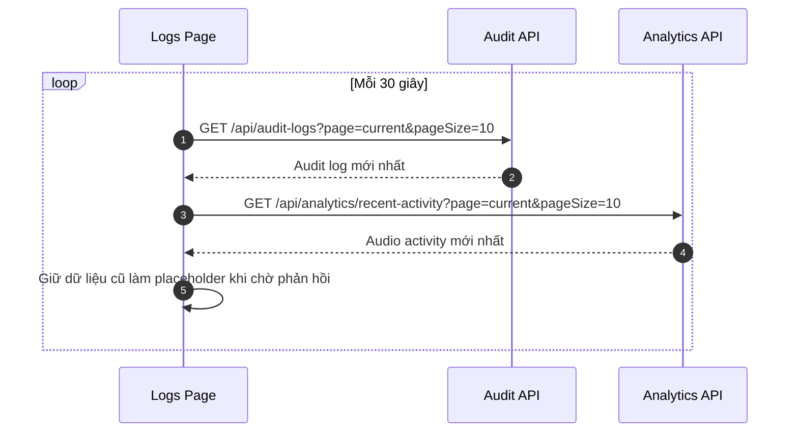
```mermaid
sequenceDiagram
    autonumber
    participant FE as Logs Page
    participant AUD as Audit API
    participant ANA as Analytics API

    loop Mỗi 30 giây
        FE->>AUD: GET /api/audit-logs?page=current&pageSize=10
        AUD-->>FE: Audit log mới nhất
        FE->>ANA: GET /api/analytics/recent-activity?page=current&pageSize=10
        ANA-->>FE: Audio activity mới nhất
        FE->>FE: Giữ dữ liệu cũ làm placeholder khi chờ phản hồi
    end
```

## 21. Phân trang nhật ký nghe audio

```mermaid
sequenceDiagram
    autonumber
    participant U as Admin
    participant FE as Logs Page
    participant ANA as Analytics API

    U->>FE: Chọn trang trước/sau hoặc số trang
    FE->>ANA: GET /api/analytics/recent-activity?page=n&pageSize=10
    ANA-->>FE: Dữ liệu trang mới
    FE-->>U: Cập nhật bảng audio activity
```

## 22. Điều hướng giữa các màn hình admin

```mermaid
sequenceDiagram
    autonumber
    participant U as Admin
    participant FE as Admin Sidebar
    participant ROUTER as React Router

    U->>FE: Chọn menu Tổng quan / Tuyến di chuyển / Nhà hàng / Người dùng / Nhật ký
    FE->>ROUTER: navigate(path)
    ROUTER->>ROUTER: Kiểm tra ProtectedRoute
    alt Đã xác thực và role = admin
        ROUTER-->>U: Mở trang tương ứng
    else Chưa xác thực hoặc sai role
        ROUTER-->>U: Chuyển về /login
    end
```
---

## Sequence ngắn gọn các flow chính

### 1. Phiên đăng nhập trang admin

```mermaid
sequenceDiagram
    autonumber
    participant U as Admin
    participant FE as Admin Frontend
    participant AUTH as Auth API

    U->>FE: Mở trang admin
    FE->>AUTH: Kiểm tra phiên đăng nhập
    alt Phiên hợp lệ
        AUTH-->>FE: Thông tin admin
        FE-->>U: Vào trang quản trị
    else Chưa đăng nhập
        AUTH-->>FE: Unauthorized
        FE-->>U: Chuyển đến trang login
        U->>FE: Nhập tài khoản và mật khẩu
        FE->>AUTH: Gửi yêu cầu đăng nhập
        alt Thành công
            AUTH-->>FE: Tạo phiên đăng nhập
            FE-->>U: Chuyển vào dashboard
        else Thất bại
            AUTH-->>FE: Báo lỗi xác thực
            FE-->>U: Hiển thị lỗi đăng nhập
        end
    end

    U->>FE: Đăng xuất
    FE->>AUTH: Gửi yêu cầu logout
    FE-->>U: Xóa phiên và quay về login
```

### 2. Xem dashboard tổng quan

```mermaid
sequenceDiagram
    autonumber
    participant U as Admin
    participant FE as Dashboard
    participant STATS as Admin Stats API
    participant ANA as Analytics API
    participant RES as Restaurant API

    U->>FE: Mở dashboard
    FE->>STATS: Lấy số liệu tổng quan
    FE->>ANA: Lấy KPI analytics
    FE->>ANA: Lấy top nhà hàng
    FE->>ANA: Lấy dữ liệu heatmap
    FE->>RES: Lấy danh sách nhà hàng
    STATS-->>FE: Dữ liệu thống kê
    ANA-->>FE: Dữ liệu analytics
    RES-->>FE: Danh sách nhà hàng
    FE-->>U: Hiển thị dashboard
```

### 3. Đổi bộ lọc heatmap

```mermaid
sequenceDiagram
    autonumber
    participant U as Admin
    participant FE as Dashboard
    participant ANA as Analytics API

    U->>FE: Chọn mốc thời gian heatmap
    FE->>ANA: Lấy dữ liệu heatmap theo bộ lọc
    alt Có dữ liệu
        ANA-->>FE: Danh sách điểm heatmap
        FE-->>U: Cập nhật bản đồ nhiệt
    else Không có dữ liệu
        ANA-->>FE: Tập rỗng
        FE-->>U: Hiển thị trạng thái không có dữ liệu
    end
```

### 4. Xem tuyến di chuyển người dùng

```mermaid
sequenceDiagram
    autonumber
    participant U as Admin
    participant FE as Trajectory Page
    participant ANA as Analytics API

    U->>FE: Mở trang tuyến di chuyển
    FE->>ANA: Lấy movement paths
    ANA-->>FE: Danh sách tuyến di chuyển
    FE-->>U: Hiển thị bản đồ hành trình
```

### 5. Đổi số lượng session tuyến di chuyển

```mermaid
sequenceDiagram
    autonumber
    participant U as Admin
    participant FE as Trajectory Page
    participant ANA as Analytics API

    U->>FE: Chọn sessionLimit
    FE->>ANA: Lấy movement paths theo sessionLimit
    ANA-->>FE: Dữ liệu mới
    FE-->>U: Cập nhật bản đồ hành trình
```

### 6. Xem danh sách nhà hàng

```mermaid
sequenceDiagram
    autonumber
    participant U as Admin
    participant FE as Restaurants Page
    participant RES as Restaurant API
    participant USER as User API

    U->>FE: Mở trang nhà hàng
    FE->>RES: Lấy danh sách nhà hàng
    FE->>USER: Lấy danh sách user
    RES-->>FE: Danh sách nhà hàng
    USER-->>FE: Danh sách user
    FE-->>U: Hiển thị bảng nhà hàng
```

### 7. Tìm kiếm nhà hàng

```mermaid
sequenceDiagram
    autonumber
    participant U as Admin
    participant FE as Restaurants Page

    U->>FE: Nhập từ khóa tìm kiếm
    FE->>FE: Lọc danh sách nhà hàng tại client
    FE-->>U: Hiển thị kết quả phù hợp
```

### 8. Xem chi tiết nhà hàng

```mermaid
sequenceDiagram
    autonumber
    participant U as Admin
    participant FE as Restaurants Page
    participant RES as Restaurant API

    U->>FE: Chọn xem chi tiết nhà hàng
    FE->>RES: Lấy chi tiết nhà hàng theo id
    alt Thành công
        RES-->>FE: Thông tin chi tiết
        FE-->>U: Mở popup chi tiết
    else Thất bại
        RES-->>FE: Lỗi tải chi tiết
        FE-->>U: Hiển thị lỗi
    end
```

### 9. Tạo nhà hàng mới

```mermaid
sequenceDiagram
    autonumber
    participant U as Admin
    participant FE as Restaurants Page
    participant RES as Restaurant API

    U->>FE: Nhập thông tin nhà hàng mới
    FE->>FE: Kiểm tra dữ liệu
    alt Hợp lệ
        FE->>RES: Gửi yêu cầu tạo nhà hàng
        alt Thành công
            RES-->>FE: Nhà hàng mới
            FE-->>U: Cập nhật danh sách và báo thành công
        else Thất bại
            RES-->>FE: Lỗi tạo nhà hàng
            FE-->>U: Hiển thị lỗi
        end
    else Không hợp lệ
        FE-->>U: Báo lỗi nhập liệu
    end
```

### 10. Khóa hoặc mở khóa nhà hàng

```mermaid
sequenceDiagram
    autonumber
    participant U as Admin
    participant FE as Restaurants Page
    participant RES as Restaurant API

    U->>FE: Chọn khóa hoặc mở khóa nhà hàng
    FE-->>U: Hiển thị xác nhận
    U->>FE: Xác nhận thao tác
    FE->>RES: Gửi yêu cầu cập nhật trạng thái
    alt Thành công
        RES-->>FE: Cập nhật xong
        FE-->>U: Làm mới danh sách và báo thành công
    else Thất bại
        RES-->>FE: Lỗi cập nhật
        FE-->>U: Hiển thị lỗi
    end
```

### 11. Xem danh sách người dùng

```mermaid
sequenceDiagram
    autonumber
    participant U as Admin
    participant FE as Users Page
    participant USER as User API

    U->>FE: Mở trang người dùng
    FE->>USER: Lấy danh sách người dùng
    alt Thành công
        USER-->>FE: Danh sách người dùng
        FE-->>U: Hiển thị bảng người dùng
    else Thất bại
        USER-->>FE: Lỗi tải dữ liệu
        FE-->>U: Hiển thị lỗi
    end
```

### 12. Tạo người dùng mới

```mermaid
sequenceDiagram
    autonumber
    participant U as Admin
    participant FE as Users Page
    participant USER as User API

    U->>FE: Nhập thông tin user mới
    FE->>FE: Kiểm tra dữ liệu
    alt Hợp lệ
        FE->>USER: Gửi yêu cầu tạo user
        alt Thành công
            USER-->>FE: User mới
            FE-->>U: Cập nhật danh sách và báo thành công
        else Thất bại
            USER-->>FE: Lỗi tạo user
            FE-->>U: Hiển thị lỗi
        end
    else Không hợp lệ
        FE-->>U: Báo lỗi nhập liệu
    end
```

### 13. Đổi vai trò người dùng

```mermaid
sequenceDiagram
    autonumber
    participant U as Admin
    participant FE as Users Page
    participant USER as User API

    U->>FE: Chọn vai trò mới
    FE->>USER: Gửi yêu cầu cập nhật role
    alt Thành công
        USER-->>FE: Cập nhật xong
        FE-->>U: Làm mới danh sách và báo thành công
    else Thất bại
        USER-->>FE: Lỗi cập nhật
        FE-->>U: Hiển thị lỗi
    end
```

### 14. Khóa hoặc mở khóa người dùng

```mermaid
sequenceDiagram
    autonumber
    participant U as Admin
    participant FE as Users Page
    participant USER as User API

    U->>FE: Chọn khóa hoặc mở khóa user
    FE-->>U: Hiển thị xác nhận
    U->>FE: Xác nhận thao tác
    FE->>USER: Gửi yêu cầu cập nhật trạng thái
    alt Thành công
        USER-->>FE: Cập nhật xong
        FE-->>U: Làm mới danh sách và báo thành công
    else Thất bại
        USER-->>FE: Lỗi cập nhật
        FE-->>U: Hiển thị lỗi
    end
```

### 15. Xem nhật ký hoạt động

```mermaid
sequenceDiagram
    autonumber
    participant U as Admin
    participant FE as Logs Page
    participant AUD as Audit API
    participant ANA as Analytics API

    U->>FE: Mở trang nhật ký
    FE->>AUD: Lấy nhật ký hệ thống
    FE->>ANA: Lấy nhật ký nghe audio
    AUD-->>FE: Audit logs
    ANA-->>FE: Audio activity logs
    FE-->>U: Hiển thị hai bảng nhật ký
```

### 16. Phân trang nhật ký

```mermaid
sequenceDiagram
    autonumber
    participant U as Admin
    participant FE as Logs Page
    participant AUD as Audit API
    participant ANA as Analytics API

    U->>FE: Chọn trang nhật ký
    FE->>AUD: Lấy audit logs theo trang
    FE->>ANA: Lấy audio activity theo trang
    AUD-->>FE: Audit logs trang mới
    ANA-->>FE: Audio activity trang mới
    FE-->>U: Cập nhật danh sách nhật ký
```

### 17. Tự động làm mới nhật ký

```mermaid
sequenceDiagram
    autonumber
    participant FE as Logs Page
    participant AUD as Audit API
    participant ANA as Analytics API

    loop Mỗi 30 giây
        FE->>AUD: Tải lại audit logs
        FE->>ANA: Tải lại audio activity
        AUD-->>FE: Dữ liệu mới
        ANA-->>FE: Dữ liệu mới
    end
```

### 18. Điều hướng giữa các màn hình admin

```mermaid
sequenceDiagram
    autonumber
    participant U as Admin
    participant FE as Sidebar
    participant ROUTER as Router

    U->>FE: Chọn menu chức năng
    FE->>ROUTER: Điều hướng sang trang tương ứng
    alt Có quyền admin
        ROUTER-->>U: Mở trang đã chọn
    else Chưa đăng nhập hoặc sai quyền
        ROUTER-->>U: Chuyển về login
    end
```
