# Flow Sequence Saler

Tài liệu mô tả flow thực tế của trang Saler trong thư mục `saler/` (snapshot theo code hiện tại).

## Phạm vi và ghi chú

- Route public: `/login`.
- Route cần đăng nhập: `/select-restaurant`, `/dashboard/*`.
- Các route con trong dashboard: `/dashboard/restaurant`, `/dashboard/dishes`, `/dashboard/images`, `/dashboard/audio/description`, `/dashboard/audio/history`, `/dashboard/account`.
- Sidebar hiển thị: Nhà hàng, Thực đơn, Hình ảnh, Âm thanh (Mô tả âm thanh, Thống kê), Tài khoản.
- Trang account là ngoại lệ: có thể truy cập dù chưa chọn nhà hàng; các trang dashboard còn lại yêu cầu đã chọn nhà hàng.
- `selectedRestaurant` hiện lưu trong state context (không persist localStorage), nên khi reload cần chọn lại nhà hàng.

## 1. Kiểm tra phiên đăng nhập

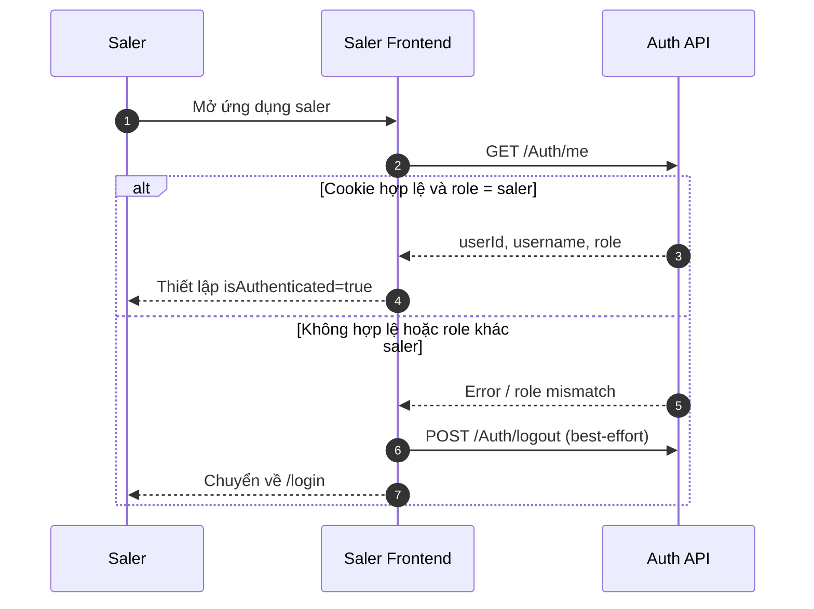
```mermaid
sequenceDiagram
	autonumber
	participant U as Saler
	participant FE as Saler Frontend
	participant AUTH as Auth API

	U->>FE: Mở ứng dụng saler
	FE->>AUTH: GET /Auth/me
	alt Cookie hợp lệ và role = saler
		AUTH-->>FE: userId, username, role
		FE-->>U: Thiết lập isAuthenticated=true
	else Không hợp lệ hoặc role khác saler
		AUTH-->>FE: Error / role mismatch
		FE->>AUTH: POST /Auth/logout (best-effort)
		FE-->>U: Chuyển về /login
	end
```

## 2. Đăng nhập saler

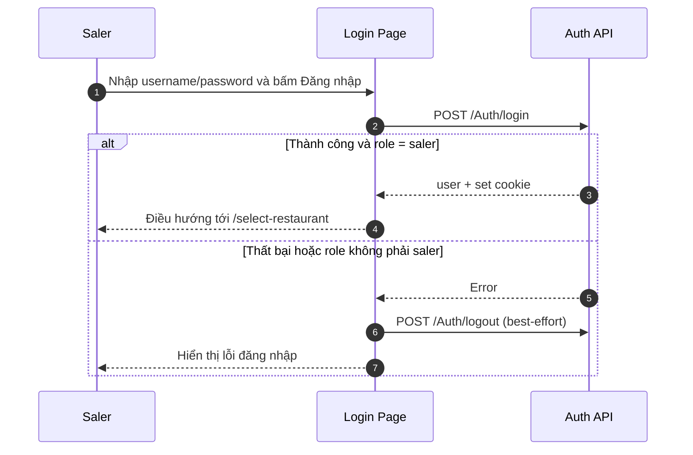
```mermaid
sequenceDiagram
	autonumber
	participant U as Saler
	participant FE as Login Page
	participant AUTH as Auth API

	U->>FE: Nhập username/password và bấm Đăng nhập
	FE->>AUTH: POST /Auth/login
	alt Thành công và role = saler
		AUTH-->>FE: user + set cookie
		FE-->>U: Điều hướng tới /select-restaurant
	else Thất bại hoặc role không phải saler
		AUTH-->>FE: Error
		FE->>AUTH: POST /Auth/logout (best-effort)
		FE-->>U: Hiển thị lỗi đăng nhập
	end
```

## 3. Quên mật khẩu bằng OTP

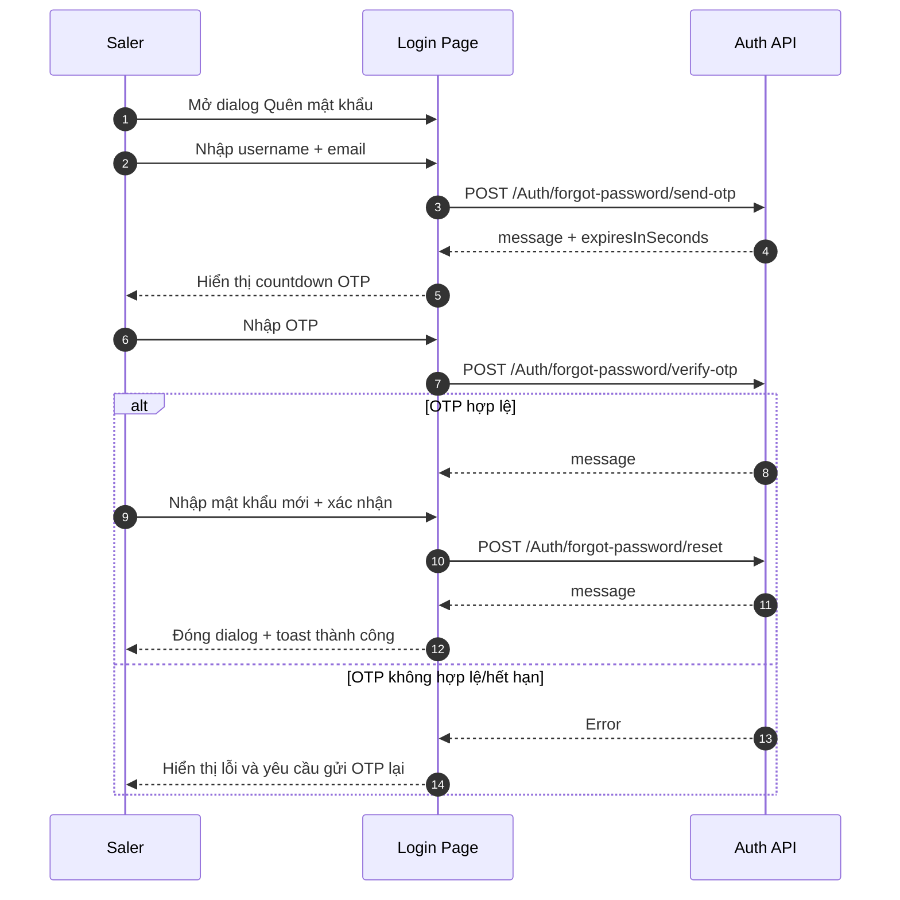
```mermaid
sequenceDiagram
	autonumber
	participant U as Saler
	participant FE as Login Page
	participant AUTH as Auth API

	U->>FE: Mở dialog Quên mật khẩu
	U->>FE: Nhập username + email
	FE->>AUTH: POST /Auth/forgot-password/send-otp
	AUTH-->>FE: message + expiresInSeconds
	FE-->>U: Hiển thị countdown OTP

	U->>FE: Nhập OTP
	FE->>AUTH: POST /Auth/forgot-password/verify-otp
	alt OTP hợp lệ
		AUTH-->>FE: message
		U->>FE: Nhập mật khẩu mới + xác nhận
		FE->>AUTH: POST /Auth/forgot-password/reset
		AUTH-->>FE: message
		FE-->>U: Đóng dialog + toast thành công
	else OTP không hợp lệ/hết hạn
		AUTH-->>FE: Error
		FE-->>U: Hiển thị lỗi và yêu cầu gửi OTP lại
	end
```

## 4. Đăng xuất

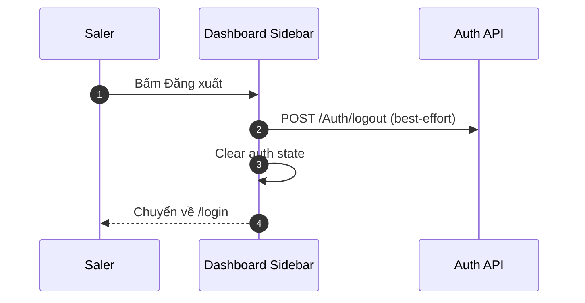
```mermaid
sequenceDiagram
	autonumber
	participant U as Saler
	participant FE as Dashboard Sidebar
	participant AUTH as Auth API

	U->>FE: Bấm Đăng xuất
	FE->>AUTH: POST /Auth/logout (best-effort)
	FE->>FE: Clear auth state
	FE-->>U: Chuyển về /login
```

## 5. Điều hướng và bảo vệ route

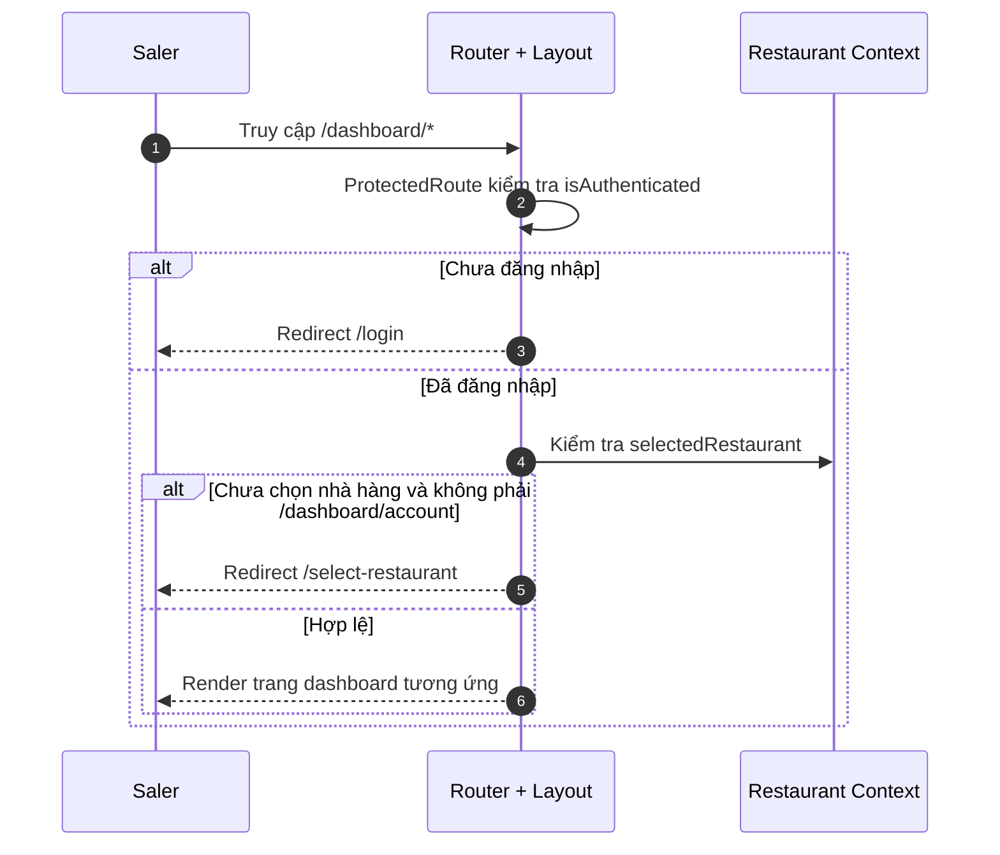
```mermaid
sequenceDiagram
	autonumber
	participant U as Saler
	participant FE as Router + Layout
	participant RC as Restaurant Context

	U->>FE: Truy cập /dashboard/*
	FE->>FE: ProtectedRoute kiểm tra isAuthenticated
	alt Chưa đăng nhập
		FE-->>U: Redirect /login
	else Đã đăng nhập
		FE->>RC: Kiểm tra selectedRestaurant
		alt Chưa chọn nhà hàng và không phải /dashboard/account
			FE-->>U: Redirect /select-restaurant
		else Hợp lệ
			FE-->>U: Render trang dashboard tương ứng
		end
	end
```

## 6. Chọn nhà hàng để quản lý

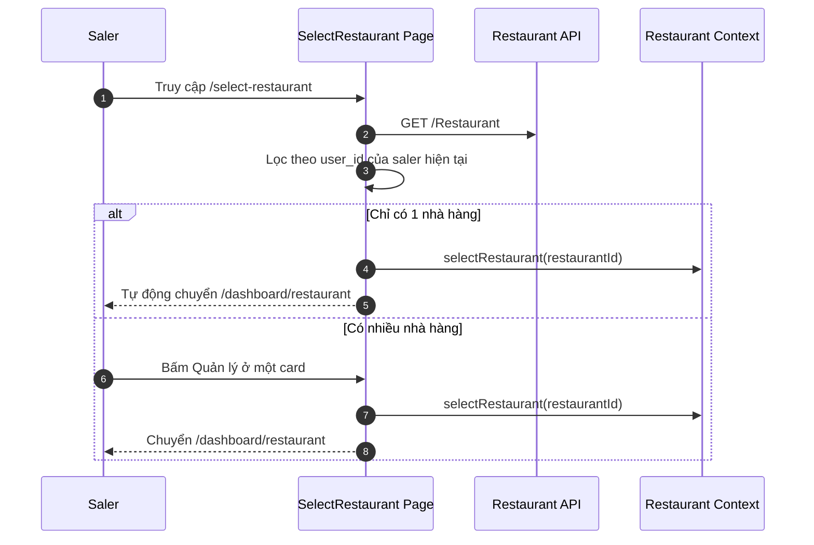
```mermaid
sequenceDiagram
	autonumber
	participant U as Saler
	participant FE as SelectRestaurant Page
	participant RES as Restaurant API
	participant RC as Restaurant Context

	U->>FE: Truy cập /select-restaurant
	FE->>RES: GET /Restaurant
	FE->>FE: Lọc theo user_id của saler hiện tại
	alt Chỉ có 1 nhà hàng
		FE->>RC: selectRestaurant(restaurantId)
		FE-->>U: Tự động chuyển /dashboard/restaurant
	else Có nhiều nhà hàng
		U->>FE: Bấm Quản lý ở một card
		FE->>RC: selectRestaurant(restaurantId)
		FE-->>U: Chuyển /dashboard/restaurant
	end
```

## 7. Chuyển nhà hàng từ header dashboard

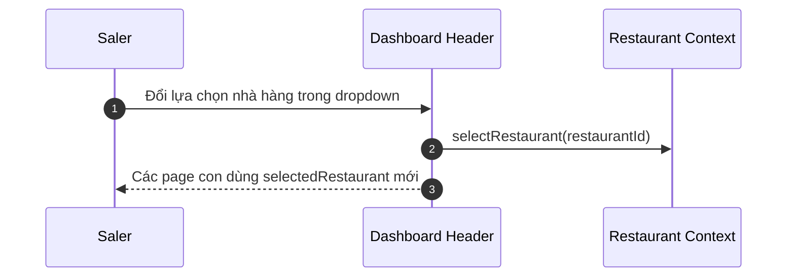
```mermaid
sequenceDiagram
	autonumber
	participant U as Saler
	participant FE as Dashboard Header
	participant RC as Restaurant Context

	U->>FE: Đổi lựa chọn nhà hàng trong dropdown
	FE->>RC: selectRestaurant(restaurantId)
	FE-->>U: Các page con dùng selectedRestaurant mới
```

## 8. Cập nhật thông tin nhà hàng

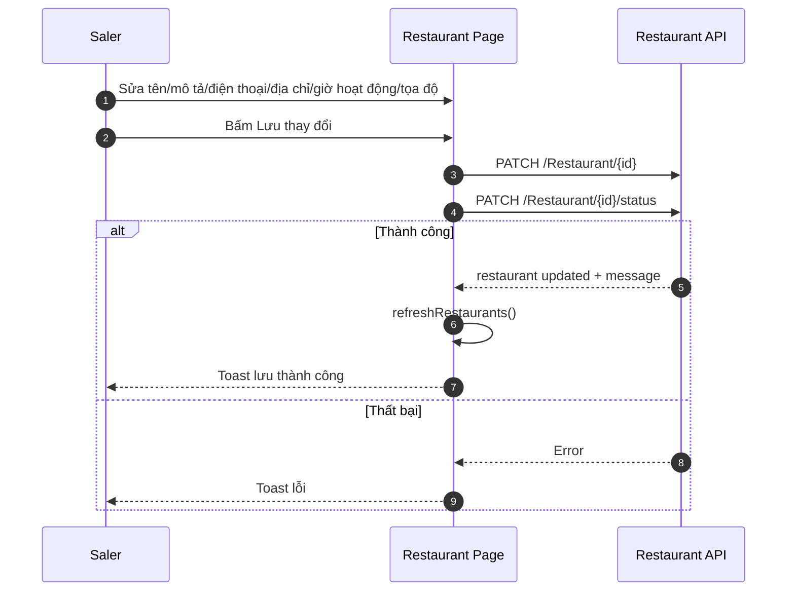
```mermaid
sequenceDiagram
	autonumber
	participant U as Saler
	participant FE as Restaurant Page
	participant RES as Restaurant API

	U->>FE: Sửa tên/mô tả/điện thoại/địa chỉ/giờ hoạt động/tọa độ
	U->>FE: Bấm Lưu thay đổi
	FE->>RES: PATCH /Restaurant/{id}
	FE->>RES: PATCH /Restaurant/{id}/status
	alt Thành công
		RES-->>FE: restaurant updated + message
		FE->>FE: refreshRestaurants()
		FE-->>U: Toast lưu thành công
	else Thất bại
		RES-->>FE: Error
		FE-->>U: Toast lỗi
	end
```

## 9. Tự động/Thủ công trạng thái mở cửa

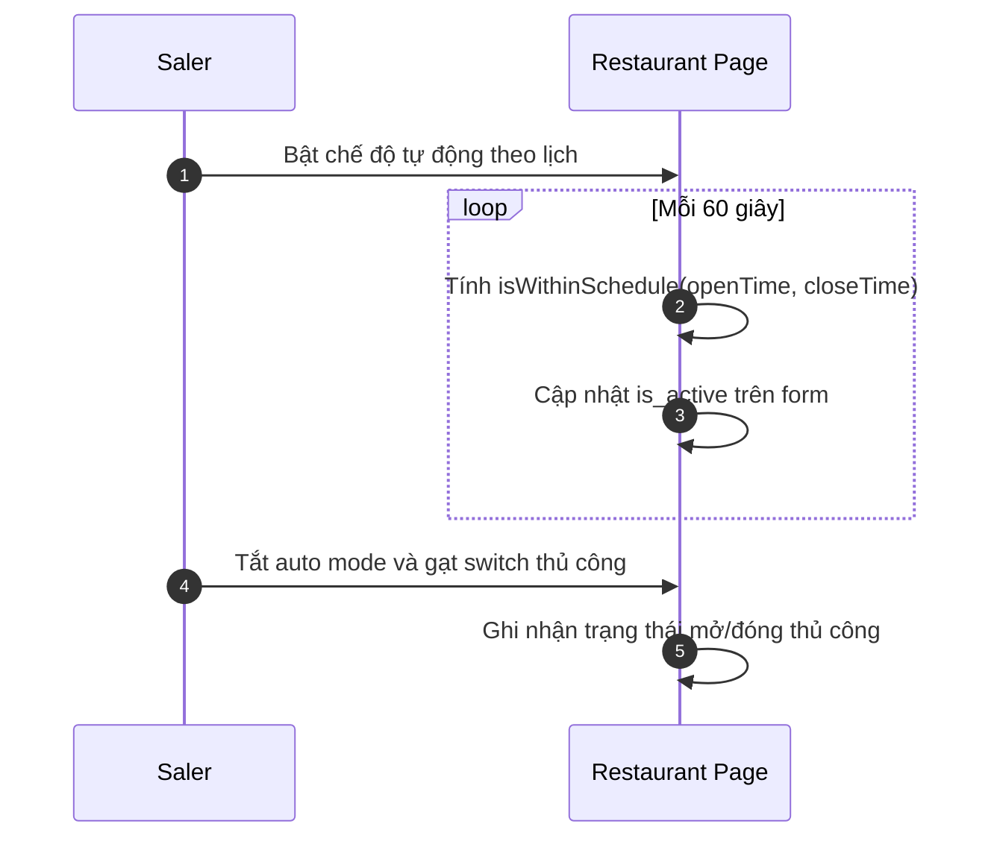
```mermaid
sequenceDiagram
	autonumber
	participant U as Saler
	participant FE as Restaurant Page

	U->>FE: Bật chế độ tự động theo lịch
	loop Mỗi 60 giây
		FE->>FE: Tính isWithinSchedule(openTime, closeTime)
		FE->>FE: Cập nhật is_active trên form
	end

	U->>FE: Tắt auto mode và gạt switch thủ công
	FE->>FE: Ghi nhận trạng thái mở/đóng thủ công
```

## 10. Tự điền tọa độ từ link Google Maps

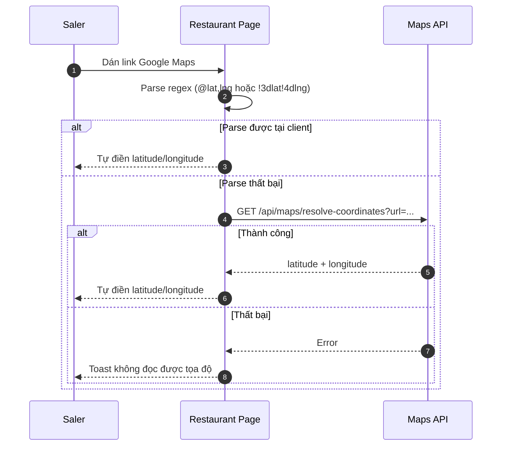
```mermaid
sequenceDiagram
	autonumber
	participant U as Saler
	participant FE as Restaurant Page
	participant MAP as Maps API

	U->>FE: Dán link Google Maps
	FE->>FE: Parse regex (@lat,lng hoặc !3dlat!4dlng)
	alt Parse được tại client
		FE-->>U: Tự điền latitude/longitude
	else Parse thất bại
		FE->>MAP: GET /api/maps/resolve-coordinates?url=...
		alt Thành công
			MAP-->>FE: latitude + longitude
			FE-->>U: Tự điền latitude/longitude
		else Thất bại
			MAP-->>FE: Error
			FE-->>U: Toast không đọc được tọa độ
		end
	end
```

## 11. Xem danh sách món ăn

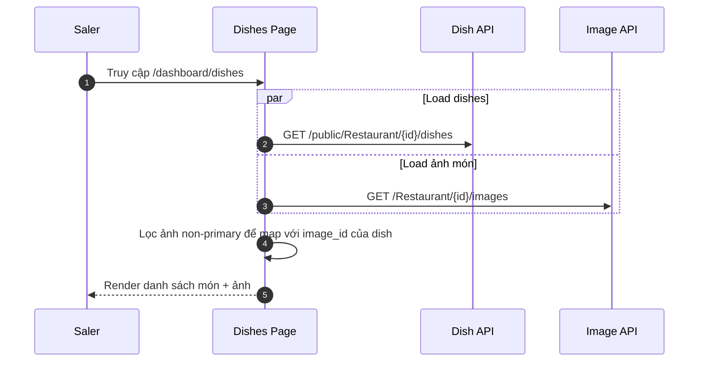
```mermaid
sequenceDiagram
	autonumber
	participant U as Saler
	participant FE as Dishes Page
	participant DISH as Dish API
	participant IMG as Image API

	U->>FE: Truy cập /dashboard/dishes
	par Load dishes
		FE->>DISH: GET /public/Restaurant/{id}/dishes
	and Load ảnh món
		FE->>IMG: GET /Restaurant/{id}/images
	end
	FE->>FE: Lọc ảnh non-primary để map với image_id của dish
	FE-->>U: Render danh sách món + ảnh
```

## 12. Thêm món ăn mới

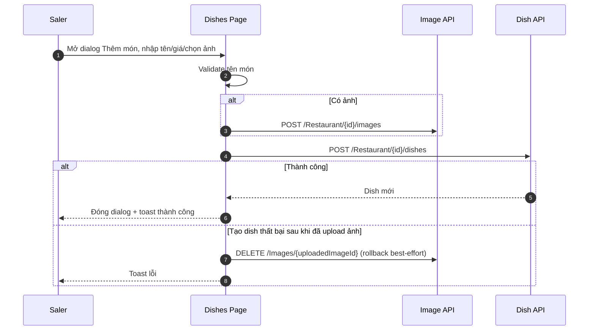
```mermaid
sequenceDiagram
	autonumber
	participant U as Saler
	participant FE as Dishes Page
	participant IMG as Image API
	participant DISH as Dish API

	U->>FE: Mở dialog Thêm món, nhập tên/giá/chọn ảnh
	FE->>FE: Validate tên món
	alt Có ảnh
		FE->>IMG: POST /Restaurant/{id}/images
	end
	FE->>DISH: POST /Restaurant/{id}/dishes
	alt Thành công
		DISH-->>FE: Dish mới
		FE-->>U: Đóng dialog + toast thành công
	else Tạo dish thất bại sau khi đã upload ảnh
		FE->>IMG: DELETE /Images/{uploadedImageId} (rollback best-effort)
		FE-->>U: Toast lỗi
	end
```

## 13. Cập nhật món ăn

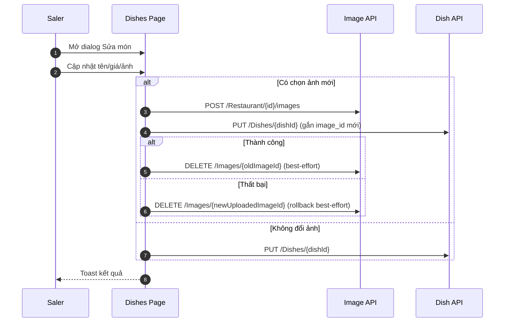
```mermaid
sequenceDiagram
	autonumber
	participant U as Saler
	participant FE as Dishes Page
	participant IMG as Image API
	participant DISH as Dish API

	U->>FE: Mở dialog Sửa món
	U->>FE: Cập nhật tên/giá/ảnh
	alt Có chọn ảnh mới
		FE->>IMG: POST /Restaurant/{id}/images
		FE->>DISH: PUT /Dishes/{dishId} (gắn image_id mới)
		alt Thành công
			FE->>IMG: DELETE /Images/{oldImageId} (best-effort)
		else Thất bại
			FE->>IMG: DELETE /Images/{newUploadedImageId} (rollback best-effort)
		end
	else Không đổi ảnh
		FE->>DISH: PUT /Dishes/{dishId}
	end
	FE-->>U: Toast kết quả
```

## 14. Xóa món ăn

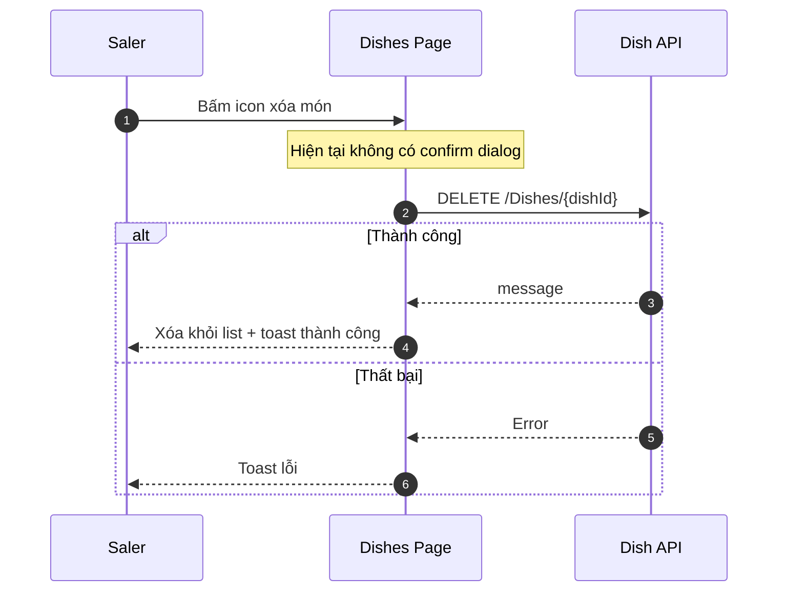
```mermaid
sequenceDiagram
	autonumber
	participant U as Saler
	participant FE as Dishes Page
	participant DISH as Dish API

	U->>FE: Bấm icon xóa món
	Note over FE: Hiện tại không có confirm dialog
	FE->>DISH: DELETE /Dishes/{dishId}
	alt Thành công
		DISH-->>FE: message
		FE-->>U: Xóa khỏi list + toast thành công
	else Thất bại
		DISH-->>FE: Error
		FE-->>U: Toast lỗi
	end
```

## 15. Thay ảnh đại diện nhà hàng

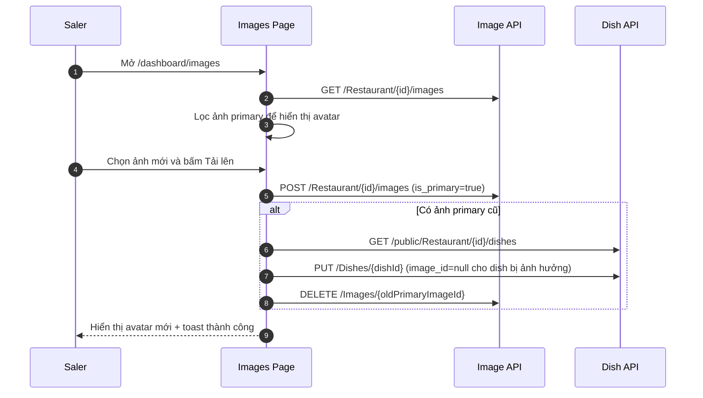
```mermaid
sequenceDiagram
	autonumber
	participant U as Saler
	participant FE as Images Page
	participant IMG as Image API
	participant DISH as Dish API

	U->>FE: Mở /dashboard/images
	FE->>IMG: GET /Restaurant/{id}/images
	FE->>FE: Lọc ảnh primary để hiển thị avatar

	U->>FE: Chọn ảnh mới và bấm Tải lên
	FE->>IMG: POST /Restaurant/{id}/images (is_primary=true)
	alt Có ảnh primary cũ
		FE->>DISH: GET /public/Restaurant/{id}/dishes
		FE->>DISH: PUT /Dishes/{dishId} (image_id=null cho dish bị ảnh hưởng)
		FE->>IMG: DELETE /Images/{oldPrimaryImageId}
	end
	FE-->>U: Hiển thị avatar mới + toast thành công
```

## 16. Tải lên và quản lý phiên bản âm thanh

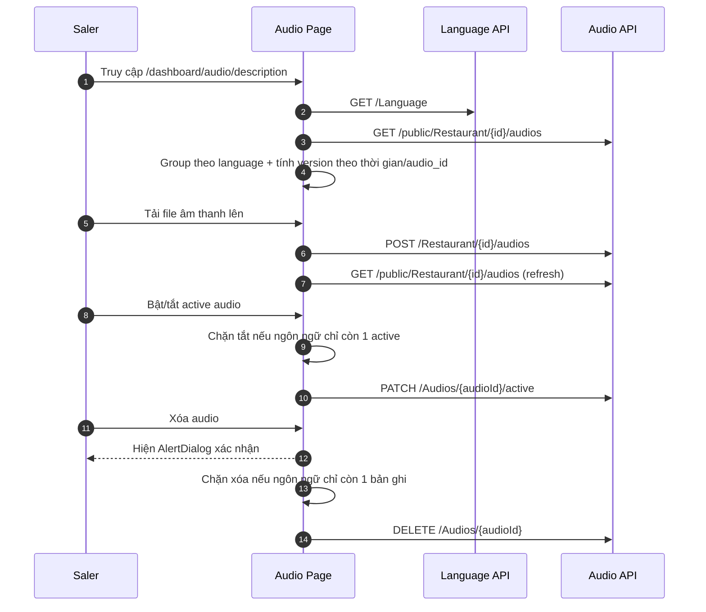
```mermaid
sequenceDiagram
	autonumber
	participant U as Saler
	participant FE as Audio Page
	participant LANG as Language API
	participant AUD as Audio API

	U->>FE: Truy cập /dashboard/audio/description
	FE->>LANG: GET /Language
	FE->>AUD: GET /public/Restaurant/{id}/audios
	FE->>FE: Group theo language + tính version theo thời gian/audio_id

	U->>FE: Tải file âm thanh lên
	FE->>AUD: POST /Restaurant/{id}/audios
	FE->>AUD: GET /public/Restaurant/{id}/audios (refresh)

	U->>FE: Bật/tắt active audio
	FE->>FE: Chặn tắt nếu ngôn ngữ chỉ còn 1 active
	FE->>AUD: PATCH /Audios/{audioId}/active

	U->>FE: Xóa audio
	FE-->>U: Hiện AlertDialog xác nhận
	FE->>FE: Chặn xóa nếu ngôn ngữ chỉ còn 1 bản ghi
	FE->>AUD: DELETE /Audios/{audioId}
```

## 17. Dịch văn bản và tạo âm thanh từ text

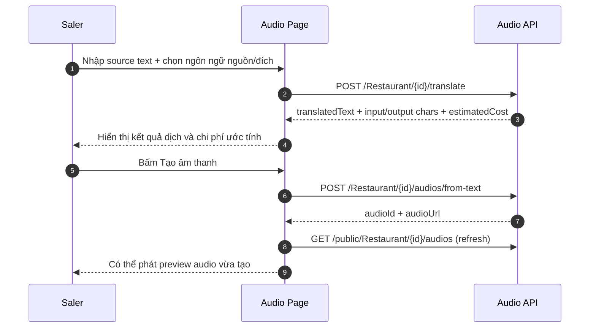
```mermaid
sequenceDiagram
	autonumber
	participant U as Saler
	participant FE as Audio Page
	participant AUD as Audio API

	U->>FE: Nhập source text + chọn ngôn ngữ nguồn/đích
	FE->>AUD: POST /Restaurant/{id}/translate
	AUD-->>FE: translatedText + input/output chars + estimatedCost
	FE-->>U: Hiển thị kết quả dịch và chi phí ước tính

	U->>FE: Bấm Tạo âm thanh
	FE->>AUD: POST /Restaurant/{id}/audios/from-text
	AUD-->>FE: audioId + audioUrl
	FE->>AUD: GET /public/Restaurant/{id}/audios (refresh)
	FE-->>U: Có thể phát preview audio vừa tạo
```

## 18. Xem thống kê nghe và lịch sử chi phí token

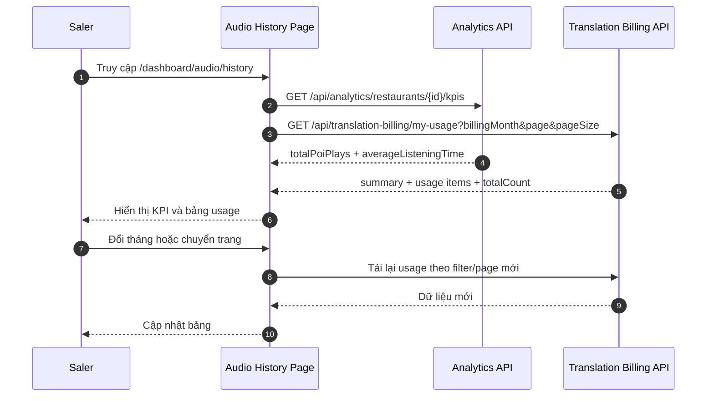
```mermaid
sequenceDiagram
	autonumber
	participant U as Saler
	participant FE as Audio History Page
	participant ANA as Analytics API
	participant BILL as Translation Billing API

	U->>FE: Truy cập /dashboard/audio/history
	FE->>ANA: GET /api/analytics/restaurants/{id}/kpis
	FE->>BILL: GET /api/translation-billing/my-usage?billingMonth&page&pageSize
	ANA-->>FE: totalPoiPlays + averageListeningTime
	BILL-->>FE: summary + usage items + totalCount
	FE-->>U: Hiển thị KPI và bảng usage

	U->>FE: Đổi tháng hoặc chuyển trang
	FE->>BILL: Tải lại usage theo filter/page mới
	BILL-->>FE: Dữ liệu mới
	FE-->>U: Cập nhật bảng
```

## 19. Xem và cập nhật tài khoản

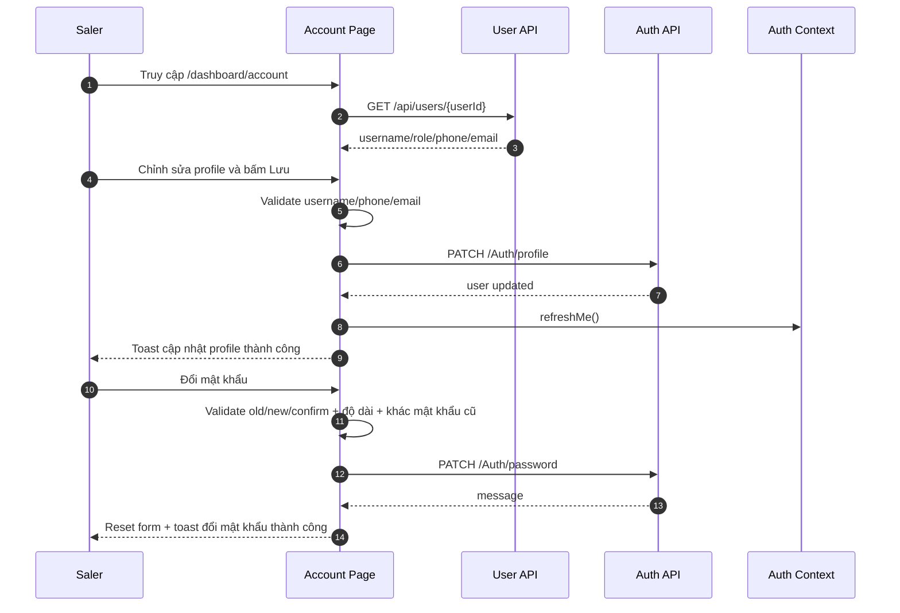
```mermaid
sequenceDiagram
	autonumber
	participant U as Saler
	participant FE as Account Page
	participant USER as User API
	participant AUTH as Auth API
	participant AUTHCTX as Auth Context

	U->>FE: Truy cập /dashboard/account
	FE->>USER: GET /api/users/{userId}
	USER-->>FE: username/role/phone/email

	U->>FE: Chỉnh sửa profile và bấm Lưu
	FE->>FE: Validate username/phone/email
	FE->>AUTH: PATCH /Auth/profile
	AUTH-->>FE: user updated
	FE->>AUTHCTX: refreshMe()
	FE-->>U: Toast cập nhật profile thành công

	U->>FE: Đổi mật khẩu
	FE->>FE: Validate old/new/confirm + độ dài + khác mật khẩu cũ
	FE->>AUTH: PATCH /Auth/password
	AUTH-->>FE: message
	FE-->>U: Reset form + toast đổi mật khẩu thành công
```

---

## Các flow đã bỏ hoặc đã đổi so với bản cũ

- Không có route dashboard tổng quan riêng cho saler; route `/dashboard` hiện redirect về `/dashboard/restaurant`.
- Không có search/filter text cho danh sách món và danh sách audio.
- Trang lịch sử token hiện chỉ lọc theo `billingMonth`; không có control lọc `status` ở UI dù API hỗ trợ tham số này.
