# ĐẶC TẢ USE CASE (TỔNG HỢP TỪ ẢNH TRONG docs/usecase)

Tài liệu này tổng hợp đặc tả use case theo từng ảnh trong thư mục docs/usecase.

## 1. Usecase App - Tổng quát

Ảnh use case: 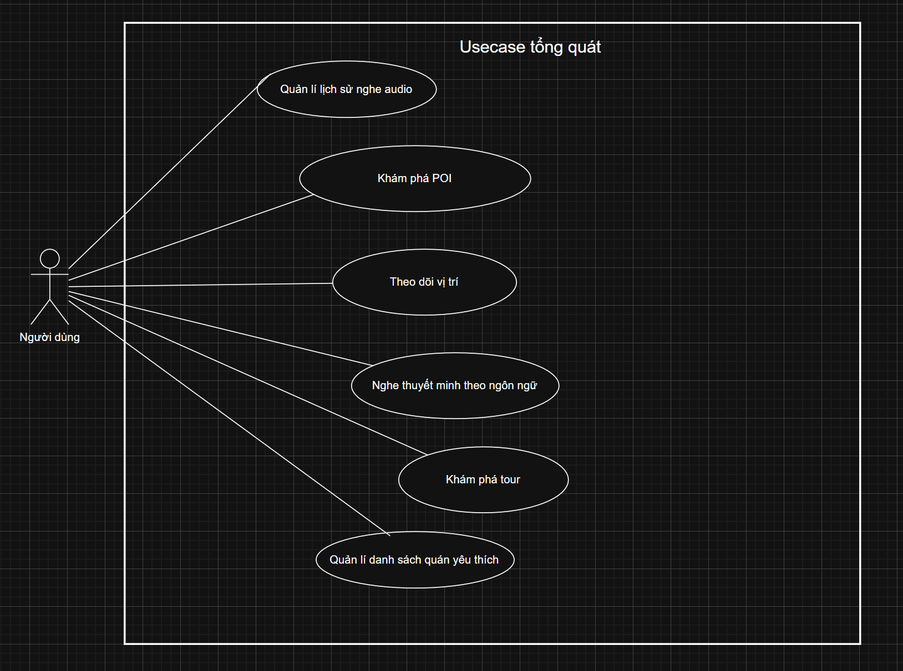

- Tên use case: Usecase tổng quát App
- Tác nhân: Người dùng
- Mô tả: Người dùng sử dụng các chức năng cốt lõi của app mobile để theo dõi vị trí, khám phá POI/tour, nghe thuyết minh và quản lý danh sách/lịch sử cá nhân.
- Tiền điều kiện: App đã cài đặt và mở thành công.
- Hậu điều kiện: Người dùng hoàn thành một hoặc nhiều thao tác chính trong hệ thống.
- Luồng chính:

1. Người dùng vào app.
2. Người dùng theo dõi vị trí.
3. Người dùng khám phá POI.
4. Người dùng nghe thuyết minh theo ngôn ngữ.
5. Người dùng khám phá tour.
6. Người dùng quản lý lịch sử nghe và danh sách quán yêu thích.

- Luồng thay thế:

1. Người dùng bỏ qua một số chức năng và chỉ dùng các chức năng cần thiết.
2. Nếu thiếu quyền vị trí hoặc không có dữ liệu, một số chức năng liên quan sẽ bị hạn chế.

## 2. Usecase App - Khám phá POI

Ảnh use case: 

- Tên use case: Khám phá POI
- Tác nhân: Người dùng
- Mô tả: Người dùng duyệt danh sách POI, tìm kiếm/lọc, xem chi tiết, thao tác với POI như yêu thích, chia sẻ, xem bản đồ, nghe thuyết minh.
- Tiền điều kiện: Đã mở app và tải được danh sách POI.
- Hậu điều kiện: Người dùng tìm thấy POI mong muốn và có thể thực hiện thao tác tiếp theo.
- Luồng chính:

1. Người dùng mở danh sách POI.
2. Người dùng lọc POI hoặc tìm kiếm POI.
3. Người dùng chọn POI để xem chi tiết.
4. Từ màn hình chi tiết, người dùng có thể thêm vào yêu thích, chia sẻ, xem trên bản đồ, nghe thuyết minh.

- Luồng thay thế:

1. Không có kết quả tìm kiếm/lọc thì hệ thống hiển thị trạng thái rỗng.
2. Nếu không tải được chi tiết POI, hệ thống thông báo lỗi và cho thử lại.

## 3. Usecase App - Khám phá Tour

Ảnh use case: 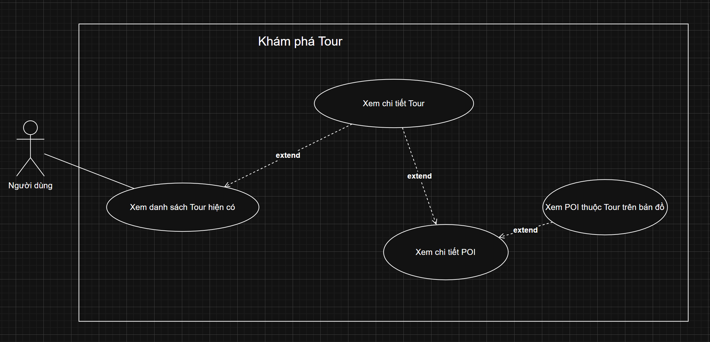

- Tên use case: Khám phá Tour
- Tác nhân: Người dùng
- Mô tả: Người dùng xem danh sách tour, vào chi tiết tour và tiếp tục xem POI thuộc tour trên bản đồ.
- Tiền điều kiện: Đã có dữ liệu tour.
- Hậu điều kiện: Người dùng xác định được tour và POI cần khám phá.
- Luồng chính:

1. Người dùng xem danh sách tour hiện có.
2. Người dùng mở chi tiết tour.
3. Người dùng xem chi tiết POI trong tour.
4. Người dùng xem POI thuộc tour trên bản đồ.

- Luồng thay thế:

1. Nếu không có tour phù hợp, hệ thống hiển thị thông báo không có dữ liệu.
2. Nếu lỗi tải dữ liệu bản đồ, hệ thống cho phép quay lại màn hình trước.

## 4. Usecase App - Nghe thuyết minh theo ngôn ngữ

Ảnh use case: 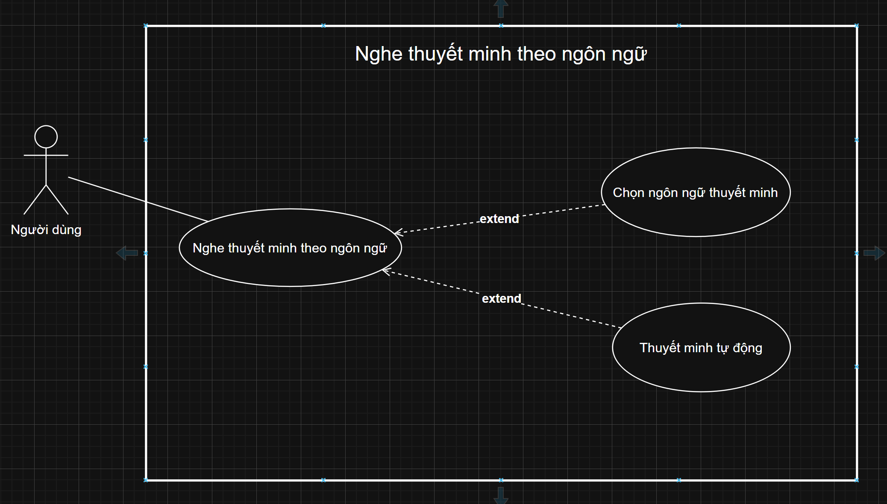

- Tên use case: Nghe thuyết minh theo ngôn ngữ
- Tác nhân: Người dùng
- Mô tả: Người dùng nghe nội dung thuyết minh theo ngôn ngữ đã chọn và có thể bật thuyết minh tự động.
- Tiền điều kiện: Đã có audio cho POI theo ngôn ngữ tương ứng.
- Hậu điều kiện: Audio được phát đúng ngôn ngữ hoặc hệ thống báo không có audio phù hợp.
- Luồng chính:

1. Người dùng bật tính năng nghe thuyết minh theo ngôn ngữ.
2. Người dùng chọn ngôn ngữ thuyết minh.
3. Hệ thống tìm audio phù hợp với ngôn ngữ.
4. Hệ thống phát audio.
5. Người dùng có thể bật thuyết minh tự động.

- Luồng thay thế:

1. Không tìm thấy audio theo ngôn ngữ thì thông báo và bỏ qua.
2. Nếu chế độ tự động tắt, người dùng vẫn có thể phát thủ công.

## 5. Usecase App - Quản lí danh sách yêu thích

Ảnh use case: 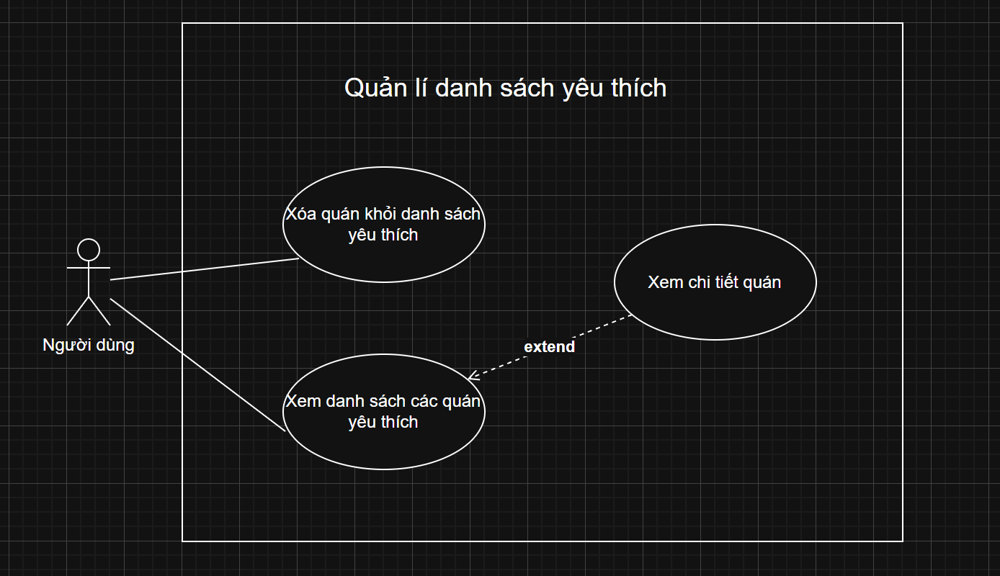

- Tên use case: Quản lí danh sách quán yêu thích
- Tác nhân: Người dùng
- Mô tả: Người dùng theo dõi danh sách quán yêu thích, xem chi tiết và xóa khỏi danh sách.
- Tiền điều kiện: Người dùng đã có ít nhất một quán trong danh sách yêu thích.
- Hậu điều kiện: Danh sách yêu thích được cập nhật theo thao tác của người dùng.
- Luồng chính:

1. Người dùng mở danh sách các quán yêu thích.
2. Người dùng xem chi tiết quán.
3. Người dùng có thể xóa quán khỏi danh sách yêu thích.

- Luồng thay thế:

1. Danh sách rỗng thì hiển thị thông báo chưa có dữ liệu.
2. Xóa thất bại thì giữ nguyên danh sách và thông báo lỗi.

## 6. Usecase App - Quản lí lịch sử

Ảnh use case: 

- Tên use case: Quản lí lịch sử POI
- Tác nhân: Người dùng
- Mô tả: Người dùng xem lại danh sách lịch sử đã nghe và mở lại chi tiết POI từ lịch sử.
- Tiền điều kiện: Đã phát sinh lịch sử nghe trước đó.
- Hậu điều kiện: Người dùng xem được thông tin lịch sử và POI liên quan.
- Luồng chính:

1. Người dùng mở danh sách lịch sử đã nghe.
2. Người dùng chọn một mục lịch sử.
3. Hệ thống mở chi tiết POI tương ứng.

- Luồng thay thế:

1. Không có lịch sử thì hiển thị trạng thái rỗng.
2. Chi tiết POI không còn tồn tại thì thông báo và loại bỏ mục lịch sử lỗi nếu cần.

## 7. Usecase App - Theo dõi vị trí

Ảnh use case: 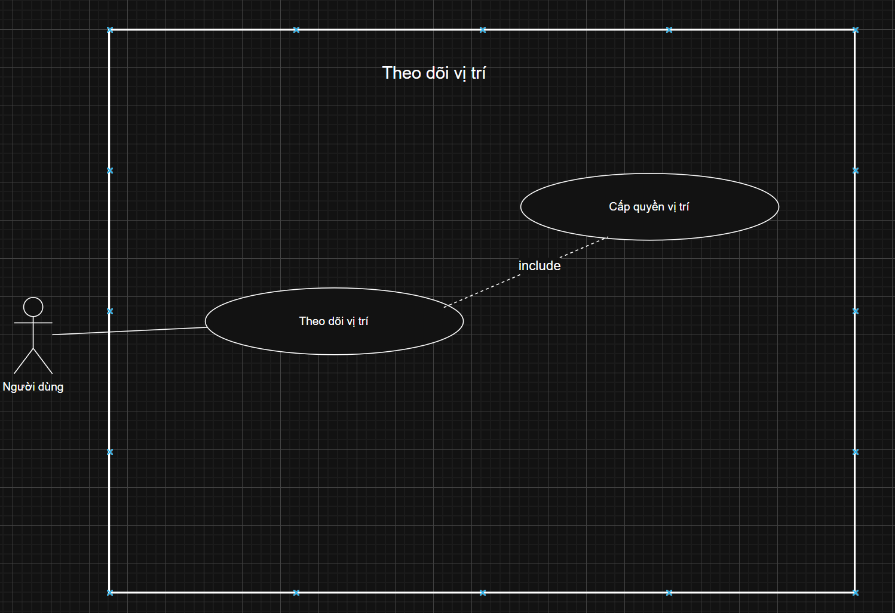

- Tên use case: Theo dõi vị trí
- Tác nhân: Người dùng
- Mô tả: App theo dõi vị trí người dùng để phục vụ geofence và thuyết minh tự động.
- Tiền điều kiện: Thiết bị hỗ trợ GPS, người dùng đồng ý cấp quyền vị trí.
- Hậu điều kiện: Vị trí được cập nhật theo chu kỳ hoặc bị tạm dừng nếu không đủ điều kiện.
- Luồng chính:

1. Người dùng bật tính năng theo dõi vị trí.
2. Hệ thống yêu cầu cấp quyền vị trí (include).
3. Người dùng chấp nhận quyền.
4. Hệ thống bắt đầu lấy vị trí và cập nhật theo chu kỳ.

- Luồng thay thế:

1. Người dùng từ chối quyền vị trí thì hệ thống dừng theo dõi và thông báo.
2. Mất tín hiệu GPS tạm thời thì hệ thống thử lại ở chu kỳ tiếp theo.

## 8. Usecase Admin - Tổng quát

Ảnh use case: 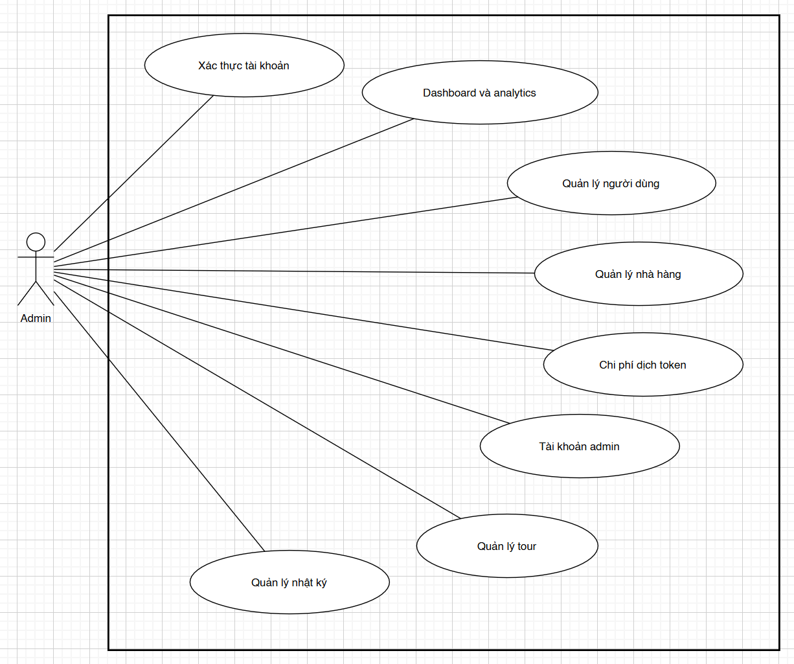

- Tên use case: Usecase tổng quát Admin
- Tác nhân: Admin (lưu ý: trên ảnh đang hiển thị nhãn "Saler")
- Mô tả: Tác nhân quản trị sử dụng các nhóm chức năng xác thực, nhà hàng, món ăn, thống kê/chi phí token, âm thanh, hình ảnh, tài khoản.
- Tiền điều kiện: Đã truy cập giao diện quản trị.
- Hậu điều kiện: Có thể thực hiện quản trị toàn bộ nội dung theo từng nhóm chức năng.
- Luồng chính:

1. Tác nhân xác thực tài khoản.
2. Tác nhân quản lý nhà hàng.
3. Tác nhân quản lý món ăn.
4. Tác nhân quản lý âm thanh mô tả.
5. Tác nhân quản lý hình ảnh nhà hàng.
6. Tác nhân xem thống kê và chi phí token.
7. Tác nhân quản lý tài khoản.

- Luồng thay thế:

1. Nếu không đủ quyền truy cập thì bị chặn vào route bảo vệ.
2. Nếu một module lỗi, tác nhân vẫn có thể sử dụng module khác.

## 9. Usecase Admin - Xác thực tài khoản

Ảnh use case: 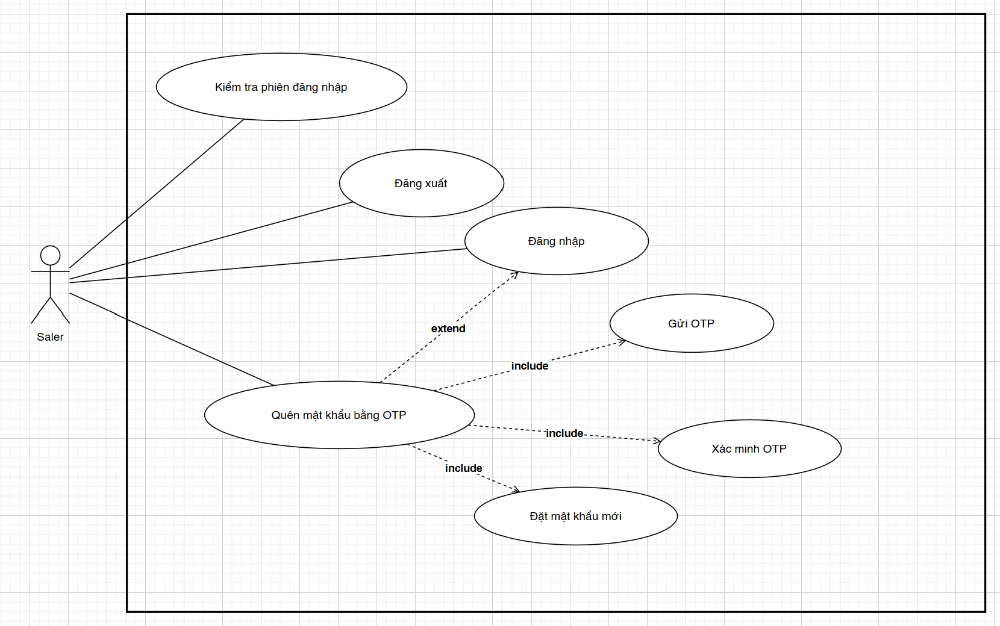

- Tên use case: Xác thực tài khoản
- Tác nhân: Admin (lưu ý: trên ảnh đang hiển thị nhãn "Saler")
- Mô tả: Đảm bảo đăng nhập an toàn, kiểm tra phiên, đăng xuất và khôi phục mật khẩu qua OTP.
- Tiền điều kiện: Tác nhân có tài khoản hợp lệ.
- Hậu điều kiện: Tác nhân đăng nhập thành công hoặc cập nhật mật khẩu mới.
- Luồng chính:

1. Tác nhân mở ứng dụng và hệ thống kiểm tra phiên đăng nhập.
2. Tác nhân đăng nhập bằng thông tin tài khoản.
3. Tác nhân đăng xuất khi cần.
4. Nếu quên mật khẩu, tác nhân thực hiện luồng OTP gồm gửi OTP, xác minh OTP, đặt mật khẩu mới.

- Luồng thay thế:

1. Sai thông tin đăng nhập thì hệ thống báo lỗi.
2. OTP hết hạn/không hợp lệ thì yêu cầu gửi lại OTP.

## 10. Usecase Admin - Thống kê và chi phí token

Ảnh use case: 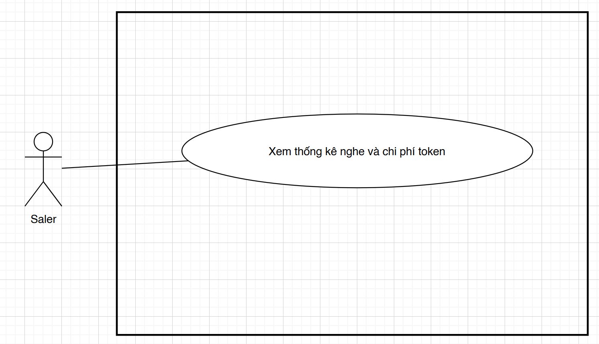

- Tên use case: Xem thống kê nghe và chi phí token
- Tác nhân: Admin (lưu ý: trên ảnh đang hiển thị nhãn "Saler")
- Mô tả: Theo dõi KPI nghe audio và dữ liệu chi phí token.
- Tiền điều kiện: Đã đăng nhập và có quyền xem thống kê.
- Hậu điều kiện: Dữ liệu thống kê được hiển thị theo bộ lọc hiện tại.
- Luồng chính:

1. Tác nhân vào trang thống kê.
2. Hệ thống tải dữ liệu thống kê nghe và chi phí token.
3. Hệ thống hiển thị kết quả.

- Luồng thay thế:

1. API lỗi hoặc rỗng dữ liệu thì hệ thống hiển thị thông báo tương ứng.

## 11. Usecase Admin - Quản lý tài khoản

Ảnh use case: 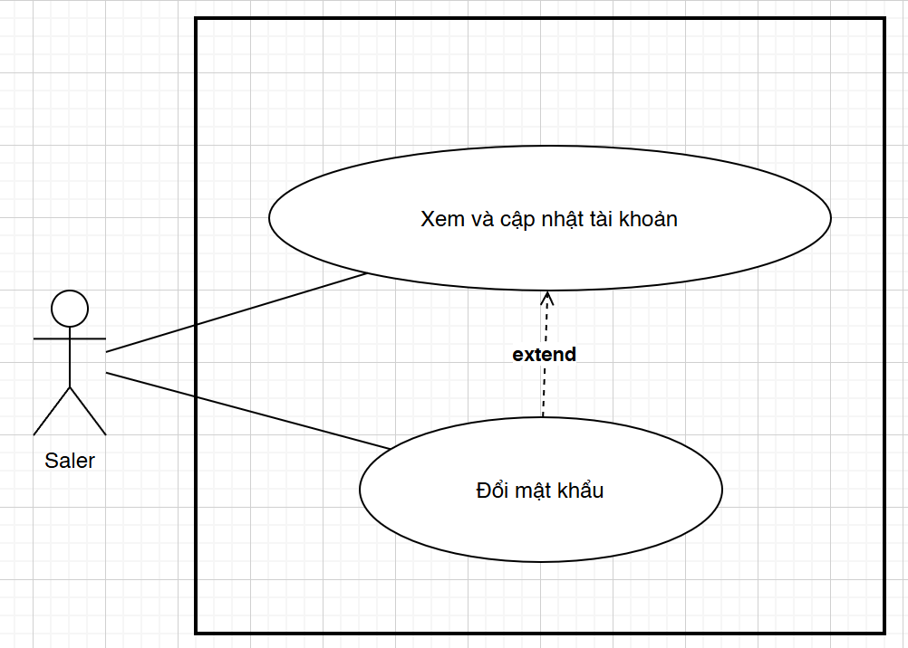

- Tên use case: Xem và cập nhật tài khoản
- Tác nhân: Admin (lưu ý: trên ảnh đang hiển thị nhãn "Saler")
- Mô tả: Tác nhân cập nhật thông tin tài khoản và có thể đổi mật khẩu (extend).
- Tiền điều kiện: Đã đăng nhập vào hệ thống.
- Hậu điều kiện: Thông tin tài khoản được cập nhật, mật khẩu mới có hiệu lực.
- Luồng chính:

1. Tác nhân mở trang tài khoản.
2. Tác nhân cập nhật thông tin và lưu.
3. Hệ thống cập nhật dữ liệu thành công.
4. Khi cần, tác nhân đổi mật khẩu.

- Luồng thay thế:

1. Dữ liệu không hợp lệ thì hệ thống báo lỗi validate.
2. Đổi mật khẩu thất bại thì giữ nguyên mật khẩu cũ.

## 12. Usecase Admin - Quản lý âm thanh mô tả

Ảnh use case: 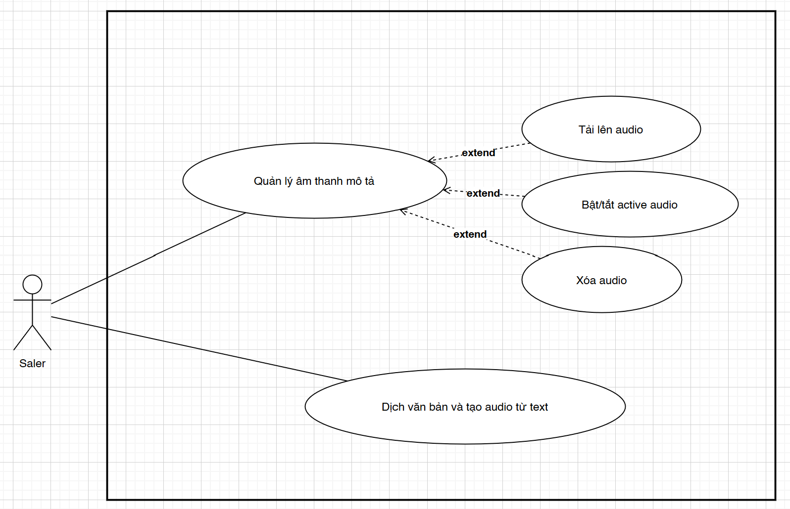

- Tên use case: Quản lý âm thanh mô tả
- Tác nhân: Admin (lưu ý: trên ảnh đang hiển thị nhãn "Saler")
- Mô tả: Quản lý vòng đời audio mô tả và tạo audio từ văn bản.
- Tiền điều kiện: Đã chọn đối tượng nhà hàng/POI cần quản lý audio.
- Hậu điều kiện: Audio được tải lên, bật/tắt active, xóa hoặc tạo mới từ text.
- Luồng chính:

1. Tác nhân mở module quản lý âm thanh mô tả.
2. Tác nhân tải lên audio mới.
3. Tác nhân bật/tắt active audio.
4. Tác nhân xóa audio khi cần.
5. Tác nhân dịch văn bản và tạo audio từ text.

- Luồng thay thế:

1. Upload thất bại thì thông báo lỗi và cho thử lại.
2. Nếu thao tác xóa/đổi trạng thái bị ràng buộc nghiệp vụ, hệ thống từ chối và thông báo lý do.

## 13. Usecase Admin - Thay ảnh đại diện nhà hàng

Ảnh use case: 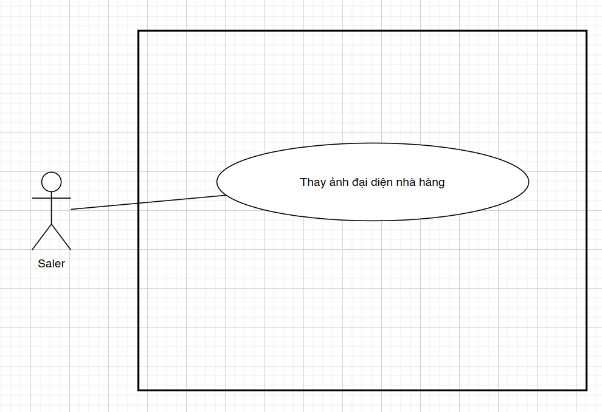

- Tên use case: Thay ảnh đại diện nhà hàng
- Tác nhân: Admin (lưu ý: trên ảnh đang hiển thị nhãn "Saler")
- Mô tả: Cập nhật ảnh đại diện (primary) cho nhà hàng.
- Tiền điều kiện: Đã đăng nhập và có nhà hàng mục tiêu.
- Hậu điều kiện: Ảnh đại diện mới được hiển thị và dữ liệu liên quan đồng bộ.
- Luồng chính:

1. Tác nhân chọn ảnh mới.
2. Hệ thống tải ảnh lên.
3. Hệ thống gán ảnh làm đại diện.
4. Hệ thống cập nhật giao diện thành công.

- Luồng thay thế:

1. Upload thất bại thì hệ thống thông báo và giữ ảnh cũ.

## 14. Usecase Admin - Điều hướng và nhà hàng

Ảnh use case: 

- Tên use case: Điều hướng và quản lý nhà hàng
- Tác nhân: Admin (lưu ý: trên ảnh đang hiển thị nhãn "Saler")
- Mô tả: Quản lý route dashboard bảo vệ, chọn/chuyển nhà hàng và cập nhật thông tin nhà hàng.
- Tiền điều kiện: Đã xác thực tài khoản.
- Hậu điều kiện: Tác nhân thao tác trên đúng nhà hàng đang quản lý.
- Luồng chính:

1. Tác nhân truy cập route dashboard được bảo vệ.
2. Tác nhân chọn nhà hàng để quản lý.
3. Tác nhân có thể chuyển nhà hàng đang quản lý.
4. Tác nhân cập nhật thông tin nhà hàng.
5. Từ use case cập nhật, có thể mở rộng sang trạng thái mở cửa tự động/thủ công và tự điền tọa độ từ link Google Maps.

- Luồng thay thế:

1. Chưa đăng nhập thì bị điều hướng về trang đăng nhập.
2. Không có nhà hàng hợp lệ thì hệ thống chặn vào các trang cần selected nhà hàng.

## 15. Usecase Admin - Món ăn (theo file ảnh hiện có)

Ảnh use case: 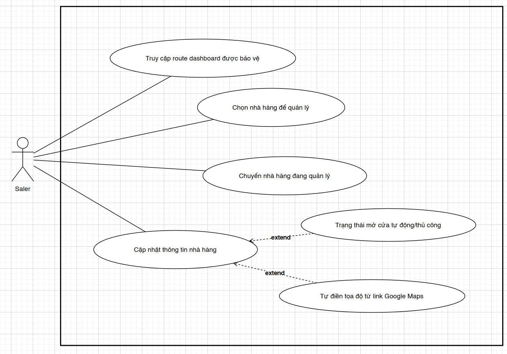

- Tên use case: Điều hướng và quản lý nhà hàng
- Tác nhân: Admin (lưu ý: trên ảnh đang hiển thị nhãn "Saler")
- Mô tả: Nội dung ảnh trùng với ChiTietDieuHuong.png trong thư mục Usecase_admin.
- Tiền điều kiện: Đã xác thực tài khoản.
- Hậu điều kiện: Tác nhân thao tác trên đúng nhà hàng đang quản lý.
- Luồng chính:

1. Tác nhân truy cập route dashboard được bảo vệ.
2. Tác nhân chọn/chuyển nhà hàng đang quản lý.
3. Tác nhân cập nhật thông tin nhà hàng.
4. Có thể mở rộng qua trạng thái mở cửa và tự điền tọa độ.

- Luồng thay thế:

1. Chưa đăng nhập hoặc chưa chọn nhà hàng thì hệ thống chặn thao tác.

## 16. Usecase Saler - Tổng quát

Ảnh use case: 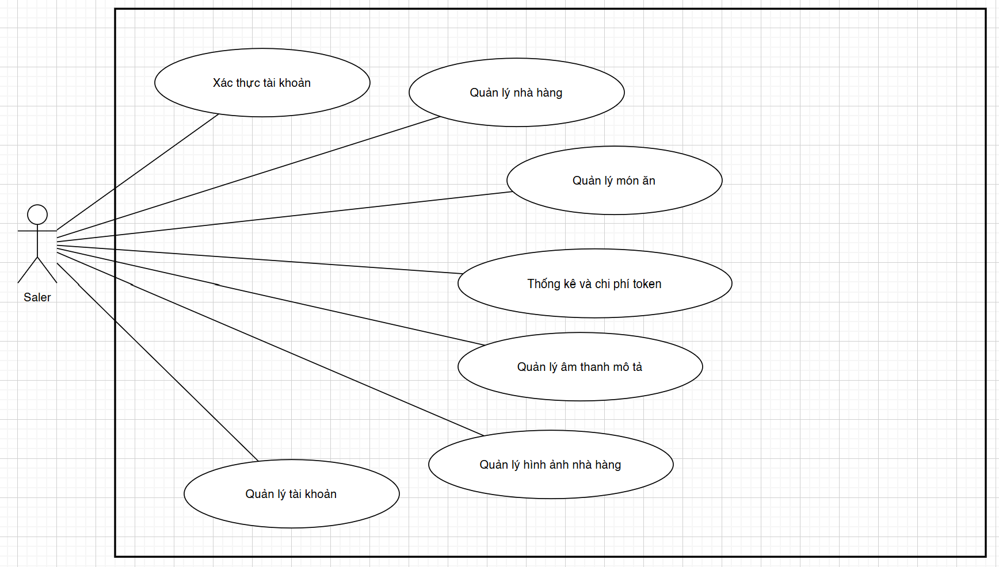

- Tên use case: Usecase tổng quát Saler
- Tác nhân: Saler
- Mô tả: Saler sử dụng đầy đủ các nhóm chức năng để quản trị nội dung nhà hàng mình phụ trách.
- Tiền điều kiện: Saler có tài khoản và truy cập được hệ thống.
- Hậu điều kiện: Saler thao tác được trên nhà hàng, món ăn, âm thanh, thống kê và tài khoản.
- Luồng chính:

1. Saler xác thực tài khoản.
2. Saler quản lý nhà hàng.
3. Saler quản lý món ăn.
4. Saler quản lý âm thanh mô tả.
5. Saler quản lý hình ảnh nhà hàng.
6. Saler xem thống kê và chi phí token.
7. Saler quản lý tài khoản.

- Luồng thay thế:

1. Nếu không đủ quyền hoặc dữ liệu thiếu, một số module sẽ tạm khóa.

## 17. Usecase Saler - Xác thực tài khoản

Ảnh use case: 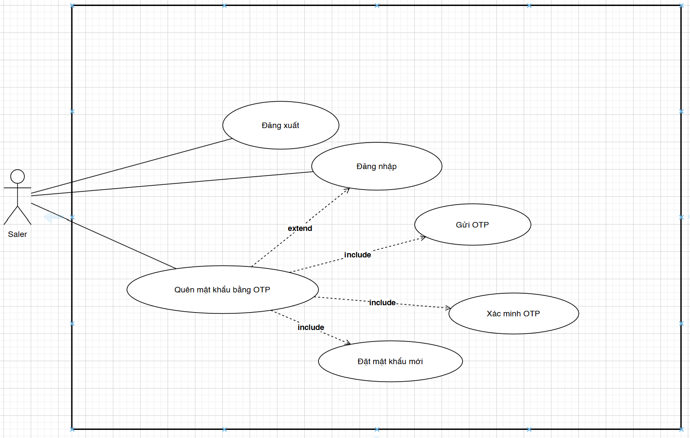

- Tên use case: Xác thực tài khoản
- Tác nhân: Saler
- Mô tả: Saler đăng nhập, đăng xuất, kiểm tra phiên, và khôi phục mật khẩu bằng OTP.
- Tiền điều kiện: Saler có tài khoản hợp lệ.
- Hậu điều kiện: Đăng nhập thành công hoặc đặt mật khẩu mới thành công.
- Luồng chính:

1. Saler vào hệ thống, hệ thống kiểm tra phiên đăng nhập.
2. Saler đăng nhập.
3. Saler đăng xuất khi cần.
4. Nếu quên mật khẩu, Saler thực hiện luồng OTP: gửi OTP, xác minh OTP, đặt mật khẩu mới.

- Luồng thay thế:

1. Đăng nhập sai thì thông báo lỗi.
2. OTP sai/hết hạn thì yêu cầu gửi lại OTP.

## 18. Usecase Saler - Điều hướng và nhà hàng

Ảnh use case: 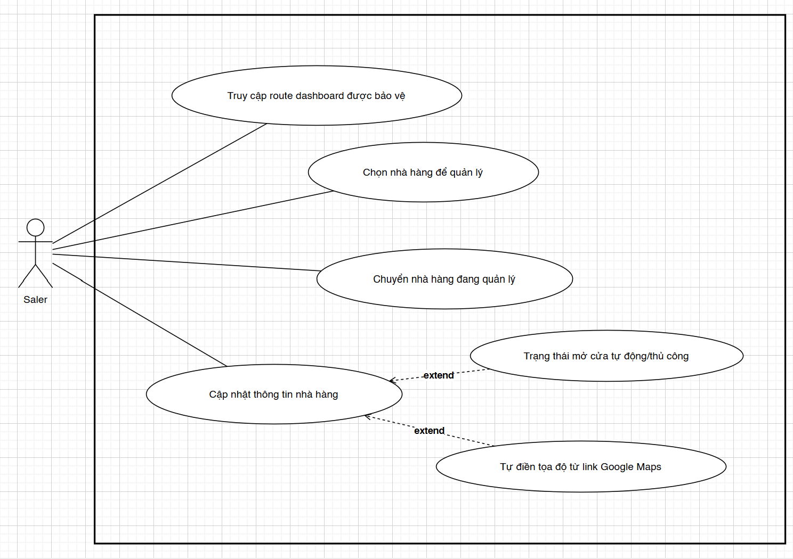

- Tên use case: Điều hướng và quản lý nhà hàng
- Tác nhân: Saler
- Mô tả: Saler vào route bảo vệ, chọn/chuyển nhà hàng và cập nhật thông tin nhà hàng.
- Tiền điều kiện: Saler đã đăng nhập thành công.
- Hậu điều kiện: Nhà hàng được chọn đúng và thông tin nhà hàng được cập nhật.
- Luồng chính:

1. Saler truy cập route dashboard được bảo vệ.
2. Saler chọn nhà hàng để quản lý.
3. Saler chuyển nhà hàng đang quản lý khi cần.
4. Saler cập nhật thông tin nhà hàng.
5. Từ use case cập nhật, có thể mở rộng qua trạng thái mở cửa tự động/thủ công và tự điền tọa độ từ link Google Maps.

- Luồng thay thế:

1. Chưa đăng nhập thì redirect về /login.
2. Chưa chọn nhà hàng thì hệ thống yêu cầu chọn trước khi vào các trang phụ thuộc.

## 19. Usecase Saler - Quản lý món ăn

Ảnh use case: 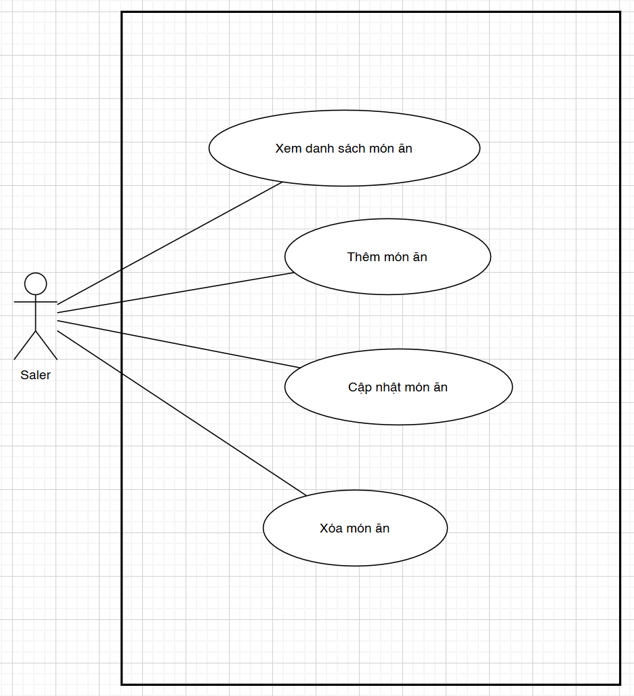

- Tên use case: Quản lý món ăn
- Tác nhân: Saler
- Mô tả: Saler thực hiện đầy đủ CRUD món ăn.
- Tiền điều kiện: Đã chọn nhà hàng cần quản lý.
- Hậu điều kiện: Danh sách món ăn được cập nhật theo thao tác.
- Luồng chính:

1. Saler xem danh sách món ăn.
2. Saler thêm món ăn mới.
3. Saler cập nhật món ăn.
4. Saler xóa món ăn.

- Luồng thay thế:

1. Dữ liệu nhập không hợp lệ thì hệ thống không lưu và thông báo.
2. Xóa thất bại thì món ăn giữ nguyên.

## 20. Usecase Saler - Thay ảnh đại diện nhà hàng

Ảnh use case: 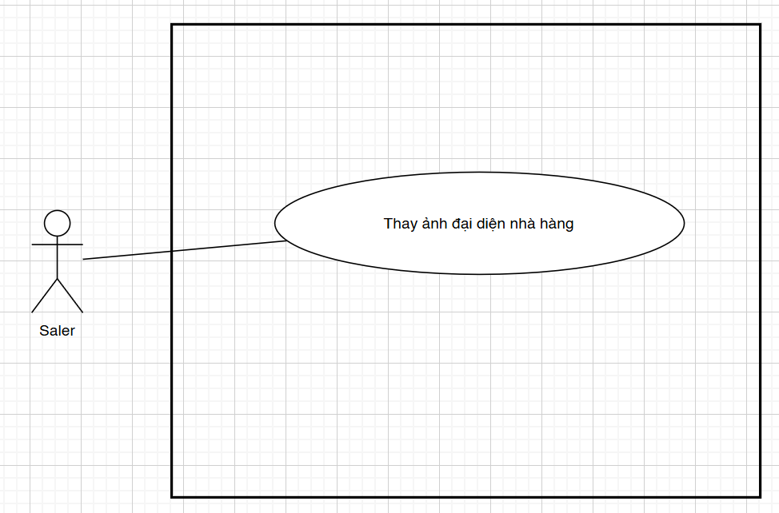

- Tên use case: Thay ảnh đại diện nhà hàng
- Tác nhân: Saler
- Mô tả: Saler cập nhật ảnh đại diện cho nhà hàng đang quản lý.
- Tiền điều kiện: Đã chọn nhà hàng và có quyền chỉnh sửa.
- Hậu điều kiện: Ảnh đại diện mới được cập nhật thành công.
- Luồng chính:

1. Saler chọn ảnh mới.
2. Hệ thống upload ảnh.
3. Hệ thống đặt ảnh vừa upload làm ảnh đại diện.
4. Hệ thống cập nhật giao diện.

- Luồng thay thế:

1. Upload lỗi thì thông báo và không thay đổi ảnh hiện tại.

## 21. Usecase Saler - Quản lý tài khoản

Ảnh use case: 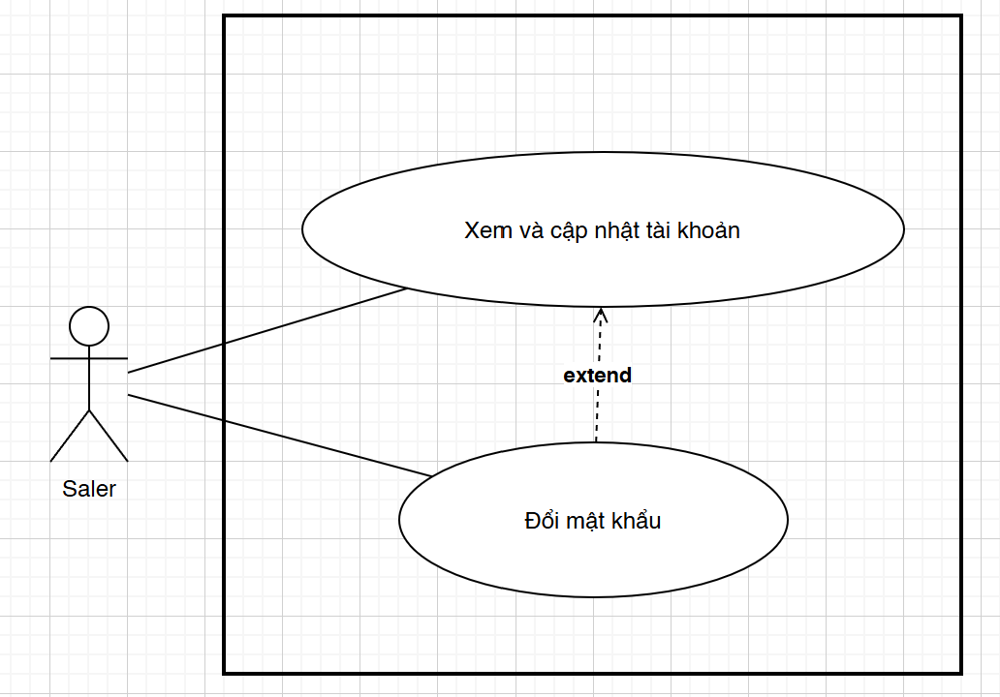

- Tên use case: Xem và cập nhật tài khoản
- Tác nhân: Saler
- Mô tả: Saler cập nhật thông tin tài khoản và đổi mật khẩu (extend).
- Tiền điều kiện: Saler đã đăng nhập.
- Hậu điều kiện: Hồ sơ được cập nhật, đổi mật khẩu thành công nếu thao tác hợp lệ.
- Luồng chính:

1. Saler mở trang tài khoản.
2. Saler cập nhật thông tin và lưu.
3. Hệ thống cập nhật thành công.
4. Saler có thể đổi mật khẩu.

- Luồng thay thế:

1. Validate lỗi thì hệ thống thông báo và giữ dữ liệu cũ.
2. Đổi mật khẩu thất bại thì thông báo và không đổi mật khẩu.

## 22. Usecase Saler - Thống kê và chi phí token

Ảnh use case: 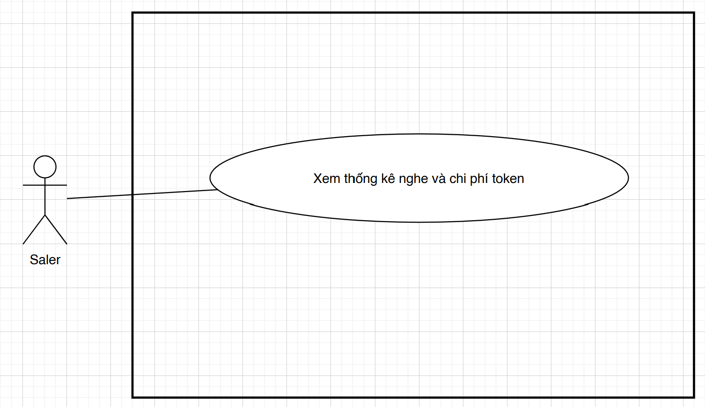

- Tên use case: Xem thống kê nghe và chi phí token
- Tác nhân: Saler
- Mô tả: Saler theo dõi số liệu nghe audio và chi phí token theo nhà hàng quản lý.
- Tiền điều kiện: Đã đăng nhập và đã chọn nhà hàng cần xem.
- Hậu điều kiện: KPI và bảng số liệu được hiển thị theo bộ lọc hiện tại.
- Luồng chính:

1. Saler vào module thống kê.
2. Hệ thống tải dữ liệu thống kê nghe và chi phí token.
3. Hệ thống hiển thị kết quả cho Saler.

- Luồng thay thế:

1. API lỗi hoặc không có dữ liệu thì hệ thống hiển thị thông báo tương ứng.
